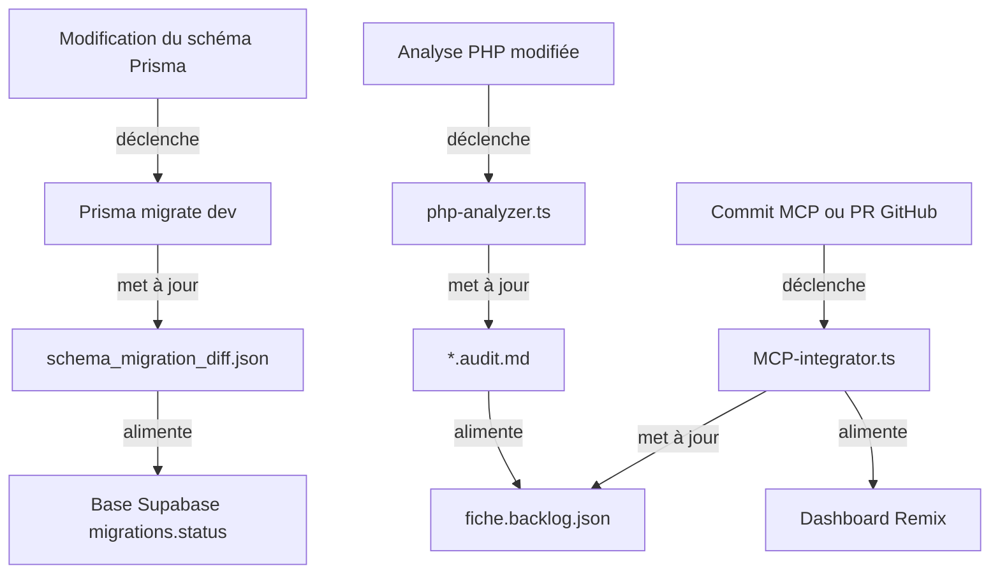
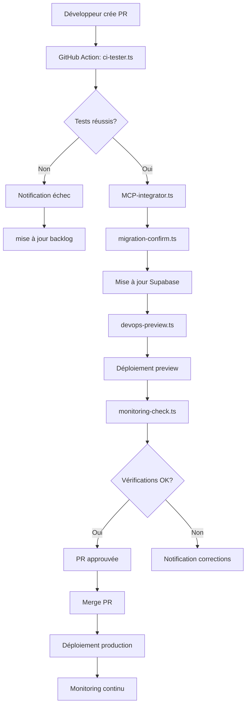

# ✅ Synthèse – Mécanisme de Migration Évolutive Versionnée

Ce document présente une synthèse consolidée du mécanisme de migration évolutive versionnée, directement exploitable dans le pipeline d'automatisation.

## 🧠 1. Audit Évolutif Versionné

| Élément | Description |
|---------|-------------|
| *.audit.md | Snapshot détaillé de chaque fichier legacy PHP (logique métier, requêtes SQL, dépendances) |
| fiche.backlog.json | Liste des tâches à exécuter sur chaque fichier avec statut (à migrer, en attente de validation, terminé) |
| schema_migration_diff.json | Historique versionné des modifications SQL ↔ Prisma (champ renommé, typé, supprimé) |
| fiche.impact_graph.json | Graphe d'impact métier pour chaque fichier |

🔁 Versionné automatiquement après chaque modification de :
- schéma Prisma (prisma migrate dev)
- analyse PHP (php-analyzer.ts)
- refacto manuel (commit MCP ou PR GitHub)

### Exemple de workflow de versionnement automatique



## 🔄 2. Synchronisation Automatique Backlog / Code / BDD

| Source | Cible | Agent |
|--------|-------|-------|
| Base SQL | Prisma Schema | mysql-analyzer+optimizer |
| Prisma Schema | DTO + Services NestJS | dev-generator.ts |
| PHP Legacy | Prisma Schema | sync-mapper.ts, migration_patch.json |

🛠️ Dès qu'un champ est :
- Renommé dans Prisma → backlog mis à jour
- Manquant dans DTO → tâche générée automatiquement
- Non utilisé côté frontend → champ marqué comme obsolète

### Exemple de synchronisation après modification de schéma

```javascript
// Extrait simplifié de sync-mapper.ts
async function handleSchemaChange(schemaPath) {
  // Analyser les changements de schéma
  const changeResults = await analyzePrismaChanges(schemaPath);
  
  // Pour chaque changement, mettre à jour le backlog
  for (const change of changeResults.changes) {
    // Mettre à jour schema_migration_diff.json
    await updateSchemaMigrationDiff(change);
    
    // Générer des tâches dans le backlog
    await updateBacklogWithChange(change);
    
    // Si champ renommé, mettre à jour les références PHP
    if (change.type === 'rename') {
      const affectedFiles = await findPhpFilesByTableColumn(
        change.table, 
        change.oldName
      );
      
      for (const file of affectedFiles) {
        await updateBacklogForPhpFile(file, change);
      }
    }
  }
  
  // Générer code DTO si nécessaire
  if (changeResults.changes.length > 0) {
    await generateUpdatedDTOs(changeResults.tables);
  }
}
```

## 🧪 3. Prévention Active des Régressions

| Contrôle | Outil/Agent | Sortie |
|----------|-------------|--------|
| Test de divergence logique | diff-validator.ts | verification_report.json |
| Test de couverture | test-writer.ts | *.spec.ts, *.e2e.ts |
| Audit des champs orphelins | sync-mapper.ts | orphan_fields.json |

💡 Chaque divergence détectée :
- Génère un ticket (via Supabase ou GitHub)
- Met à jour fiche.backlog.json
- Déclenche des tests ciblés via GitHub Actions

### Configuration GitHub Actions pour les tests ciblés

```yaml
# .github/workflows/test-divergence.yml
name: Test divergence détectée

on:
  repository_dispatch:
    types: [divergence_detected]

jobs:
  run-tests:
    runs-on: ubuntu-latest
    steps:
      - uses: actions/checkout@v3
      
      - name: Setup Node.js
        uses: actions/setup-node@v3
        with:
          node-version: '18'
          
      - name: Install dependencies
        run: npm ci
        
      - name: Run targeted tests
        run: |
          node scripts/run-targeted-tests.js \
            --module ${{ github.event.client_payload.module }} \
            --file ${{ github.event.client_payload.file }}
            
      - name: Update backlog status
        run: |
          node scripts/update-backlog-status.js \
            --file ${{ github.event.client_payload.file }} \
            --status "${{ job.status }}"
```

## 📊 4. Vision Centralisée + Monitoring

| Interface | Fonction | Technologie |
|-----------|----------|-------------|
| Remix dashboard.tsx | Vue migration fichier/table/module | React + Tailwind |
| Supabase migrations.status | État des fichiers, validation, revue | PostgreSQL table |
| GitHub + MCP | Historique des commits, branches par fichier | CI/CD auto |
| Prometheus + Grafana | Monitoring post-deploy (SEO, temps de réponse) | DevOps |

### Structure de la table Supabase migrations.status

```sql
CREATE TABLE migrations.status (
  id UUID PRIMARY KEY DEFAULT uuid_generate_v4(),
  file_path TEXT NOT NULL,
  module_name TEXT NOT NULL,
  status TEXT NOT NULL CHECK (status IN ('pending', 'in_progress', 'review', 'completed')),
  assignee TEXT,
  reviewer TEXT,
  started_at TIMESTAMP WITH TIME ZONE,
  completed_at TIMESTAMP WITH TIME ZONE,
  last_updated TIMESTAMP WITH TIME ZONE DEFAULT NOW(),
  migration_batch TEXT,
  complexity_score FLOAT,
  test_coverage FLOAT,
  seo_score FLOAT,
  metrics JSONB,
  backlog_file TEXT,
  audit_file TEXT,
  pr_url TEXT,
  notes TEXT
);

-- Index pour les requêtes fréquentes
CREATE INDEX idx_status_file_path ON migrations.status(file_path);
CREATE INDEX idx_status_module ON migrations.status(module_name);
CREATE INDEX idx_status_status ON migrations.status(status);
```

## 🔁 5. Intégration CI/CD et MCP

| Étape CI | Outil | Actions |
|----------|-------|---------|
| Migration pushée | GitHub Action | Exécute ci-tester.ts |
| Validation PR | migration-confirm.ts | Mise à jour du status dans Supabase |
| Déploiement preview | devops-preview.ts | Coolify / Docker preview |
| Tests post-deploy | monitoring-check.ts | SEO + perf + 200/404 check |

### Workflow CI/CD automatisé



## 🧩 Astuce de pro – Synchronisation continue

Vous pouvez activer un mode watch intelligent dans n8n :

```yaml
Déclencheur = modification schema.prisma OU ajout PR
→ Re-lancer : php-analyzer.ts, sync-mapper.ts
→ Mettre à jour : backlog.json + migration_patch.json + dashboard
```

### Configuration n8n pour la synchronisation continue

```json
{
  "name": "Synchronisation Continue",
  "nodes": [
    {
      "parameters": {
        "path": "/workspaces/project/prisma/schema.prisma",
        "mode": "file"
      },
      "name": "Watch Schema Prisma",
      "type": "n8n-nodes-base.watchFiles",
      "typeVersion": 1,
      "position": [250, 300]
    },
    {
      "parameters": {
        "authentication": "oAuth2",
        "repository": "{{$env.GITHUB_REPO}}",
        "events": ["pull_request"]
      },
      "name": "Watch GitHub PRs",
      "type": "n8n-nodes-base.githubTrigger",
      "typeVersion": 1,
      "position": [250, 500]
    },
    {
      "parameters": {
        "command": "tsx scripts/php-analyzer.ts"
      },
      "name": "Run PHP Analyzer",
      "type": "n8n-nodes-base.executeCommand",
      "typeVersion": 1,
      "position": [500, 300]
    },
    {
      "parameters": {
        "command": "tsx scripts/sync-mapper.ts"
      },
      "name": "Run Sync Mapper",
      "type": "n8n-nodes-base.executeCommand",
      "typeVersion": 1,
      "position": [500, 500]
    },
    {
      "parameters": {
        "url": "https://api.example.com/webhook/update-dashboard",
        "options": {
          "method": "POST",
          "body": "={ \"source\": \"n8n\", \"action\": \"sync\", \"timestamp\": {{$now}} }"
        }
      },
      "name": "Update Dashboard",
      "type": "n8n-nodes-base.httpRequest",
      "typeVersion": 1,
      "position": [750, 400]
    }
  ],
  "connections": {
    "Watch Schema Prisma": {
      "main": [
        [
          {
            "node": "Run PHP Analyzer",
            "type": "main",
            "index": 0
          }
        ]
      ]
    },
    "Watch GitHub PRs": {
      "main": [
        [
          {
            "node": "Run Sync Mapper",
            "type": "main",
            "index": 0
          }
        ]
      ]
    },
    "Run PHP Analyzer": {
      "main": [
        [
          {
            "node": "Update Dashboard",
            "type": "main",
            "index": 0
          }
        ]
      ]
    },
    "Run Sync Mapper": {
      "main": [
        [
          {
            "node": "Update Dashboard",
            "type": "main",
            "index": 0
          }
        ]
      ]
    }
  }
}
```

Cette synthèse consolidée présente un mécanisme complet de migration évolutive versionnée, combinant audit, synchronisation automatique, prévention des régressions, monitoring centralisé et intégration CI/CD. Ce système industrialisé piloté par IA assure une migration fiable, traçable et efficace du code PHP legacy vers une architecture moderne NestJS + Remix + PostgreSQL.
