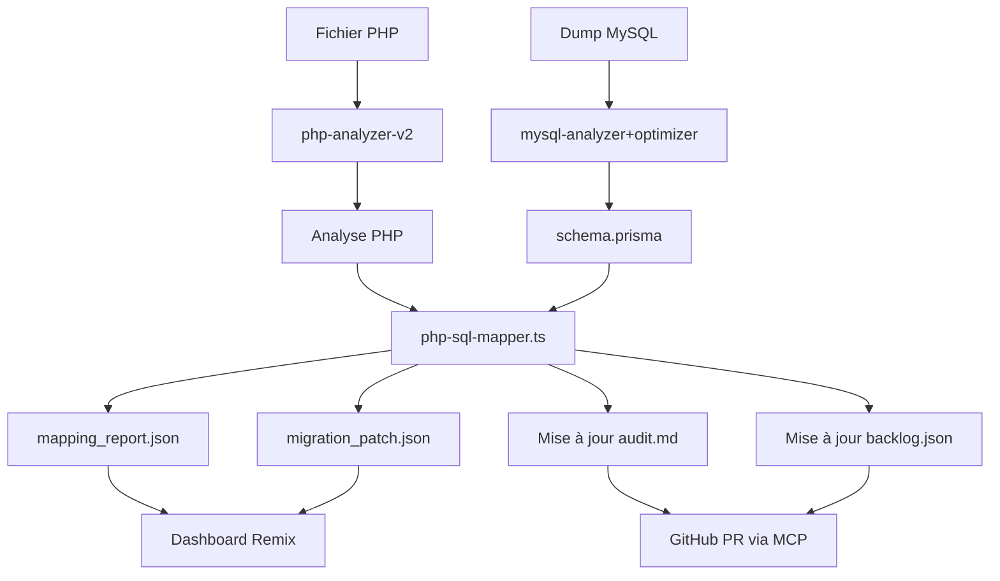

# 🧠 Agent de Mapping SQL → Code PHP

## 🎯 Objectif

Assurer une synchronisation complète entre les champs SQL utilisés dans le code PHP legacy (`$row['prix']`, `$user['email']`, etc.) et les modèles Prisma générés pour PostgreSQL. L'agent facilite ainsi l'intégration des entités Prisma dans les nouveaux services NestJS générés.

## 🔎 Fonctionnalités Clés

| Fonction | Description |
|----------|-------------|
| 🔍 Analyse statique PHP | Parse les fichiers .php pour détecter tous les champs utilisés dans les accès SQL (`$row[...]`, `fetch_assoc`, `PDO::fetch`) |
| 🧬 Matching intelligent | Compare les noms détectés aux champs Prisma (`schema.prisma`) pour trouver : exact match, alias (`user_name` ↔ `username`), champs manquants |
| ⚠️ Rapport de divergence | Génère un fichier `mapping_report.json` listant : champs manquants, renommés, en trop |
| 🔁 Suggestions de migration | Propose un fichier `migration_patch.json` listant les actions correctives à appliquer (ex: rename, add, drop) |
| 📎 Mise à jour des audits | Met à jour automatiquement les fichiers `fiche.audit.md` et `fiche.backlog.json` associés au fichier PHP analysé |

## 📂 Entrées

✅ 1 fichier PHP  
✅ schema.prisma  
✅ (optionnel) schema_map.json ou schema_migration_diff.json

## 📄 Sorties

| Fichier | Contenu |
|---------|---------|
| mapping_report.json | Liste des correspondances champ-par-champ |
| migration_patch.json | Instructions précises de synchronisation |
| fiche.audit.md | Section enrichie : champs SQL → Prisma |
| fiche.backlog.json | Mise à jour des tâches associées à la migration des champs |

## 🛠️ Exemple d'analyse

### Entrée PHP

```php
$sql = "SELECT prix_ht, prix_ttc, quantite FROM produits";
$row = mysqli_fetch_assoc($result);
$prixHT = $row['prix_ht'];
```

### Schéma Prisma

```prisma
model Produit {
  id        Int
  prixHt    Float  @map("prix_ht")
  prixTtc   Float  @map("prix_ttc")
  quantite  Int
}
```

### Rapport de mapping

```json
{
  "Produit": {
    "prix_ht": "mapped to prixHt",
    "prix_ttc": "mapped to prixTtc",
    "quantite": "mapped",
    "prix_revendeur": "⚠️ not found in PHP",
    "poids": "⚠️ not found in PHP"
  }
}
```

## 🔄 Algorithme de correspondance

L'agent utilise une approche en plusieurs étapes pour mapper les champs SQL avec Prisma:

1. **Correspondance exacte** - Recherche d'un champ avec le même nom ou attribut `@map`
2. **Correspondance conventionnelle** - Conversion snake_case → camelCase (`user_name` → `userName`)
3. **Correspondance par similarité** - Utilisation de la distance de Levenshtein pour trouver des champs similaires
4. **Détection de champs manquants** - Identification des champs PHP absents dans Prisma
5. **Détection de champs inutilisés** - Identification des champs Prisma non utilisés dans PHP

## 🔄 Intégration dans le pipeline de migration

### Flux de travail avec n8n



### Configuration n8n

```json
{
  "nodes": [
    {
      "name": "PHP File Trigger",
      "type": "n8n-nodes-base.webhook",
      "parameters": {
        "path": "analyze-php",
        "responseMode": "lastNode"
      },
      "position": [250, 300]
    },
    {
      "name": "Run php-analyzer",
      "type": "n8n-nodes-base.executeCommand",
      "parameters": {
        "command": "npx ts-node ./agents/php-analyzer-v2.ts --file={{$json.phpFile}}"
      },
      "position": [450, 300]
    },
    {
      "name": "Check Prisma Schema",
      "type": "n8n-nodes-base.executeCommand",
      "parameters": {
        "command": "npx prisma format"
      },
      "position": [450, 400]
    },
    {
      "name": "Run php-sql-mapper",
      "type": "n8n-nodes-base.executeCommand",
      "parameters": {
        "command": "npx ts-node ./agents/php-sql-mapper.ts {{$json.phpFile}} ./prisma/schema.prisma ./output"
      },
      "position": [650, 350]
    },
    {
      "name": "Notify Dashboard",
      "type": "n8n-nodes-base.httpRequest",
      "parameters": {
        "url": "https://example.com/api/update-dashboard",
        "method": "POST",
        "bodyParameters": {
          "file": "={{$json.phpFile}}",
          "action": "mapping-completed"
        }
      },
      "position": [850, 350]
    }
  ]
}
```

## 🚀 Astuce Avancée

Vous pouvez automatiser ce mapping dans le pipeline n8n en chaînant :

1. `php-analyzer-v2` → extrait les champs SQL
2. `mysql-analyzer+optimizer` → génère schema.prisma
3. `php-sql-mapper` → effectue le diff et synchronisation
4. Met à jour les tickets/priorités dans Supabase ou Notion

## 📌 Pour aller plus loin

- Activer l'analyse contextuelle dans les boucles (`foreach($rows as $row)`), pas uniquement les appels directs
- Activer un mode "auto-suggest patch" qui injecte des PR GitHub avec renommages et adaptations directement
- Intégrer une vérification des performances de requêtes et suggérer des optimisations d'index
- Ajouter un support pour l'analyse des opérations JOIN et des sous-requêtes complexes

Cet agent est essentiel dans le pipeline de migration car il assure que la nouvelle architecture Prisma/PostgreSQL préserve la cohérence avec la logique métier existante tout en apportant les avantages du typage fort et des conventions modernes.
