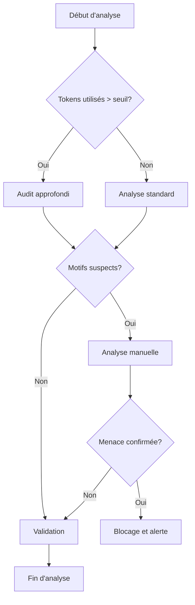

# 🛡️ Checklist bonus sécurité

## 🎯 Vue d'ensemble

Cette checklist bonus de sécurité vient compléter les mesures existantes pour garantir que le processus de migration automatisée par IA ne compromet pas la sécurité du code et de l'infrastructure. Elle couvre des aspects spécifiques liés à l'utilisation d'IA dans la migration, à la sécurité du code généré et aux vulnérabilités potentielles introduites pendant le processus.

## 📋 Checklist de sécurité IA

### Sécurité des modèles et prompts

| # | Vérification | Priorité | Fréquence | Responsable |
|---|--------------|----------|-----------|-------------|
| 1.1 | Vérifier l'absence d'injection de prompts malveillants | Critique | Chaque exécution | Responsable IA |
| 1.2 | Valider que les modèles IA sont à jour avec les correctifs de sécurité | Haute | Hebdomadaire | DevSecOps |
| 1.3 | Analyser les prompts pour détecter les tentatives d'extraction de données sensibles | Critique | Chaque exécution | Système automatisé |
| 1.4 | Vérifier l'étanchéité entre contextes utilisateurs dans les prompts | Haute | Chaque déploiement | Responsable IA |
| 1.5 | Contrôler la température des modèles pour éviter les comportements imprévisibles | Moyenne | Configuration initiale | Responsable IA |

### Vérification du code généré

| # | Vérification | Priorité | Fréquence | Responsable |
|---|--------------|----------|-----------|-------------|
| 2.1 | Scanner le code généré pour détecter des vulnérabilités OWASP Top 10 | Critique | Chaque génération | SAST automatisé |
| 2.2 | Vérifier l'injection de dépendances non autorisées | Critique | Chaque génération | Système automatisé |
| 2.3 | Analyser les motifs suspects (callbacks inhabituels, encodages, obfuscation) | Haute | Chaque génération | SAST automatisé |
| 2.4 | Valider la gestion correcte des erreurs et exceptions | Moyenne | Chaque génération | Validateur IA |
| 2.5 | Contrôler l'absence de hardcoding de secrets ou identifiants | Critique | Chaque génération | Scanner de secrets |
| 2.6 | Vérifier les potentielles fuites de mémoire ou problèmes de ressources | Moyenne | Chaque génération | Analyse statique |
| 2.7 | Analyser les requêtes SQL générées contre les injections | Critique | Chaque génération | SAST dédié SQL |
| 2.8 | Vérifier la conformité RGPD du traitement des données personnelles | Haute | Post-génération | DPO |

### Sécurité de l'infrastructure

| # | Vérification | Priorité | Fréquence | Responsable |
|---|--------------|----------|-----------|-------------|
| 3.1 | Vérifier l'isolation de l'environnement de génération | Critique | Configuration initiale | DevSecOps |
| 3.2 | Valider le principe de moindre privilège pour les agents IA | Haute | Configuration initiale | Architecte sécurité |
| 3.3 | Contrôler les accès réseau pour les systèmes IA | Haute | Quotidien | Monitoring automatisé |
| 3.4 | Vérifier le chiffrement des données en transit et au repos | Critique | Configuration initiale | Architecte sécurité |
| 3.5 | Valider la ségrégation entre environnements de dev, test et production | Haute | Configuration initiale | DevOps |
| 3.6 | Mettre en place une détection d'anomalies sur les comportements IA | Moyenne | Continu | Système SIEM |

### Gestion des identités et accès

| # | Vérification | Priorité | Fréquence | Responsable |
|---|--------------|----------|-----------|-------------|
| 4.1 | Vérifier l'authentification MFA pour tous les accès aux systèmes IA | Critique | Configuration initiale | IAM |
| 4.2 | Contrôler la rotation des clés API et tokens | Haute | Mensuel | DevSecOps |
| 4.3 | Valider les restrictions d'accès aux modèles selon les rôles | Haute | Chaque déploiement | IAM |
| 4.4 | Mettre en place un audit trail des interactions avec les systèmes IA | Moyenne | Configuration initiale | DevSecOps |
| 4.5 | Vérifier l'absence de credentials en clair dans les journaux | Critique | Continu | Monitoring automatisé |

## 🔍 Processus de vérification avancé

### Analyse de comportement du modèle

### Validation multimodèle

Pour les modules critiques, utiliser une approche de génération multimodèle:
1. Générer le code avec au moins deux modèles IA différents
2. Comparer les sorties pour détecter des divergences
3. Analyser manuellement les différences significatives
4. Rejeter la génération si des écarts de sécurité sont identifiés

## 🚨 Réponse aux incidents de sécurité IA

### Types d'incidents spécifiques

| Type d'incident | Signes d'alerte | Réponse immédiate |
|-----------------|-----------------|-------------------|
| Hallucination dangereuse | Code généré illogique ou risqué | Blacklister le pattern, isoler l'échantillon |
| Fuite de données via prompt | Informations sensibles dans les sorties | Bloquer les sorties, auditer l'historique |
| Attaque par empoisonnement | Dégradation progressive de la qualité | Restaurer les modèles, analyser le fine-tuning |
| Surpassement de contexte | Génération d'éléments hors périmètre | Renforcer les limites contextuelles |
| Contournement d'instructions | Non-respect des contraintes de sécurité | Reformuler les prompts, limiter la température |

### Procédure de réponse dédiée

1. **Détection et alerte**
   - Système automatisé de détection d'anomalies
   - Alertes temps réel aux équipes sécurité et IA

2. **Confinement**
   - Isolement du système IA concerné
   - Suspension des opérations de génération en cours
   - Sauvegarde sécurisée des logs et artefacts

3. **Analyse**
   - Examen des patterns ayant déclenché l'incident
   - Revue des prompts et paramètres utilisés
   - Identification de la cause racine

4. **Remédiation**
   - Mise à jour des guardrails et contraintes
   - Ajustement des modèles et paramètres
   - Renforcement des validations

5. **Reprise**
   - Tests de validation sur des cas sécurisés
   - Reprise progressive avec supervision renforcée
   - Surveillance accrue pendant une période déterminée

## 📊 Métriques de sécurité

### Indicateurs de performance clés (KPIs)

| Métrique | Objectif | Fréquence de mesure |
|----------|----------|---------------------|
| Taux de faux positifs sécurité | < 5% | Hebdomadaire |
| Taux de détection des vulnérabilités connues | > 98% | Par génération |
| Temps moyen de détection d'incident | < 10 minutes | Mensuel |
| Temps moyen de résolution | < 4 heures | Mensuel |
| Couverture SAST du code généré | 100% | Par génération |
| Score OWASP du code généré | > 90/100 | Par génération |

### Tableau de bord sécurité

Un tableau de bord dédié à la sécurité doit être intégré au Command Center, incluant:
- État temps réel des contrôles de sécurité
- Alertes et incidents en cours
- Métriques de tendances sur la qualité sécuritaire du code
- Cartographie des risques par module migré
- Journal d'audit des vérifications effectuées

## 🔐 Tests d'intrusion et Red Team

### Stratégie de test offensive

1. **Tests d'intrusion périodiques**
   - Simulation d'attaques sur l'infrastructure IA
   - Tentatives d'injection dans les prompts
   - Essais de détournement des modèles

2. **Exercices Red Team**
   - Scénarios d'attaque contre le pipeline de migration
   - Tentatives d'extraction de données sensibles
   - Tests d'évasion des contrôles de validation

3. **Bug Bounty interne**
   - Programme incitatif pour la découverte de failles
   - Focus sur les vulnérabilités spécifiques à l'IA
   - Récompenses proportionnelles à la criticité

## 🧩 Intégration avec les outils existants

| Outil | Intégration | Objectif |
|-------|-------------|----------|
| SonarQube | Automatique post-génération | Analyse qualité et sécurité du code |
| OWASP Dependency Check | Automatique sur les dépendances | Vérification des vulnérabilités connues |
| Vault | API sécurisée | Gestion des secrets sans exposition |
| Falco | Surveillance runtime | Détection de comportements anormaux |
| Snyk | Scan continu | Analyse de vulnérabilités en temps réel |
| Trivy | Scan conteneurs | Analyse des images Docker utilisées |

Cette checklist bonus sécurité fournit un cadre complémentaire pour garantir que la migration automatisée par IA respecte les plus hauts standards de sécurité, tout en tenant compte des vecteurs d'attaque spécifiques liés à l'utilisation de l'intelligence artificielle.
