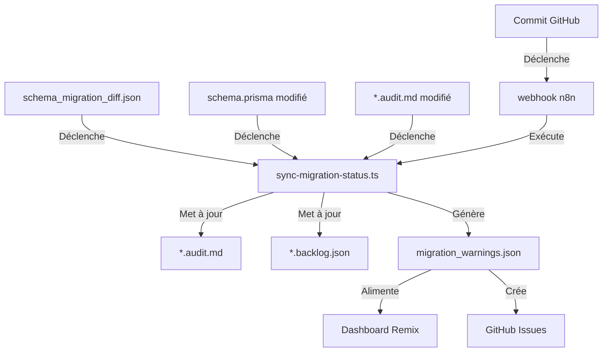

# 🔄 Système de Mise à Jour Automatique du Plan de Migration

## 🧠 Objectif

Assurer la synchronisation en temps réel entre :
- la structure de la base migrée (Prisma/PostgreSQL),
- les audits des fichiers PHP (*.audit.md),
- le backlog (*.backlog.json),
- les notifications des divergences (migration_warnings.json).

Cette synchronisation garantit une cohérence continue tout au long du processus de migration, en détectant et signalant automatiquement les divergences.

## 🛠️ Fonctionnalités principales

### ✅ 1. Mise à jour des fichiers *.audit.md

**Condition** : Lorsqu'un champ utilisé dans un fichier PHP est renommé/supprimé/modifié dans Prisma.

**Actions** :

- Annoter le champ impacté dans la section SQL du fichier audit :
  ```markdown
  - **champ**: `is_active` → 🟠 renommé en `isActive` dans Prisma
  ```

- Ajouter un bloc ⚠️ Mismatch détecté en bas du fichier :
  ```markdown
  > ⚠️ Le champ `legacy_password` n'existe plus dans le modèle Prisma.
  ```

### ✅ 2. Mise à jour du fichier *.backlog.json

**Action automatique** :

- Mettre à jour l'état du fichier :
  ```json
  {
    "file": "fiche.php",
    "status": "requires_review",
    "reason": "Schema mismatch: column legacy_password removed",
    "linkedSchema": "users"
  }
  ```

### ✅ 3. Génération du fichier migration_warnings.json

Fichier global listant tous les conflits en attente de traitement.

```json
[
  {
    "type": "removed_field",
    "file": "fiche.php",
    "table": "users",
    "column": "legacy_password",
    "action_required": "Remove usage or create fallback logic"
  },
  {
    "type": "renamed_field",
    "file": "commande.php",
    "from": "is_active",
    "to": "isActive",
    "action_required": "Refactor variable names"
  }
]
```

## 🔄 Architecture du système



## 🔁 Déclencheurs du système

Le système est déclenché par :
- Chaque modification du fichier schema_migration_diff.json
- Ou chaque commit modifiant un fichier *.audit.md ou schema.prisma

## 💡 Astuces avancées

| Astuce | Détail |
|--------|--------|
| 📦 Tag du commit automatique | Crée un commit de synchronisation sync-schema-[timestamp] |
| 🔁 Intégration à n8n | Exécution planifiée ou déclenchée par push GitHub |
| 🧪 Ajout d'un test Jest | Vérifie que chaque audit.md est cohérent avec schema_migration_diff.json |

## 📊 Métriques de surveillance

Le système produit des métriques importantes pour surveiller l'état de la migration :

- **Taux de divergence** : % des fichiers PHP avec des divergences de schéma
- **Temps de résolution** : Délai moyen entre détection et correction d'une divergence
- **Impact potentiel** : Score calculé en fonction de la criticité des fichiers impactés

Ces métriques sont disponibles via le dashboard Remix et peuvent être exportées pour les rapports d'avancement.

## 🔄 Processus d'intégration continue

1. **Détection** : Le système détecte une divergence de schéma
2. **Notification** : Mise à jour des fichiers d'audit et de backlog
3. **Communication** : Création d'un ticket GitHub ou notification Slack
4. **Résolution** : Le développeur résout la divergence
5. **Vérification** : Le système valide automatiquement la résolution
6. **Documentation** : Mise à jour de l'historique de migration

## 🧪 Validation et tests

Pour garantir la fiabilité du système, plusieurs niveaux de tests sont implémentés :

```typescript
// Tests de cohérence entre audit et schéma
describe('Audit-Schema Consistency', () => {
  test('All SQL fields in audit files should exist in Prisma schema', async () => {
    const auditFiles = await findAllAuditFiles();
    const schema = readPrismaSchema();
    
    for (const auditFile of auditFiles) {
      const sqlFields = extractSqlFieldsFromAudit(auditFile);
      for (const field of sqlFields) {
        expect(fieldExistsInSchema(field, schema)).toBeTruthy();
      }
    }
  });
});
```

Ce système de mise à jour automatique élimine les erreurs manuelles dans le processus de migration et garantit une cohérence entre tous les artefacts du projet.
