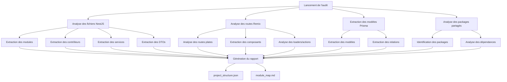
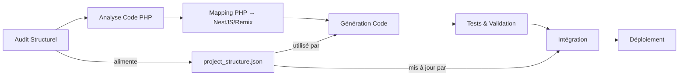

# 🔎 Audit Structurel du Projet NestJS + Remix

## 🎯 Objectifs

| But | Détail |
|-----|--------|
| 🧭 Cartographie du projet | Identifier les routes Remix, les modules NestJS, les entités Prisma, les DTOs, les composants React |
| 🏗 Compréhension de l'architecture | Clarifier la hiérarchie réelle /apps, /packages, /libs, les alias, les modules partagés |
| ⚠ Prévention des conflits | Préparer l'espace pour intégrer les blocs migrés (PHP → NestJS/Remix) sans collision de noms ou régressions de structure |

## 🧰 Méthodologie

| Outil / Technique | Usage |
|-------------------|-------|
| ts-morph | Analyse AST TypeScript pour extraire les modules NestJS, DTOs, services |
| glob + fs | Explorer récursivement les fichiers .tsx, .ts, .prisma, etc. |
| remix-flat-routes | Analyse automatique des routes Remix à partir des fichiers app/routes/**/*.tsx |
| prisma schema parser | Extraire les modèles et relations de schema.prisma |
| (optionnel) Nx/Turbo project-graph | Si dispo, extraire les dépendances croisées entre apps/packages |

## 📊 Diagramme du processus d'analyse



## 📤 Sorties Générées

### 1. project_structure.json

Structure JSON détaillée de tous les éléments détectés.

```json
{
  "backend": {
    "modules": ["UsersModule", "AuthModule", "OrdersModule"],
    "controllers": ["UsersController", "AuthController"],
    "services": ["UsersService", "MailService"],
    "dto": ["CreateUserDto", "LoginDto"]
  },
  "frontend": {
    "routes": [
      { "path": "/", "file": "app/routes/_index.tsx" },
      { "path": "/login", "file": "app/routes/login.tsx" }
    ],
    "components": ["Header", "LoginForm", "ProductList"]
  },
  "prisma": {
    "models": ["User", "Session", "Order"],
    "relations": ["User -> Session", "Order -> User"]
  },
  "shared": {
    "packages": ["ui", "config", "zod-schemas"]
  }
}
```

### 2. module_map.md

Document lisible avec tous les modules, leur rôle, et où ils se situent.

```markdown
## Backend NestJS

### ✅ UsersModule
- 📁 apps/backend/src/users/
- 🎯 Gère l'inscription, la connexion et les profils utilisateur
- 🔗 Lié à Prisma → User, Session

### ✅ OrdersModule
- 📁 apps/backend/src/orders/
- 🎯 Gère les commandes et le panier

## Frontend Remix

### 📄 /login.tsx
- Formulaire de connexion
- Utilise `useLoaderData`, `action`, `Form`, `zod`

## Shared

### `@fafa/ui`
- 📦 Composants UI réutilisables
- ✅ Utilisé dans toutes les routes Remix

### `@fafa/zod-schemas`
- 🎯 Validations communes frontend/backend
```

## 🧪 Astuces avancées

| Astuce | Détail |
|--------|--------|
| 📐 Tag automatique des dossiers critiques | Ajoutez @core, @legacy-compatible, @seo-sensitive pour les repérer dans l'UI |
| 🔄 Intégration avec dev-generator.ts | Ce fichier sera la base pour empêcher la création de doublons |
| 🧼 Détection de fichiers orphelins | Comparez les fichiers présents avec les modules déclarés pour trouver les composants inutilisés |

## 🚀 Intégration avec le pipeline de migration

L'audit structurel constitue une première étape essentielle avant de commencer la migration PHP → NestJS/Remix. Il permet de :

1. **Connaître le terrain d'arrivée** : Comprendre la structure du projet cible avant d'y injecter du nouveau code
2. **Éviter les conflits de noms** : S'assurer que les modules à migrer n'entrent pas en conflit avec l'existant
3. **Identifier les opportunités de réutilisation** : Repérer les services/composants existants qui pourraient être utilisés par le code migré
4. **Garantir la cohérence architecturale** : Respecter les patterns et conventions déjà en place

### Workflow d'intégration



## 🧠 Approche d'automatisation

L'audit structurel peut être automatisé via un script dédié (`project-structure-analyzer.ts`) qui sera exécuté :

- Au lancement du projet de migration
- À chaque ajout significatif de code
- Avant chaque intégration de code migré
- Via un hook CI/CD pour maintenir à jour la carte du projet

Le script peut également être intégré à un workflow n8n pour une exécution planifiée ou événementielle.
