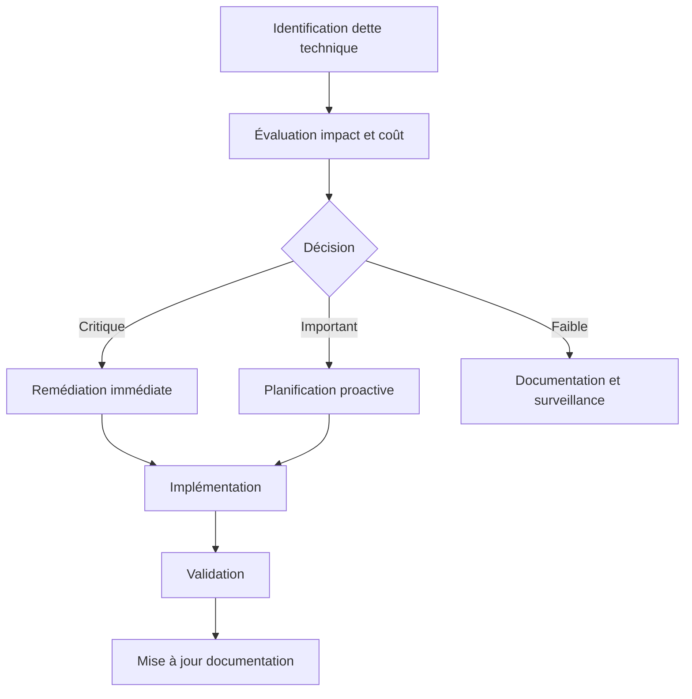
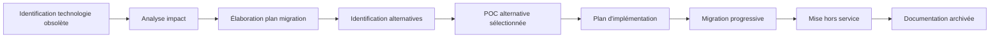

# Technologies, outils et services – état actuel et perspectives d'évolution

## 📊 État actuel de la stack technologique

### Langages de programmation

| Langage | Version | Utilisation principale | Maturité | Support LTS |
|---------|---------|------------------------|----------|------------|
| TypeScript | 5.1.x | Frontend, Backend, APIs | ★★★★★ | 2025 |
| PHP | 8.1.x | Code legacy à migrer | ★★★★☆ | 2024-11 |
| JavaScript | ES2022 | Scripts d'automation | ★★★★★ | N/A |
| Python | 3.10.x | Outils d'analyse, ML | ★★★★☆ | 2026-10 |
| SQL | N/A | Requêtes et migrations | ★★★★★ | N/A |

### Frameworks et bibliothèques

| Framework/Bibliothèque | Version | Domaine | Maturité | Perspectives |
|------------------------|---------|---------|----------|--------------|
| NestJS | 10.x | Backend API | ★★★★☆ | Évolution active |
| Remix | 2.x | Frontend | ★★★★☆ | Adoption croissante |
| React | 18.x | Composants frontend | ★★★★★ | Standard stable |
| n8n | 1.x | Automation, workflows | ★★★☆☆ | À surveiller |
| Prisma | 5.x | ORM | ★★★★☆ | Évolution active |
| Express | 4.x | API legacy | ★★★★☆ | Remplacement progressif |
| Jest | 29.x | Tests unitaires | ★★★★★ | Standard stable |
| Cypress | 12.x | Tests E2E | ★★★★☆ | Standard E2E |

### Bases de données et stockage

| Technologie | Version | Utilisation | Maturité | Perspectives |
|-------------|---------|-------------|----------|--------------|
| MongoDB | 6.0 | Base de données principale | ★★★★☆ | Maintien |
| PostgreSQL | 15.x | Données relationnelles | ★★★★★ | Expansion |
| Redis | 7.x | Cache, files d'attente | ★★★★★ | Expansion |
| MinIO | N/A | Stockage d'objets | ★★★★☆ | Maintien |
| ElasticSearch | 8.x | Recherche, logs | ★★★★☆ | Évaluation |

### Infrastructure et DevOps

| Outil/Service | Utilisation | Maturité | Perspectives |
|---------------|-------------|----------|--------------|
| Docker | Conteneurisation | ★★★★★ | Standard stable |
| GitHub Actions | CI/CD | ★★★★☆ | Expansion |
| Kubernetes | Orchestration (partiel) | ★★★☆☆ | Expansion planifiée |
| Terraform | IaC | ★★★★☆ | Adoption en cours |
| Prometheus/Grafana | Monitoring | ★★★★☆ | Expansion |
| Sentry | Tracking d'erreurs | ★★★★☆ | Maintien |

### Services externes

| Service | Utilisation | Satisfaction | Alternatives évaluées |
|---------|-------------|--------------|----------------------|
| OpenAI API | Agents IA, analyse | ★★★★☆ | Azure OpenAI, Anthropic |
| AWS S3 | Stockage backup | ★★★★★ | GCP Storage, Azure Blob |
| Vercel | Déploiement Frontend | ★★★★☆ | Netlify, Cloudflare Pages |
| Slack | Notifications, alertes | ★★★★★ | Discord, MS Teams |
| GitHub | VCS, issues, projets | ★★★★★ | GitLab, BitBucket |

## 🔄 Cycle de vie et gestion des technologies

### Politique d'adoption

Notre approche d'adoption des nouvelles technologies suit un processus en 5 étapes:

1. **Veille technologique** - Identification des technologies prometteuses
2. **Évaluation** - Tests en environnement isolé et analyse comparative
3. **Preuve de concept** - Implémentation limitée sur cas d'usage réel
4. **Adoption progressive** - Intégration sur projets non critiques
5. **Standardisation** - Adoption comme standard et documentation

### Critères d'évaluation

Chaque nouvelle technologie est évaluée selon les critères suivants:

| Critère | Pondération | Exemples de métriques |
|---------|-------------|----------------------|
| Performance | 20% | Temps de réponse, throughput, utilisation ressources |
| Maturité | 15% | Âge du projet, communauté, fréquence des releases |
| Sécurité | 20% | Vulnérabilités connues, politiques de correction |
| Maintenabilité | 15% | Qualité documentation, simplicité architecture |
| Compatibilité | 10% | Intégration avec stack existante |
| Scalabilité | 10% | Comportement sous charge, limites connues |
| Coût total | 10% | Licences, hébergement, coûts opérationnels |

### Gestion de la dette technique

## 🚀 Perspectives d'évolution

### Évolutions planifiées à court terme (0-6 mois)

| Technologie/Outil | Action | Objectif | Priorité |
|-------------------|--------|----------|----------|
| Kubernetes | Expansion | Migration complète de l'infrastructure | Haute |
| OpenTelemetry | Adoption | Amélioration observabilité | Moyenne |
| Remix v2 | Mise à jour | Utilisation des nouvelles fonctionnalités | Moyenne |
| Storybook | Adoption | Standardisation des composants UI | Faible |
| GitHub Copilot | Expansion | Déploiement à toute l'équipe | Moyenne |

### Évolutions envisagées à moyen terme (6-18 mois)

| Domaine | Évolution envisagée | Bénéfices attendus | Étape actuelle |
|---------|---------------------|-------------------|----------------|
| IA | Modèles IA spécifiques au domaine | Amélioration qualité des migrations | Évaluation |
| Infrastructure | Passage complet au GitOps | Traçabilité, répétabilité | Exploration |
| API | Adoption de GraphQL | Flexibilité des requêtes, optimisation | POC |
| Sécurité | Zero Trust Architecture | Renforcement sécurité globale | Recherche |
| Performance | Adoption de Edge Functions | Réduction latence, coûts optimisés | Veille |

### Veille technologique active

Domaines sous surveillance continue:

- **Web Assembly**: Pour optimisations performance
- **IA générative**: Nouveaux modèles et capacités
- **Edge Computing**: Déploiement en périphérie
- **Outil-as-code**: Infrastructure, tests, documentation
- **Services Serverless**: Évolutivité et coûts à la demande

## 📉 Obsolescence programmée

### Technologies en fin de vie

| Technologie | Date fin utilisation | Raison | Plan de remplacement |
|-------------|---------------------|--------|---------------------|
| PHP 7.x | Q4 2023 | Fin support sécurité | Migration vers PHP 8.1 puis TypeScript |
| jQuery | Q2 2024 | Technologies modernes disponibles | Remplacement par React/Vanilla JS |
| Express.js v4 | Q3 2024 | Architecture dépassée | Migration vers NestJS |
| Bootstrap 4 | Q1 2024 | Design System moderne requis | Migration vers Tailwind CSS |
| Jenkins | Q4 2024 | Maintenance complexe | GitHub Actions + ArgoCD |

### Processus de fin de vie

## 💡 Stratégie d'investissement technologique

### Principes directeurs

1. **Équilibre innovation/stabilité**: 70% technologies éprouvées, 30% innovation
2. **Approche cloud-native**: Priorité aux solutions conçues pour le cloud
3. **Ouverture et standards**: Préférence pour les technologies open source et standards
4. **Flexibilité d'évolution**: Éviter les solutions créant des dépendances fortes
5. **Valeur vs. tendance**: Évaluation basée sur la valeur réelle, non sur l'effet de mode

### Budget d'innovation

Allocation annuelle de 20% du temps technique à l'expérimentation et l'innovation:

- **Exploration guidée**: 40% - Technologies présélectionnées pour évaluation
- **Exploration libre**: 30% - Choix libre des équipes techniques
- **Formation**: 20% - Montée en compétence sur les technologies adoptées
- **Contribution open source**: 10% - Amélioration des outils utilisés

### Gouvernance technologique

La sélection et l'évolution des technologies sont supervisées par:

- **Comité d'architecture**: Évaluation trimestrielle de la roadmap technologique
- **Tech Radar**: Classification des technologies (Adopt, Trial, Assess, Hold)
- **Retours d'expérience**: Sessions bimestrielles de partage des leçons apprises
- **Benchmarks techniques**: Évaluations comparatives des alternatives

Cette approche structurée nous permet d'évoluer de manière mesurée et contrôlée, en tirant parti des nouvelles technologies tout en maintenant la stabilité et la qualité de notre plateforme.
