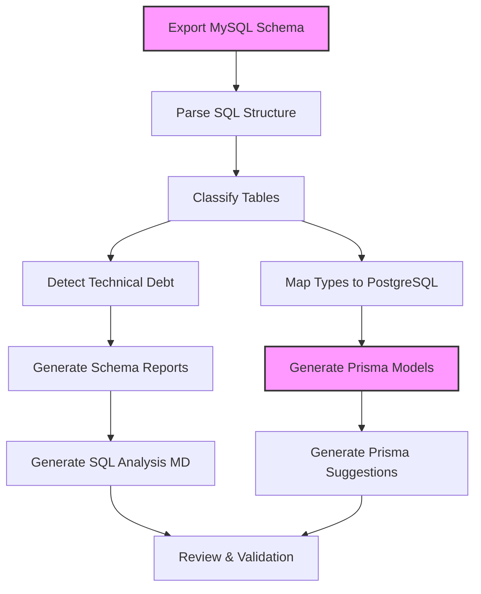
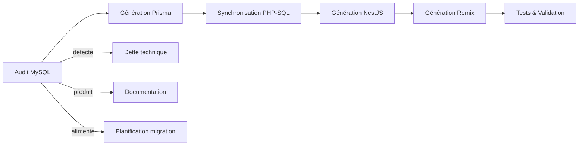

# 🔍 Audit de la base MySQL

## 🎯 Objectifs

| Cible | Description |
|-------|-------------|
| 🧼 Nettoyage & extraction propre | Exporter la structure SQL sans données pour analyse pure |
| 🧩 Détection des entités critiques | Identifier les tables liées au métier (produits, panier, commandes, SEO, etc.) |
| 🗃 Classification fonctionnelle | Séparer les entités techniques, secondaires ou obsolètes |
| 🛠 Génération du plan de migration | Produire un modèle Prisma optimisé et prêt à intégrer |

## 🧰 Méthodologie

| Étape | Outil/Recommandation |
|-------|----------------------|
| 1️⃣ Export de la structure SQL | `mysqldump --no-data -u root -p dbname > mysql_schema.sql` |
| 2️⃣ Parsing du fichier SQL | Script dédié (`sql-structure-parser.ts`) basé sur antlr ou regex structurée |
| 3️⃣ Classification | Fichier de règles (regex par nom : logs, stats, config, etc.) |
| 4️⃣ Suggestion de typage Postgres | Convertir : TINYINT → Boolean, ENUM → String, DATETIME → Timestamp |
| 5️⃣ Détection de dette SQL | Table sans PRIMARY KEY, relations implicites, VARCHAR(9999) suspect |

## 📊 Diagramme du processus d'audit



## 📤 Sorties Générées

### 1. mysql_schema_map.json

Schéma brut MySQL parsé, structuré par table, champs, types, clés.

```json
{
  "tables": {
    "AUTO_MARQUE": {
      "columns": {
        "id": "INT PRIMARY KEY",
        "libelle": "VARCHAR(255)",
        "logo": "TEXT",
        "slug": "VARCHAR(255)"
      }
    },
    "AUTO_PANIER": {
      "columns": {
        "id": "INT AUTO_INCREMENT",
        "user_id": "INT",
        "created_at": "DATETIME"
      },
      "relations": {
        "user_id": "→ USERS.id"
      }
    }
  }
}
```

### 2. mysql_to_prisma_map.json

Mapping champ à champ pour Prisma avec type cible, nom suggéré, et justification.

```json
{
  "AUTO_PANIER": {
    "id": { "prisma": "Int @id @default(autoincrement())" },
    "user_id": { "prisma": "User @relation(fields: [userId], references: [id])" },
    "created_at": { "prisma": "DateTime @default(now())" }
  }
}
```

### 3. prisma_models.suggestion.prisma

```prisma
model Panier {
  id        Int      @id @default(autoincrement())
  user      User     @relation(fields: [userId], references: [id])
  userId    Int
  createdAt DateTime @default(now())
}
```

### 4. sql_analysis.md

Audit écrit des anomalies, dettes, incohérences relationnelles, pour traçabilité humaine.

```markdown
## Audit Technique MySQL

### Problèmes détectés :
- `AUTO_GAMME` : Pas de clé primaire
- `AUTO_MARQUE.logo` : Utilise `TEXT`, peut être optimisé avec `VARCHAR(512)`
- `AUTO_PANIER.user_id` : Relation non déclarée en FK

### Suggestions :
- Remplacer `ENUM` par `VARCHAR`
- Remplacer `TINYINT(1)` par `BOOLEAN`
- Convertir `DATETIME DEFAULT 0` en `TIMESTAMP DEFAULT now()`
```

## 🧠 Classification des tables

L'analyse permet de classifier les tables en catégories selon leur fonction métier :

| Catégorie | Description | Exemples |
|-----------|-------------|----------|
| 🛒 E-commerce | Tables liées aux produits et transactions | `PRODUCTS`, `ORDERS`, `CART` |
| 👤 Utilisateurs | Gestion des utilisateurs et permissions | `USERS`, `ROLES`, `PERMISSIONS` |
| 🔍 SEO | Contenus pour le référencement | `SEO_*`, `META_*`, `REDIRECTS` |
| 📊 Statistiques | Tables d'analyse et logging | `STATS_*`, `LOGS_*` |
| ⚙️ Configuration | Paramètres système | `CONFIG_*`, `SETTINGS` |

## 🚨 Détection de dette technique SQL

L'analyse recherche automatiquement plusieurs problèmes courants :

1. **Tables sans clé primaire** - Risque d'intégrité des données
2. **Relations implicites** - Champs `*_id` sans contrainte de clé étrangère
3. **Typage inadéquat** - VARCHAR surdimensionnés, TEXT pour petites données
4. **Indexation manquante** - Colonnes fréquemment filtrées sans index
5. **Conventions de nommage incohérentes** - Mélange de styles (snake_case, CamelCase)

## 💡 Astuces avancées

| Astuce | Détail |
|--------|--------|
| 📦 Grouper les entités métier critiques | Auto-suggérer User, Product, Cart, Order, SEO_*, AUTO_* pour priorisation |
| 🧠 Refacto auto des types | Intégrer un fichier mysql_type_converter.json dans l'agent mysql-analyzer+optimizer.ts |
| 🔁 Diff automatique avec Prisma existant | Générer un schema_migration_diff.json si Prisma est déjà partiellement en place |

## 🔄 Intégration avec le pipeline de migration

L'audit MySQL s'intègre parfaitement dans le flux de travail global de migration :



Cette étape d'audit fournit les fondations solides pour une migration réussie en assurant que la nouvelle structure de données sera optimisée et corrigera les problèmes existants de la base legacy.
