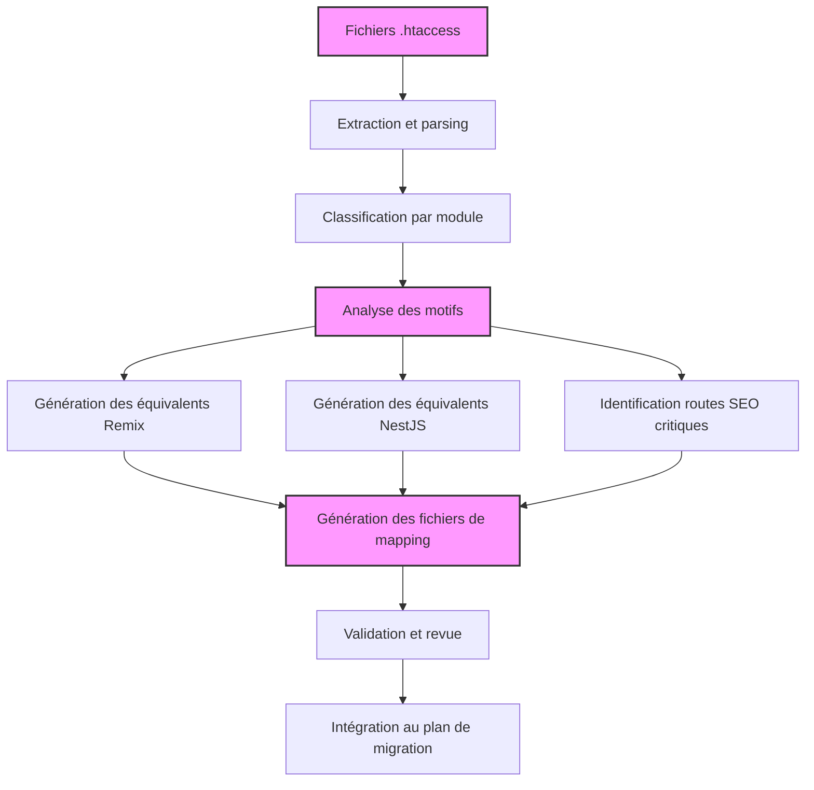

# 🔄 Analyse stratégique des règles .htaccess

## 🎯 Objectifs

| Cible | Description |
|-------|-------------|
| ✅ Centraliser toutes les règles .htaccess | Redirections (301, 302), RewriteRule, RewriteCond, ErrorDocument, IndexIgnore, etc. |
| 🔄 Migrer vers les routes modernes | Générer des équivalents Remix (routes/slug.tsx) et NestJS (@Middleware, @Controller) |
| 🧠 Préserver le SEO | Identifier les anciennes routes critiques à maintenir ou rediriger pour le SEO et le trafic existant |
| 🔐 Sécuriser les accès | Identifier les restrictions d'accès (deny, allow, auth) et les reconfigurer dans NestJS |

## 🧰 Méthodologie

| Étape | Détail |
|-------|--------|
| 📥 Extraction | Importer le fichier .htaccess (ou plusieurs s'il y a un .htaccess par module) |
| 🔍 Parsing structuré | Utiliser un parseur ou regex pour extraire : RewriteRule, Redirect, ErrorDocument, etc. |
| 🧩 Regroupement par blocs métier | Classer les règles par logique métier : SEO, Blog, Commande, Corepanel, Expéditions, etc. |
| 🔁 Traduction vers JS | Générer des routes Remix et/ou NestJS équivalentes : redirections, middlewares, erreurs, etc. |
| 🗺 Routage dynamique | Générer des routes conditionnelles modernes ($slug.tsx, /$category/$article.tsx, etc.) |
| 📎 Tracking SEO | Documenter les routes sensibles pour éviter la perte d'indexation (Google, Ahrefs, etc.) |

## 📊 Diagramme du processus d'analyse



## 📤 Sorties Générées

### 1. htaccess_map.json – Parsing brut et enrichi

```json
{
  "rules": [
    {
      "type": "RewriteRule",
      "pattern": "^corepanel/blog-([0-9]+)\\.html$",
      "target": "/blog/$1",
      "flags": ["L", "R=301"],
      "category": "blog"
    },
    {
      "type": "Redirect",
      "status": 301,
      "from": "/promo.php",
      "to": "/promotions"
    }
  ]
}
```

### 2. routing_map.json – Routes à générer ou rediriger dans Remix/NestJS

```json
{
  "remix": [
    {
      "from": "^/corepanel/blog-(\\d+)\\.html$",
      "to": "/blog/$1",
      "type": "dynamic",
      "file": "routes/blog_.$id.tsx"
    }
  ],
  "nestjs": [
    {
      "path": "/api/legacy/commandes.php",
      "controller": "LegacyCommandController",
      "middleware": ["RewriteRedirectMiddleware"]
    }
  ]
}
```

### 3. seo_routes.md – Liste des anciennes URLs critiques à préserver

```markdown
# 📈 Routes SEO Critiques

| URL legacy | Cible migrée | Action |
|------------|--------------|--------|
| /corepanel/blog-4321.html | /blog/4321 | Redirection 301 |
| /core/_seo/pieces.gamme.php?marque=peugeot&type=307 | /pieces/peugeot/307 | Route dynamique |
| /404.html | /not-found | Personnalisation error boundary |

## 🚨 Priorité : Ces routes génèrent du trafic important (logs Nginx + Ahrefs)
```

## 🧩 Types de règles traités

L'analyse prend en compte plusieurs types de règles .htaccess courantes :

| Type de règle | Exemple Apache | Équivalent Remix/NestJS |
|---------------|----------------|--------------------------|
| RewriteRule | `RewriteRule ^article-([0-9]+)\.html$ /articles.php?id=$1 [L]` | Route dynamique `routes/article.$id.tsx` |
| RewriteCond + Rule | Conditions multiples | Routes avec Loader/middleware conditionnel |
| Redirect | `Redirect 301 /old.html /new` | Redirections dans routes.tsx ou Controller |
| ErrorDocument | `ErrorDocument 404 /error404.html` | Error Boundary Remix + Exception Filter NestJS |
| Authorization | `Require valid-user` | AuthGuard NestJS + Remix authenticated route |

## 🧠 Classification et priorisation des règles

Une classification efficace des règles permet de prioriser les migrations :

### Par impact métier

- **Critique** - Routes utilisées quotidiennement, fortes conversions
- **Important** - Pages SEO, contenus indexés
- **Standard** - Routes administratives, fonctionnalités secondaires
- **Faible** - Anciens chemins, rarement utilisés

### Par impact SEO

- **Tier 1** - URLs indexées avec backlinks externes (priorité maximale)
- **Tier 2** - URLs indexées sans backlinks significatifs
- **Tier 3** - URLs internes non indexées

## 💡 Astuces avancées

| Astuce | Description |
|--------|-------------|
| 📦 Centralisez les fichiers .htaccess par module | Blog, SEO, Panier, Corepanel – pour faciliter le mapping métier |
| 🧠 Ajoutez une pondération SEO par route | Basée sur les accès logs (Googlebot, referrers, backlinks) pour prioriser |
| 🧰 Générateur Remix Ready | Créez automatiquement les fichiers Remix route.$slug.tsx à partir du routing_map.json |
| 🔁 Ajoutez un composant `<CanonicalLink>` dans les pages migrées | Pour chaque route issue d'une redirection |

## 🔄 Intégration dans le pipeline de migration

L'analyse des règles .htaccess s'insère efficacement dans le pipeline global de migration :

1. **Identification** : Localisation de tous les fichiers .htaccess dans le projet
2. **Analyse** : Génération des mappings via htaccess-router-analyzer.ts
3. **Classification** : Regroupement et priorisation des règles
4. **Génération** : Création des routes Remix et contrôleurs NestJS
5. **Validation SEO** : Vérification des redirections pour préserver le SEO
6. **Intégration** : Ajout des routes générées au projet cible

Cette étape est critique pour assurer une transition fluide du système de routage, tout en préservant le capital SEO existant et les fonctionnalités d'accès.
