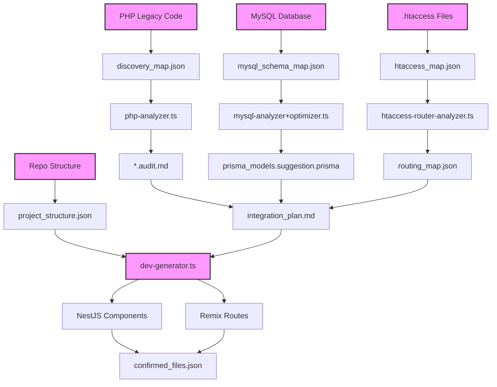

# 🔄 Sorties Croisées du Pipeline de Migration IA

## 📊 Vue d'ensemble

Le pipeline de migration génère plusieurs fichiers intermédiaires qui s'alimentent mutuellement pour former un système cohérent et traçable. Cette orchestration garantit que chaque étape du processus dispose des informations nécessaires provenant des étapes précédentes.

## 📑 Fichiers clés et leurs interconnexions

| Fichier | Contenu | Utilité pour l'intégration |
|---------|---------|----------------------------|
| `discovery_map.json` | Fichiers PHP classés par priorité (complexité, SEO, impact métier) | Guide l'ordre de traitement par les agents php-analyzer et dev-generator |
| `project_structure.json` | Architecture actuelle du monorepo : modules Remix/NestJS, packages, entités | Aligne les composants générés (Remix + NestJS) sur la structure existante |
| `mysql_schema_map.json` | Extraction de la structure SQL MySQL (tables, types, relations) | Sert de base à la génération du schema.prisma |
| `prisma_models.suggestion.prisma` | Modèle Prisma suggéré, optimisé pour PostgreSQL | Base d'intégration dans NestJS (@InjectRepository()) |
| `htaccess_map.json` | Règles de réécriture, redirections, SEO issues du .htaccess | Alimente routing_patch.json pour générer les routes Remix/NestJS ou middleware |
| `integration_plan.md` | Plan d'intégration par bloc PHP (fichier, dépendances, modules cibles, contraintes SEO) | Feuille de route précise, agent par agent, avec tous les liens vers les fichiers générés |

## 🔄 Flux de données entre fichiers



## 📋 Détail des interconnexions

### De PHP Legacy à Remix/NestJS

1. **Chemin SQL → Prisma → NestJS**:
   - `mysql_schema_map.json` -> `prisma_models.suggestion.prisma` -> `*.service.ts` dans NestJS
   - Les entités du modèle Prisma sont utilisées pour générer les services et repositories NestJS

2. **Chemin PHP → Audit → Composants**:
   - `*.audit.md` -> `php_sql_links.json` -> `*.controller.ts` et `*.tsx` (Remix)
   - L'audit du code PHP permet d'extraire la logique métier et les accès SQL

3. **Chemin htaccess → Routing → Remix Routes**:
   - `htaccess_map.json` -> `routing_map.json` -> routes dans Remix et contrôleurs NestJS
   - Les règles de redirection et de réécriture sont transformées en routes modernes

4. **Chemin structure → architecture finale**:
   - `project_structure.json` influence la structure des composants générés
   - Les nouveaux composants suivent l'architecture existante du monorepo

## 💡 Recommandations avancées

### 1. Orchestration via n8n

Reliez ces fichiers via n8n pour automatiser la synchronisation entre agents:
- Si `schema_map.json` change, re-déclencher `sync-mapper.ts`
- Si `routing_map.json` change, régénérer les routes Remix
- Si `*.audit.md` est modifié, mettre à jour les tâches de backlog

```json
{
  "trigger": {
    "type": "watch_file",
    "path": "schema_migration_diff.json"
  },
  "actions": [
    {
      "name": "Run sync-mapper",
      "command": "tsx agents/sync-mapper.ts"
    },
    {
      "name": "Update backlog",
      "command": "tsx agents/update-backlog.ts"
    }
  ]
}
```

### 2. Dashboards Remix pour suivi

Utilisez `project_structure.json`, `integration_plan.md` et `confirmed_files.json` pour générer une interface de suivi par migration:

```tsx
// Exemple d'une route dashboard.tsx Remix
import { useLoaderData } from "@remix-run/react";
import { json } from "@remix-run/node";
import { getIntegrationStatus } from "~/services/migration.server";

export async function loader() {
  const status = await getIntegrationStatus();
  return json(status);
}

export default function MigrationDashboard() {
  const data = useLoaderData<typeof loader>();
  
  return (
    <div className="p-6">
      <h1 className="text-2xl font-bold mb-6">Migration Dashboard</h1>
      
      <div className="stats-overview grid grid-cols-4 gap-4 mb-6">
        <StatCard 
          title="Total Files" 
          value={data.totalFiles} 
          color="blue" 
        />
        <StatCard 
          title="Migrated" 
          value={data.migratedFiles} 
          color="green" 
          percentage={data.migratedPercentage}
        />
        <StatCard 
          title="In Progress" 
          value={data.inProgressFiles} 
          color="yellow" 
        />
        <StatCard 
          title="Pending" 
          value={data.pendingFiles} 
          color="gray" 
        />
      </div>
      
      <div className="modules-progress mb-6">
        <h2 className="text-xl font-semibold mb-3">Modules Progress</h2>
        <ModulesProgressTable modules={data.moduleProgress} />
      </div>
      
      <div className="recent-migrations">
        <h2 className="text-xl font-semibold mb-3">Recent Migrations</h2>
        <RecentMigrationsTable migrations={data.recentMigrations} />
      </div>
    </div>
  );
}
```

### 3. Traçabilité

Chaque fichier généré est versionné avec:
- Horodatage
- Lien PR GitHub
- Référence aux fichiers legacy analysés

Cela permet de tracer l'origine de chaque composant et de comprendre les décisions de migration.

### 4. CI/CD

En cas de modification détectée dans `schema.prisma` ou `*.tsx`, déclencher automatiquement:
- Les tests via `ci-tester.ts`
- La validation des contraintes via `schema-validator.ts`
- La mise à jour du backlog via `update-backlog.ts`

```yaml
# Exemple de workflow GitHub Actions
name: Validate Migration Changes

on:
  pull_request:
    paths:
      - 'prisma/schema.prisma'
      - 'app/routes/**/*.tsx'
      - 'apps/backend/src/**/*.ts'

jobs:
  validate:
    runs-on: ubuntu-latest
    steps:
      - uses: actions/checkout@v3
      - uses: actions/setup-node@v3
        with:
          node-version: '18'
      
      - name: Install dependencies
        run: npm ci
      
      - name: Run schema validation
        run: npx tsx tools/schema-validator.ts
      
      - name: Run tests
        run: npx tsx tools/ci-tester.ts
      
      - name: Update backlog
        run: npx tsx agents/update-backlog.ts
```

## 🔁 Cycle de vie des sorties de pipeline

Pour garantir la fraîcheur et la pertinence des données, un cycle de vie est appliqué à chaque fichier généré:

1. **Génération**: Création initiale par l'agent correspondant
2. **Validation**: Vérification automatique + revue humaine facultative
3. **Intégration**: Utilisé comme entrée pour d'autres agents
4. **Mise à jour**: Régénération lorsque les dépendances changent
5. **Archivage**: Conservation dans l'historique après utilisation

Ce cycle garantit que les modifications en cascade sont correctement propagées dans tout le pipeline de migration.

## 🚀 Avantages du croisement des sorties

L'interconnexion des différentes sorties du pipeline offre plusieurs avantages:

1. **Cohérence** - Garantit l'alignement entre tous les aspects de la migration
2. **Traçabilité** - Permet de suivre l'origine de chaque décision de migration
3. **Automatisation** - Facilite la détection des impacts en cascade
4. **Visibilité** - Offre une vue d'ensemble claire du statut de la migration
5. **Qualité** - Réduit les risques d'incohérence entre les différentes parties

Cette approche systématique et interconnectée est essentielle pour gérer la complexité d'une migration à grande échelle tout en maintenant une qualité et une cohérence élevées.
