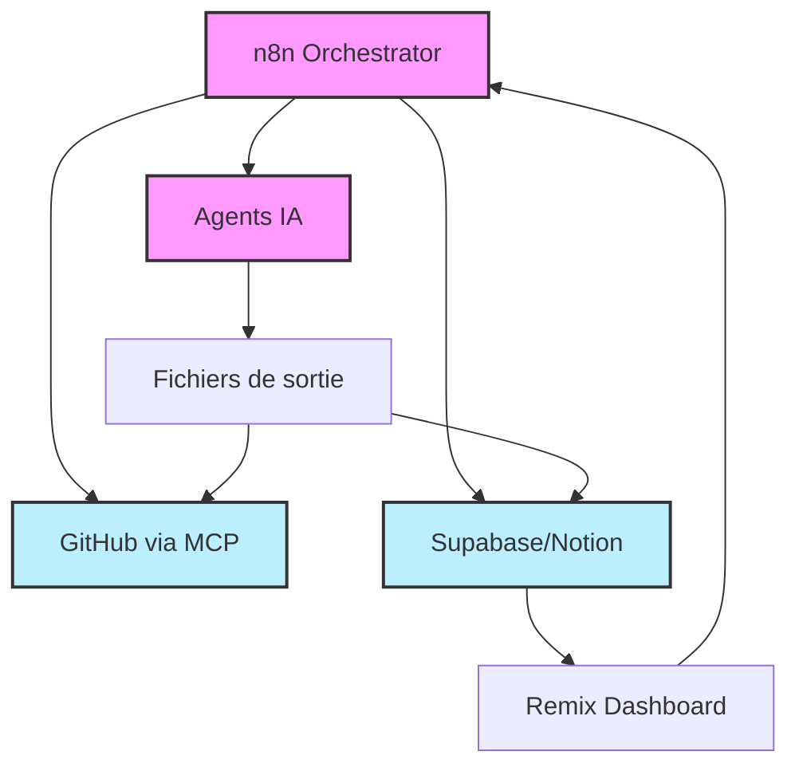
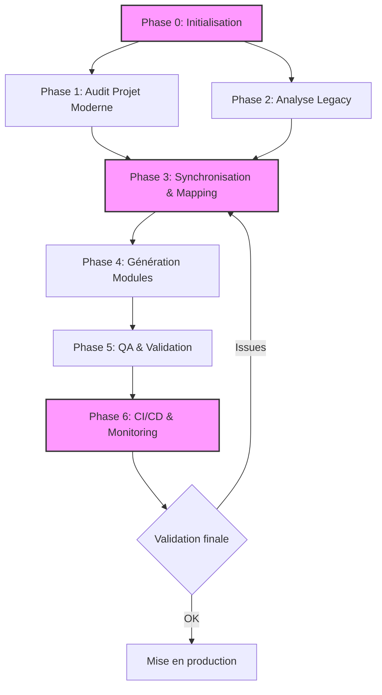

# 🧠 Architecture du Système de Migration IA Distribué

Ce document présente l'architecture complète du système de migration IA pour passer de PHP/MySQL à NestJS + Remix + PostgreSQL, avec Prisma, n8n, MCP, et une traçabilité complète.

## 🌐 Architecture Globale – IA Distribuée & Orchestrée

| Composant | Rôle | Technologies / Sorties |
|-----------|------|------------------------|
| n8n | Orchestration de tous les agents | Triggers (cron, push, manuel), workflows modulaire |
| MCP | Intégration GitHub | PRs, commits, liens avec les audits |
| Supabase / CSV / Notion | Suivi de migration (statuts, logs, scores) | Exports centralisés |
| Remix Dashboard (optionnel) | Interface UI de pilotage migration | Visualisation des statuts, SEO, tests |



## 📦 Phase 0 – Initialisation & Sécurisation

| Étape | Action | Sortie |
|-------|--------|--------|
| 0.1 | Geler code PHP (git tag) | legacy-vFinal.bundle |
| 0.2 | Exporter base MySQL | mysql.sql.gz + hash.sha256 |
| 0.3 | Sauvegarder .htaccess | htaccess.original |
| 0.4 | Verrouiller stack Docker | docker-compose.lock.yml |

> ✅ **Astuce**: Utilisez Docker Compose + Digests pour des versions immuables.

## 🔍 Phase 1 – Audit du Projet Moderne (NestJS/Remix)

| Agent | Fonction | Sorties |
|-------|----------|---------|
| monorepo-analyzer.ts | Structure, style, modules détectés | project_structure.json, code_style_profile.json |
| eslint-parser, tailwind-scanner | Configs ESLint, Tailwind | eslint_rules.json, tailwind_tokens.json |

## 🧬 Phase 2 – Analyse Legacy PHP + MySQL

| Agent | Objectif | Sorties |
|-------|----------|---------|
| legacy-discovery.ts | Tri des fichiers PHP prioritaires | discovery_map.json, priority_list.csv |
| php-analyzer.ts | Audit de chaque fichier PHP | fiche.audit.md, fiche.impact_graph.json |
| mysql-analyzer.ts | Migration MySQL → Prisma | schema_map.json, prisma_models.suggestion.prisma |
| htaccess-analyzer.ts | Règles SEO, redirections | htaccess_map.json, routing_patch.json |

## 🔄 Phase 3 – Synchronisation & Mapping

| Agent | Objectif | Sorties |
|-------|----------|---------|
| sync-mapper.ts | Lier SQL ↔ Prisma ↔ DTOs | migration_patch.json, php_sql_links.json |
| routing-sync.ts | Routes PHP ↔ Remix | url_redirection_map.json, canonical_map.json |
| slug-preserver.ts | Préserver les slugs SEO | slug_map.json |

## ⚙️ Phase 4 – Génération Automatisée de Modules

| Agent | Objectif | Sorties |
|-------|----------|---------|
| dev-generator.ts | Créer modules NestJS + Remix | *.ts, *.tsx, dto.ts, controller.ts |
| seo-meta-generator.ts | SEO enrichi | seo_meta.json |
| remix-loader-builder.ts | Loaders, meta Remix | loader.ts, meta.ts |
| prisma-adapter.ts | Adapter modèles | patch.prisma, model_map.json |

## ✅ Phase 5 – QA & Validation

| Agent | Objectif | Sorties |
|-------|----------|---------|
| test-writer.ts | Génère tests unitaires + E2E | *.spec.ts, *.e2e.ts |
| diff-validator.ts | Compare PHP ↔ NestJS | verification_report.json |
| qa-checklist.ts | Checklist QA automatique | fiche.qa.md |
| migration-confirm.ts | Marque comme validé | confirmed_files.json |

## 🚀 Phase 6 – CI/CD & Monitoring

| Agent | Objectif | Sorties |
|-------|----------|---------|
| ci-tester.ts | Génère pipeline GitHub Actions | .github/workflows/ci.yml |
| devops-preview.ts | Déploiement preview (Coolify/Caddy) | URL preview |
| monitoring-check.ts | Vérification SEO + Web Vitals | monitoring_report.json |

## 🧠 Agents IA Améliorés (v2)

| Agent | Spécificité IA | Notes |
|-------|----------------|-------|
| legacy-discovery-LLM | Pondération SEO, logs, complexité | priorise migration |
| php-analyzer-v2 | Analyse multidimensionnelle | intègre PHPStan |
| mysql-analyzer+optimizer | Détection dettes SQL | typage Postgres optimal |
| htaccess-router-analyzer | Conversion intelligente | vers routes Remix/NestJS |
| component-generator | Génère UI + back alignée | conforme audit |
| seo-checker+canonical | SEO audit + validation Lighthouse | structuré |
| mcp-integrator | Liaison GitHub automatisée | PR + CI/CD liés |

## 🔗 Fichiers de Sortie Croisés

| Fichier | Rôle |
|---------|------|
| discovery_map.json | Priorité fichiers PHP |
| project_structure.json | Structure monorepo |
| schema_migration_diff.json | Différences SQL/Prisma |
| integration_plan.md | Guide d'intégration des blocs |
| migration_patch.json | Champs modifiés + mapping |
| url_redirection_map.json | Routes PHP → Remix |
| fiche.audit.md, fiche.qa.md | Audit détaillé, QA |
| confirmed_files.json | Modules validés |
| monitoring_report.json | SEO + Web Vitals |
| dashboard.tsx (optionnel) | UI de suivi de migration |

## 🔄 Flux de données entre les phases



## 🧩 Bonus : Synchronisation Continue Automatisée

Le système implémente une synchronisation continue qui assure la cohérence de bout en bout:

- Mise à jour des audits .audit.md en cas de changement SQL détecté
- Versionnage automatique des diffs SQL + modèles Prisma
- Notifications migration_warnings.json générées dynamiquement
- Lien fort entre backlog, modèle de données, et composants générés

### Workflow n8n de synchronisation

```json
{
  "name": "Sync on Schema Change",
  "nodes": [
    {
      "parameters": {
        "path": "schema.prisma",
        "event": "change"
      },
      "name": "Watch Prisma Schema",
      "type": "n8n-nodes-base.watchFiles",
      "position": [250, 300]
    },
    {
      "parameters": {
        "command": "npm run sync-agents"
      },
      "name": "Run Sync Script",
      "type": "n8n-nodes-base.executeCommand",
      "position": [450, 300]
    },
    {
      "parameters": {
        "url": "https://api.github.com/repos/owner/repo/dispatches",
        "authentication": "genericCredentialType",
        "genericAuthType": "httpHeaderAuth",
        "sendQuery": false,
        "sendBody": true,
        "bodyParameters": {
          "event_type": "schema_updated",
          "client_payload": {
            "timestamp": "={{ $now }}"
          }
        }
      },
      "name": "Trigger GitHub Actions",
      "type": "n8n-nodes-base.httpRequest",
      "position": [650, 300]
    }
  ]
}
```

Cette architecture complète garantit une migration robuste, traçable et progressive de PHP/MySQL vers l'écosystème moderne NestJS + Remix + PostgreSQL.
