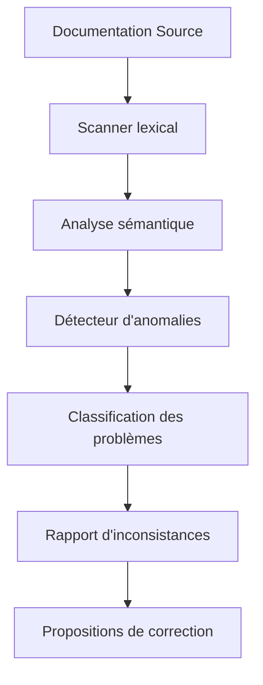
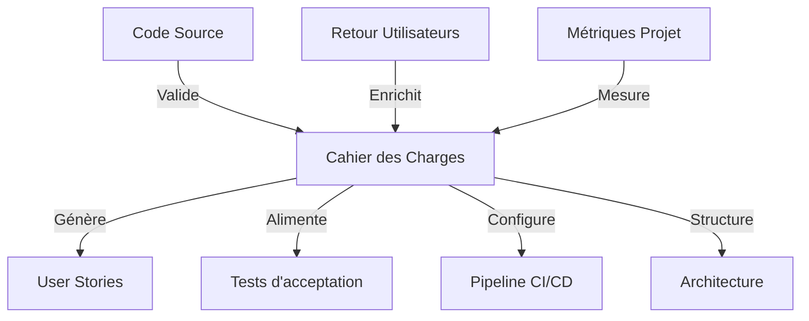
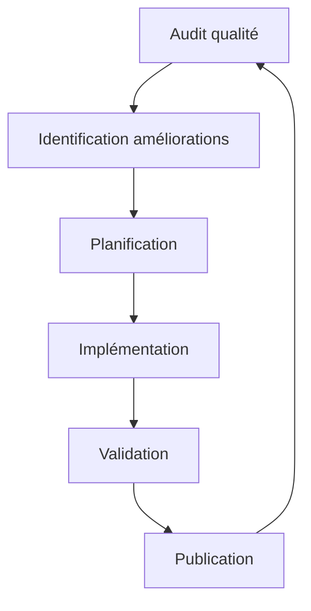

# Méthodologie d'amélioration continue

## 🔍 Vue d'ensemble

Cette section établit un cadre méthodologique pour l'amélioration constante du cahier des charges, garantissant sa progression vers l'excellence et son maintien au niveau d'un projet professionnel industrialisable.

## 🏗️ Renforcement de la structure

### Analyse structurelle automatisée

Un processus automatisé évalue régulièrement la structure du cahier des charges:

```typescript
interface StructuralAnalysisResult {
  coherenceScore: number;      // 0-100
  hierarchyDepth: number;      // Profondeur moyenne des sections
  crossReferenceCount: number; // Liens internes entre sections
  balanceScore: number;        // Équilibre entre sections
  recommendations: string[];   // Suggestions d'amélioration
}

function analyzeStructure(documents: Document[]): StructuralAnalysisResult {
  // Analyse de la cohérence entre sections
  // Évaluation de la hiérarchie et des références croisées
  // Calcul des métriques d'équilibre
  // Génération de recommandations
}
```

### Principes de structuration

1. **Hiérarchie cohérente** - Organisation pyramidale claire
2. **Modularité** - Sections autonomes mais interconnectées
3. **Progression logique** - Flux naturel de l'information
4. **Traçabilité** - Liens explicites entre exigences, architecture et implémentation

### Actions de renforcement

- Audit trimestriel de structure avec rapport d'amélioration
- Refactoring des sections déséquilibrées ou incohérentes
- Optimisation des liens entre sections interdépendantes
- Standardisation des modèles et formats par type de section

## 🛠️ Correction des failles et incohérences

### Détection systématique

Un pipeline de validation identifie proactivement:

- **Contradictions** - Affirmations incompatibles entre sections
- **Ambiguïtés** - Formulations imprécises ou sujettes à interprétation
- **Obsolescence** - Informations dépassées non alignées avec l'état actuel
- **Incomplétude** - Sections partiellement documentées



### Processus de résolution

1. **Identification** - Détection automatique ou manuelle
2. **Classification** - Catégorisation par type et sévérité
3. **Analyse d'impact** - Évaluation des ramifications
4. **Résolution** - Correction avec traçabilité de la décision
5. **Validation** - Vérification de la cohérence post-correction

### Matrice de priorisation

| Sévérité \ Impact | Localisé | Multiple | Global |
|-------------------|----------|----------|--------|
| **Critique**      | Priorité 2 | Priorité 1 | Priorité 1 |
| **Majeure**       | Priorité 3 | Priorité 2 | Priorité 1 |
| **Mineure**       | Priorité 4 | Priorité 3 | Priorité 2 |

## 📑 Complétion avec rigueur

### Identification des lacunes

Un système d'analyse de complétude évalue chaque section selon:

- **Couverture fonctionnelle** - Tous les aspects métier abordés
- **Profondeur technique** - Niveau de détail suffisant pour l'implémentation
- **Justification des choix** - Documentation des décisions et alternatives
- **Métriques et critères** - Éléments mesurables pour validation

### Normes de complétion

Pour chaque type de section, des critères spécifiques définissent la complétude:

| Type de section | Critères de complétude |
|----------------|------------------------|
| Architecture | Diagrammes, interfaces, patterns, alternatives considérées |
| Exigences | Cas d'utilisation, critères d'acceptation, priorisation |
| Infrastructure | Topologie, dimensionnement, résilience, sécurité |
| Migration | Étapes, validations, rollback, préservation des données |

### Méthodologie d'enrichissement ciblé

1. **Analyse de gaps** - Identification des informations manquantes
2. **Recherche documentaire** - Collecte d'informations additionnelles
3. **Consultation d'experts** - Validation par des spécialistes
4. **Documentation structurée** - Intégration cohérente dans le cahier
5. **Revue par les pairs** - Validation de la complétude et pertinence

## 🚀 Élévation vers un niveau professionnel industrialisable

### Caractéristiques d'excellence visées

- **Automatisation complète** - Génération, validation et maintenance assistées
- **Versionning sémantique** - Gestion claire des évolutions documentaires
- **Tests documentaires** - Validation de la conformité et cohérence
- **Dérivation d'artefacts** - Génération de livrables spécialisés
- **Métriques de qualité** - Évaluation objective et continue

### Intégration dans l'écosystème de développement



### Plan d'industrialisation

| Phase | Objectif | Livrables |
|-------|----------|-----------|
| 1 - Normalisation | Standardisation complète | Templates, glossaire, conventions |
| 2 - Outillage | Mise en place des outils | Scripts, validators, linters |
| 3 - Automatisation | Automatisation des processus | Pipelines, hooks, générateurs |
| 4 - Intégration | Alignement avec DevOps | APIs, webhooks, dérivation |
| 5 - Optimisation | Amélioration continue | Métriques, analytics, feedback loops |

### Métriques d'excellence

Nous suivons ces indicateurs pour mesurer le niveau d'excellence:

- **Documentation Maturity Model (DMM)** : Niveau 4 minimum (Optimisé)
- **Taux d'utilisation effective** : >90% (mesure d'utilité perçue)
- **Précision technique** : >99% d'exactitude vérifiable
- **Légèreté cognitive** : Temps d'assimilation <30min pour développeurs
- **Actualité** : <7 jours d'écart avec la réalité du projet

## 🔄 Processus continu d'amélioration

### Cycle d'évolution documentaire



### Gouvernance documentaire

- **Comité de qualité** : Revue trimestrielle des standards
- **Responsable documentation** : Garant de l'excellence continue
- **Contributeurs** : Formation aux bonnes pratiques
- **Automation** : Amélioration constante des outils d'assistance

En appliquant rigoureusement cette méthodologie, nous garantissons que le cahier des charges évolue continuellement vers l'excellence, constituant une base solide pour le développement industrialisé du projet.
