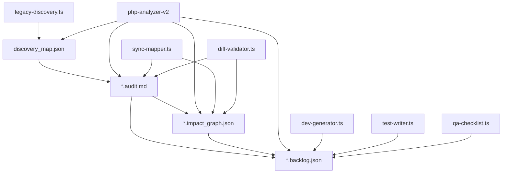

# 🔄 Base Commune Synchronisée – Fichiers Partagés par Tous les Agents IA

## 📝 Vue d'ensemble

La Base Commune Synchronisée constitue le fondement de l'écosystème de migration IA, garantissant que tous les agents travaillent sur des données cohérentes. Ces fichiers servent de source unique de vérité pour l'ensemble du processus de migration.

## 🗂️ Fichiers principaux

| 🗂️ Fichier | 🧠 Rôle | 🔄 Mise à jour par |
|------------|---------|-------------------|
| discovery_map.json | Liste de tous les fichiers PHP classés par priorité (complexité, SEO, fréquence) | legacy-discovery.ts, php-analyzer-v2 |
| *.audit.md | Rapport d'audit pour chaque fichier PHP : logique métier, SQL, dépendances, erreurs détectées | php-analyzer-v2, sql-analyzer, sync-mapper.ts, diff-validator.ts |
| *.backlog.json | Liste des tâches de migration pour chaque fichier (DTO à générer, controller, tests, redirections, etc.) | php-analyzer-v2, dev-generator.ts, test-writer.ts, qa-checklist.ts |
| *.impact_graph.json | Graphique des dépendances inter-modules, impacts croisés (ex : un fichier modifiant 3 modèles Prisma) | php-analyzer-v2, sync-mapper.ts, diff-validator.ts |

## 📊 Structure et interdépendances



## 🔁 Mise à jour continue

Tous ces fichiers sont :

- 🧠 **Lus comme source de vérité** pour adapter la génération
- ✍️ **Modifiés dès qu'un changement est détecté** dans la base SQL, le code PHP, ou les modèles Prisma
- 📤 **Poussés automatiquement via MCP** dans le repo GitHub lié (avec versionnement)

## 📝 Détail des fichiers

### discovery_map.json

Ce fichier index tous les fichiers PHP du projet legacy et leur attribue une priorité de migration.

```json
{
  "metadata": {
    "generated_at": "2025-05-10T14:30:00Z",
    "version": "1.2.0",
    "total_files": 427
  },
  "files": [
    {
      "path": "src/panier/checkout.php",
      "priority": "high",
      "complexity": 0.87,
      "seo_impact": "low",
      "access_frequency": "very_high",
      "dependencies": ["src/user/auth.php", "src/db/orders.php"],
      "tags": ["e-commerce", "payment", "critical"]
    },
    {
      "path": "src/produits/fiche.php",
      "priority": "high",
      "complexity": 0.65,
      "seo_impact": "very_high",
      "access_frequency": "very_high",
      "dependencies": ["src/db/products.php", "src/seo/meta.php"],
      "tags": ["product", "seo", "critical"]
    }
    // ... autres fichiers
  ],
  "modules": {
    "e-commerce": ["src/panier/*", "src/checkout/*"],
    "products": ["src/produits/*", "src/categories/*"],
    "user": ["src/user/*", "src/account/*"],
    "seo": ["src/seo/*", "src/_seo/*"]
  }
}
```

### exemple-fichier.audit.md

Ce fichier analyse en profondeur chaque fichier PHP et documente son fonctionnement, ses dépendances et ses accès SQL.

```markdown
---
file: src/produits/fiche.php
analyzed_at: 2025-05-10T15:22:37Z
analyzer_version: 2.3.0
priority: high
status: pending_migration
tags: [product, seo, mysql, template]
---

# Audit: src/produits/fiche.php

## Summary

Ce fichier gère l'affichage des fiches produit avec les caractéristiques, images et prix. Il possède des optimisations SEO et des fonctionnalités de variantes.

## Dependencies

- External Libraries:
  - Smarty (template engine)
  - PHPMailer (notifications stock)

- Project Files:
  - `../db/products.php` - Accès à la base de données produits
  - `../seo/meta.php` - Génération des balises meta
  - `../panier/add.php` - Ajout au panier

## SQL Queries

```php
// Line 34
$sql = "SELECT p.*, c.nom as categorie_nom 
        FROM produits p 
        JOIN categories c ON p.categorie_id = c.id 
        WHERE p.slug = ?";
$stmt = $db->prepare($sql);
$stmt->execute([$slug]);
$product = $stmt->fetch(PDO::FETCH_ASSOC);
```

```php
// Line 76
$sql = "SELECT * FROM produit_images WHERE produit_id = ? ORDER BY position ASC";
$stmt = $db->prepare($sql);
$stmt->execute([$product['id']]);
$images = $stmt->fetchAll(PDO::FETCH_ASSOC);
```

## Logic Blocks:

1. **Initialisation**: Lines 10-25
   Validation des paramètres d'entrée et configuration initiale.

2. **Récupération produit**: Lines 30-45
   Récupération du produit depuis la base avec sa catégorie.

3. **Gestion 404**: Lines 47-55
   Redirection ou 404 si le produit n'existe pas.

4. **Récupération images**: Lines 75-85
   Chargement des images produit et génération des thumbnails.

5. **SEO Optimization**: Lines 90-110
   Génération des meta tags, canonical URL, microdata et rich snippets.

6. **Rendu template**: Lines 115-130
   Préparation et rendu du template Smarty avec toutes les données.

## SEO Impact Analysis:

- URLs importantes: `/produit/{slug}`
- Meta tags générés: title, description, keywords, canonical
- Schema.org: Product, Offer, AggregateRating
- Balises OpenGraph présentes
- Meta viewport correcte

## Recommendations:

- Migrer vers un controller NestJS ProductController
- Créer un components/ProductDetail.tsx dans Remix
- Préserver la route `/produit/{slug}` pour le SEO
- Ajouter un routage 404 personnalisé
- Conserver les balises meta et Schema.org
```

### exemple-fichier.backlog.json

Ce fichier liste toutes les tâches de migration nécessaires pour un fichier PHP donné.

```json
{
  "file": "src/produits/fiche.php",
  "status": "in_progress",
  "analyzer_version": "2.3.0",
  "updated_at": "2025-05-11T09:15:22Z",
  "priority": "high",
  "progress": 0.35,
  "tasks": [
    {
      "id": "task-001",
      "type": "prisma_model",
      "description": "Créer modèle Prisma Product complet avec relations Category et Image",
      "status": "completed",
      "target_file": "prisma/schema.prisma",
      "assigned_to": "dev-generator.ts"
    },
    {
      "id": "task-002",
      "type": "nestjs_controller",
      "description": "Créer ProductController avec méthode getProductBySlug",
      "status": "completed",
      "target_file": "apps/backend/src/products/products.controller.ts",
      "assigned_to": "dev-generator.ts"
    },
    {
      "id": "task-003",
      "type": "nestjs_service",
      "description": "Implémenter ProductService avec logique métier",
      "status": "in_progress",
      "target_file": "apps/backend/src/products/products.service.ts",
      "assigned_to": "dev-generator.ts",
      "notes": "Doit gérer le cas 404 comme dans le PHP original"
    },
    {
      "id": "task-004",
      "type": "remix_route",
      "description": "Créer route Remix produit.$slug.tsx",
      "status": "pending",
      "target_file": "apps/frontend/app/routes/produit.$slug.tsx",
      "assigned_to": "dev-generator.ts"
    },
    {
      "id": "task-005",
      "type": "remix_component",
      "description": "Créer composant ProductDetail.tsx",
      "status": "pending",
      "target_file": "apps/frontend/app/components/ProductDetail.tsx",
      "assigned_to": "component-generator.ts"
    },
    {
      "id": "task-006",
      "type": "seo",
      "description": "Migrer balises SEO et Schema.org",
      "status": "pending",
      "target_file": "apps/frontend/app/routes/produit.$slug.tsx",
      "assigned_to": "seo-meta-generator.ts"
    },
    {
      "id": "task-007",
      "type": "test",
      "description": "Créer tests pour ProductController",
      "status": "pending",
      "target_file": "apps/backend/src/products/products.controller.spec.ts",
      "assigned_to": "test-writer.ts"
    },
    {
      "id": "task-008",
      "type": "test",
      "description": "Créer tests E2E pour route produit",
      "status": "pending",
      "target_file": "apps/e2e/products.spec.ts",
      "assigned_to": "test-writer.ts"
    },
    {
      "id": "task-009",
      "type": "qa",
      "description": "Vérifier correspondance PHP vs NestJS",
      "status": "pending",
      "assigned_to": "diff-validator.ts"
    }
  ],
  "dependencies": [
    {
      "file": "src/db/products.php",
      "status": "completed"
    },
    {
      "file": "src/seo/meta.php",
      "status": "in_progress"
    }
  ],
  "tags": ["product", "seo", "critical"]
}
```

### exemple-fichier.impact_graph.json

Ce fichier documente les dépendances et impacts du fichier PHP sur le reste de l'application.

```json
{
  "file": "src/produits/fiche.php",
  "analyzed_at": "2025-05-10T16:45:12Z",
  "impacts": {
    "database": {
      "tables": [
        { "name": "produits", "operation": "read", "frequency": "high" },
        { "name": "categories", "operation": "read", "frequency": "high" },
        { "name": "produit_images", "operation": "read", "frequency": "high" },
        { "name": "produit_variants", "operation": "read", "frequency": "medium" },
        { "name": "product_views", "operation": "write", "frequency": "high" }
      ]
    },
    "files": {
      "depends_on": [
        { "path": "src/db/products.php", "type": "include", "critical": true },
        { "path": "src/seo/meta.php", "type": "include", "critical": true },
        { "path": "src/panier/add.php", "type": "include", "critical": false },
        { "path": "templates/product.tpl", "type": "template", "critical": true }
      ],
      "called_by": [
        { "path": "src/index.php", "type": "router", "critical": true },
        { "path": "src/sitemap/generator.php", "type": "include", "critical": false }
      ]
    },
    "modules": {
      "products": { "impact": "high", "entities": ["Product", "ProductImage", "Category"] },
      "cart": { "impact": "medium", "entities": ["CartItem"] },
      "seo": { "impact": "high", "entities": ["SeoMeta", "Sitemap"] }
    },
    "apis": [
      { "path": "/api/products/:slug", "method": "GET", "migration_status": "pending" },
      { "path": "/api/product-images/:productId", "method": "GET", "migration_status": "pending" }
    ],
    "routes": [
      { "path": "/produit/:slug", "seo_impact": "very_high", "migration_status": "pending" }
    ]
  },
  "graph_data": {
    "nodes": [
      { "id": "src/produits/fiche.php", "type": "php_file", "group": "product" },
      { "id": "produits", "type": "table", "group": "database" },
      { "id": "categories", "type": "table", "group": "database" },
      { "id": "Product", "type": "prisma_model", "group": "models" },
      { "id": "Category", "type": "prisma_model", "group": "models" },
      { "id": "ProductImage", "type": "prisma_model", "group": "models" },
      { "id": "ProductController", "type": "nestjs", "group": "backend" },
      { "id": "produit.$slug", "type": "remix_route", "group": "frontend" }
    ],
    "edges": [
      { "source": "src/produits/fiche.php", "target": "produits", "type": "reads" },
      { "source": "src/produits/fiche.php", "target": "categories", "type": "reads" },
      { "source": "Product", "target": "produits", "type": "maps_to" },
      { "source": "Category", "target": "categories", "type": "maps_to" },
      { "source": "ProductController", "target": "Product", "type": "uses" },
      { "source": "produit.$slug", "target": "ProductController", "type": "api_call" }
    ]
  }
}
```

## 🧠 Recommandations avancées

1. **Versionnement des fichiers**
   - Versionner chaque fichier avec un hash ou une date (audit_2025-04-09.md) pour historiser les changements
   - Exemple de nommage: `fiche.audit.v20250510.md` ou `fiche.audit.a7f3bc9.md`

2. **Liens croisés entre fichiers**
   - Inclure des liens croisés entre audit.md ↔ backlog.json ↔ impact_graph.json pour navigation rapide dans un outil comme Obsidian ou Notion
   - Format recommandé: `[Voir backlog](./fiche.backlog.json)` ou `"audit_link": "./fiche.audit.md"`

3. **Système de tags**
   - Taguer chaque audit avec: #module, #seo, #complexity:high, #status:pending, etc.
   - Utiliser un bloc YAML frontmatter pour une meilleure compatibilité avec les outils de documentation:

```markdown
---
file: src/produits/fiche.php
tags: [products, seo, complexity:high, status:pending]
priority: high
seo_impact: very_high
nestjs_modules: [ProductModule, CategoryModule]
remix_routes: [/produit/:slug]
---
```

4. **Intégration avec observabilité**
   - Lier ces fichiers à des tableaux de bord de monitoring:
   ```json
   "monitoring": {
     "grafana_dashboard": "https://monitoring.example.com/d/abc123/migration-progress",
     "seo_metrics": "https://lighthouse.example.com/reports/fiche-produit",
     "performance_comparison": "https://metrics.example.com/php-vs-nestjs/fiche-produit"
   }
   ```

5. **Automatisation de génération des tâches**
   - Générer automatiquement des issues GitHub ou tickets Jira à partir du backlog:
   ```bash
   # Script d'exemple
   node tools/backlog-to-github.js --file=src/produits/fiche.backlog.json --repo=org/migration
   ```

Cette Base Commune Synchronisée assure la cohérence et la traçabilité complète tout au long du processus de migration, permettant à tous les agents IA de travailler en harmonie avec une source de vérité unique et évolutive.
