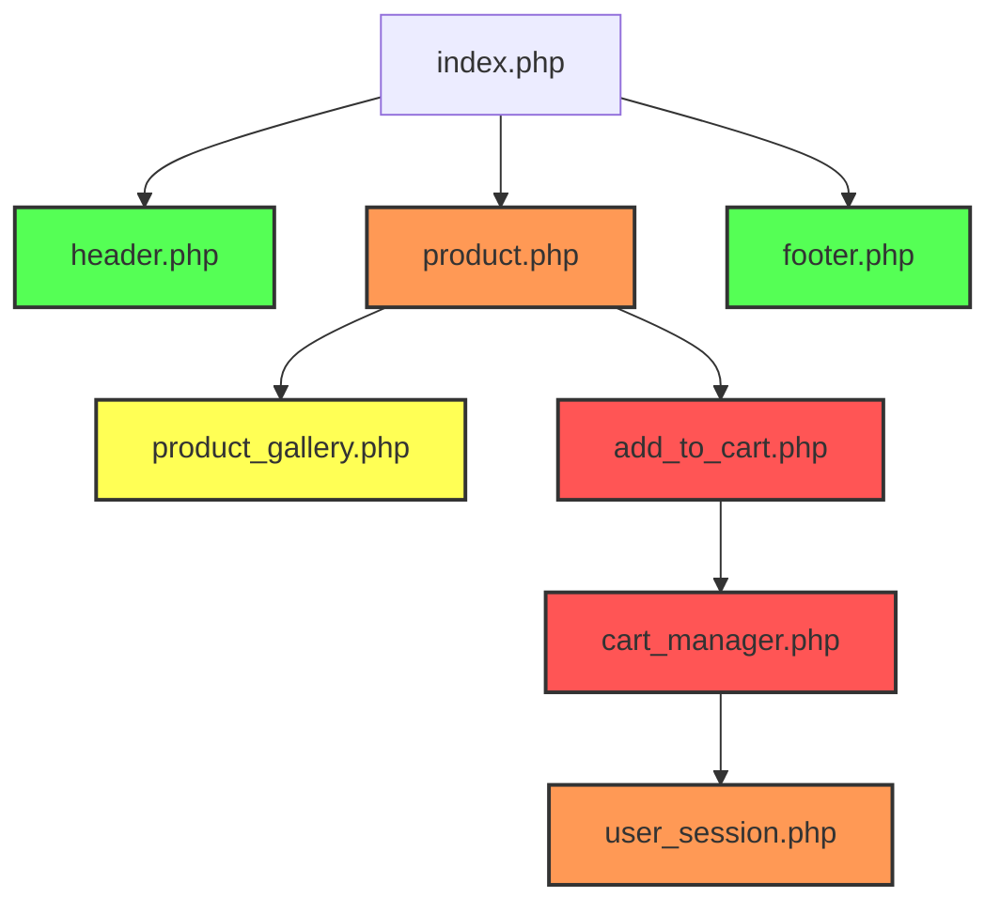

# 🗂️ Organisation Stratégique de l'Audit – Backlog IA Distribué

## 🎯 Objectif

Constituer un backlog intelligent et priorisé pour la migration des fichiers PHP vers NestJS/Remix, basé sur :

- L'impact métier
- La complexité technique
- Les dépendances croisées
- Le potentiel SEO / trafic / fréquence d'appel

Cette approche stratégique garantit une migration progressive, fonctionnelle et cohérente, en minimisant les risques et en maximisant la valeur ajoutée à chaque étape.

## 🔍 Étapes Clés

| Étape | Description |
|-------|-------------|
| 📊 Tri par impact | Classer les fichiers en fonction de leur poids métier (panier, produit, paiement), de leur complexité (WMC, CCN) et de leur usage (logs Apache ou stats). |
| 🧱 Détection des dépendances | Analyse automatique des appels croisés, includes imbriqués, routes imbriquées, et composants partagés pour établir une matrice de dépendance. |
| ⏱️ Estimation effort/temps | Génération automatique d'un score de migration (1-5) par fichier en croisant complexité, volume de code, et couplage. |
| 🔄 Stratégie par lot | Génération d'un plan de migration par vagues métier, chaque lot étant fonctionnellement cohérent (ex: "bloc panier", "authentification", "blog SEO", etc.). |

## 🧮 Méthodes de calcul des scores

### 1. Score d'impact métier (1-5)

- **5 (Critique)**: Fonctionnalités transactionnelles (paiement, panier, commande)
- **4 (Élevé)**: Fiches produit, recherche, compte utilisateur
- **3 (Moyen)**: Catalogue, navigation, pages statiques importantes
- **2 (Faible)**: Pages administratives, outils internes
- **1 (Minimal)**: Composants auxiliaires, pages rarement visitées

### 2. Score de complexité technique (1-5)

Calculé à partir de métriques objectives:

- **Complexité cyclomatique** (CCN): Nombre de chemins d'exécution
- **Volume de code**: Lignes de code effectif (sans commentaires)
- **Nombre de dépendances**: Inclusions et appels à d'autres composants
- **Dette technique**: Détection de code legacy, duplication, pratiques obsolètes

### 3. Score SEO et trafic (1-5)

Basé sur l'analyse des données d'accès:

- **Fréquence d'appel** (logs Apache)
- **Indexation** (données Search Console)
- **Backlinks externes** (données Ahrefs/SEMrush)
- **Importance dans la structure du site** (distance depuis la homepage)

## 📊 Visualisation des dépendances



## 📤 Sorties Générées

### 1. migration_backlog.md

Liste des fichiers triés par priorité de migration, avec explication des critères (impact métier, complexité, SEO, etc.)

Exemple:

```markdown
# Migration Backlog - Priorité de migration des fichiers PHP

## Vague 1: Fonctionnalités Core E-commerce (Sprint 1-2)

### 1. src/cart/checkout.php
- **Score total**: 4.8/5 ⭐⭐⭐⭐⭐
- **Impact métier**: 5/5 (Transactionnel, critique pour le CA)
- **Complexité**: 4.5/5 (CCN: 32, Dépendances: 8)
- **SEO/Trafic**: 5/5 (500k vues/mois, étape de conversion)
- **Dépendances**: payment.php, user.php, order.php
- **Notes**: Point central du tunnel de conversion, priorité absolue

### 2. src/product/view.php
- **Score total**: 4.6/5 ⭐⭐⭐⭐⭐
- **Impact métier**: 5/5 (Présentation produit, critique pour conversions)
- **Complexité**: 4.2/5 (CCN: 27, Dépendances: 6)
- **SEO/Trafic**: 5/5 (2.3M vues/mois, pages les plus indexées)
- **Dépendances**: gallery.php, pricing.php, availability.php
- **Notes**: Fort impact SEO, backlinks importants

## Vague 2: Fonctionnalités Utilisateur (Sprint 3-4)

### 3. src/user/account.php
- **Score total**: 4.3/5 ⭐⭐⭐⭐☆
- **Impact métier**: 4/5 (Gestion compte client)
- **Complexité**: 4.5/5 (CCN: 31, Dépendances: 9)
- **SEO/Trafic**: 4/5 (800k vues/mois)
- **Dépendances**: auth.php, profile.php, orders.php
- **Notes**: Complexe mais moins critique pour SEO que produits
```

### 2. dependency_matrix.json

Matrice des dépendances inter-fichiers, formatée pour visualisation en heatmap ou graph Mermaid.

```json
{
  "nodes": [
    {"id": "index.php", "score": 3.2, "group": "core"},
    {"id": "product.php", "score": 4.6, "group": "products"},
    {"id": "cart.php", "score": 4.8, "group": "cart"},
    {"id": "user.php", "score": 4.3, "group": "users"},
    {"id": "payment.php", "score": 4.9, "group": "payment"},
    {"id": "category.php", "score": 3.8, "group": "products"}
  ],
  "links": [
    {"source": "index.php", "target": "product.php", "value": 5},
    {"source": "index.php", "target": "cart.php", "value": 3},
    {"source": "product.php", "target": "cart.php", "value": 8},
    {"source": "cart.php", "target": "payment.php", "value": 10},
    {"source": "cart.php", "target": "user.php", "value": 7},
    {"source": "category.php", "target": "product.php", "value": 6}
  ],
  "metadata": {
    "created": "2025-06-20T15:45:00Z",
    "version": "1.0.0",
    "total_files": 42,
    "analyzed_files": 42,
    "high_priority_files": 12,
    "medium_priority_files": 18,
    "low_priority_files": 12
  }
}
```

### 3. migration_wave_plan.json

Plan de migration découpé par vagues fonctionnelles, avec ordonnancement optimal des blocs PHP à traiter.

```json
{
  "plan_name": "E-commerce Migration Plan",
  "created_at": "2025-06-20T15:45:00Z",
  "total_waves": 5,
  "estimated_duration": "12 weeks",
  "waves": [
    {
      "id": 1,
      "name": "Core E-commerce",
      "sprint_allocation": "Sprints 1-2",
      "business_value": "Critical - Revenue-generating",
      "files": [
        {"path": "src/cart/checkout.php", "score": 4.8, "dependencies": 3},
        {"path": "src/product/view.php", "score": 4.6, "dependencies": 2},
        {"path": "src/payment/process.php", "score": 4.9, "dependencies": 4}
      ],
      "expected_benefits": "Secure core transaction flow, performance improvements for key revenue pages",
      "risks": "Transaction disruption, cart abandonment",
      "test_priority": "Critical - Full E2E"
    },
    {
      "id": 2,
      "name": "User Management",
      "sprint_allocation": "Sprints 3-4",
      "business_value": "High - Customer retention",
      "files": [
        {"path": "src/user/account.php", "score": 4.3, "dependencies": 3},
        {"path": "src/user/auth.php", "score": 4.5, "dependencies": 2},
        {"path": "src/user/profile.php", "score": 3.8, "dependencies": 4}
      ],
      "expected_benefits": "Improved security, better user experience",
      "risks": "Authentication failures, data inconsistency",
      "test_priority": "High - Security focused"
    },
    {
      "id": 3,
      "name": "Catalog & Navigation",
      "sprint_allocation": "Sprints 5-6",
      "business_value": "High - Product discovery",
      "files": [
        {"path": "src/catalog/category.php", "score": 3.8, "dependencies": 2},
        {"path": "src/catalog/search.php", "score": 4.2, "dependencies": 3},
        {"path": "src/catalog/filter.php", "score": 3.7, "dependencies": 4}
      ],
      "expected_benefits": "Better SEO, faster search, improved filtering",
      "risks": "Missing products, broken navigation",
      "test_priority": "High - Functional & SEO"
    },
    {
      "id": 4,
      "name": "Content Management",
      "sprint_allocation": "Sprints 7-8",
      "business_value": "Medium - Marketing & SEO",
      "files": [
        {"path": "src/content/blog.php", "score": 3.5, "dependencies": 1},
        {"path": "src/content/page.php", "score": 3.2, "dependencies": 2},
        {"path": "src/content/media.php", "score": 3.0, "dependencies": 3}
      ],
      "expected_benefits": "Improved content management, better SEO",
      "risks": "Missing content, broken links",
      "test_priority": "Medium - Content integrity"
    },
    {
      "id": 5,
      "name": "Admin & Reporting",
      "sprint_allocation": "Sprints 9-10",
      "business_value": "Medium - Operations",
      "files": [
        {"path": "src/admin/dashboard.php", "score": 2.8, "dependencies": 5},
        {"path": "src/admin/orders.php", "score": 3.3, "dependencies": 3},
        {"path": "src/admin/reports.php", "score": 2.7, "dependencies": 4}
      ],
      "expected_benefits": "Better admin tools, improved reporting",
      "risks": "Admin workflow disruption",
      "test_priority": "Medium - Admin focused"
    }
  ]
}
```

## ⚙️ Astuces Avancées

### 1. Visualisation Dépendance 

Génère une heatmap ou graphe Mermaid à partir de dependency_matrix.json pour identifier visuellement les noyaux critiques à isoler/refactorer en priorité.

```javascript
// Code d'exemple pour générer un graphe Mermaid depuis dependency_matrix.json
function generateMermaidFromMatrix(matrix) {
  let mermaidCode = "graph TD\n";
  
  // Ajouter les nœuds
  matrix.nodes.forEach(node => {
    const styleClass = node.score > 4.5 ? "critical" : 
                       node.score > 4.0 ? "high" : 
                       node.score > 3.5 ? "medium" : "low";
    mermaidCode += `    ${node.id.replace(/\./g, '_')}["${node.id} (${node.score})"]:::${styleClass}\n`;
  });
  
  // Ajouter les liens
  matrix.links.forEach(link => {
    const sourceId = link.source.replace(/\./g, '_');
    const targetId = link.target.replace(/\./g, '_');
    const thickness = link.value > 8 ? "very-thick" : 
                     link.value > 5 ? "thick" : 
                     link.value > 3 ? "normal" : "thin";
    mermaidCode += `    ${sourceId} -->|${link.value}| ${targetId}\n`;
  });
  
  // Ajouter les classes de style
  mermaidCode += `    classDef critical fill:#f55,stroke:#333,stroke-width:2px;\n`;
  mermaidCode += `    classDef high fill:#f95,stroke:#333,stroke-width:2px;\n`;
  mermaidCode += `    classDef medium fill:#ff5,stroke:#333,stroke-width:2px;\n`;
  mermaidCode += `    classDef low fill:#5f5,stroke:#333,stroke-width:2px;\n`;
  
  return mermaidCode;
}
```

### 2. Score de Migration IA

Intègre un système de scoring (par ex. : score: 4/5) dans le migration_backlog.md pour estimer :

- 📦 Taille du fichier
- ⚠️ Niveau de couplage
- 📈 Importance métier/SEO
- 🧠 Complexité algorithmique

```javascript
// Fonction de calcul du score composite
function calculateMigrationScore(file) {
  // Taille (1-5)
  const sizeScore = calculateSizeScore(file.size);
  
  // Couplage (1-5)
  const couplingScore = file.dependencies * 0.5;
  
  // Importance métier/SEO (1-5)
  const businessScore = file.businessImpact;
  
  // Complexité algorithmique (1-5)
  const complexityScore = file.ccn / 10; // CCN / 10 plafonné à 5
  
  // Score composite pondéré
  return (
    (sizeScore * 0.15) +
    (couplingScore * 0.25) +
    (businessScore * 0.4) +
    (complexityScore * 0.2)
  ).toFixed(1);
}
```

## 🎯 Plan d'exécution pour l'organisation stratégique

1. **Analyse initiale** (J1-J5)
   - Extraction de tous les fichiers PHP
   - Parsing des dépendances et inclusions
   - Collecte des données d'accès et métriques SEO

2. **Calcul des scores** (J6-J10)
   - Analyse statique de code (complexité, taille)
   - Croisement avec données business
   - Génération des scores composites

3. **Organisation des vagues** (J11-J15)
   - Regroupement fonctionnel
   - Optimisation des dépendances
   - Validation métier des priorités

4. **Création du backlog** (J16-J20)
   - Génération des fichiers de sortie
   - Production du plan de migration
   - Intégration au tableau de bord

## 💡 Dashboard Remix (option)

Possibilité de créer une interface `/dashboard/backlog` pour afficher dynamiquement :

- Les vagues de migration (wave 1, 2, 3…)
- Les fichiers par priorité
- Les dépendances critiques (avec liens cliquables vers les audits)

```tsx
// Exemple de code pour le dashboard Remix
export default function BacklogDashboard() {
  const { migrationPlan, dependencyMatrix } = useLoaderData<typeof loader>();
  
  return (
    <div className="p-6">
      <h1 className="text-2xl font-bold mb-6">Migration Backlog Dashboard</h1>
      
      {/* Progression globale */}
      <div className="mb-8">
        <h2 className="text-xl font-semibold mb-3">Progression globale</h2>
        <div className="w-full bg-gray-200 rounded-full h-4">
          <div 
            className="bg-blue-600 h-4 rounded-full" 
            style={{ width: `${migrationPlan.progress}%` }}
          ></div>
        </div>
        <div className="flex justify-between mt-1 text-sm">
          <span>0%</span>
          <span>{migrationPlan.progress}% complété</span>
          <span>100%</span>
        </div>
      </div>
      
      {/* Vagues de migration */}
      <div className="mb-8">
        <h2 className="text-xl font-semibold mb-3">Vagues de migration</h2>
        <div className="grid grid-cols-1 md:grid-cols-2 lg:grid-cols-3 gap-4">
          {migrationPlan.waves.map(wave => (
            <WaveCard 
              key={wave.id}
              wave={wave}
              progress={calculateWaveProgress(wave)}
            />
          ))}
        </div>
      </div>
      
      {/* Graphe de dépendances */}
      <div>
        <h2 className="text-xl font-semibold mb-3">Graphe de dépendances</h2>
        <DependencyGraph matrix={dependencyMatrix} />
      </div>
    </div>
  );
}
```

Cette organisation stratégique assure une migration cohérente, progressive et alignée sur les priorités business, tout en minimisant les risques techniques grâce à une gestion intelligente des dépendances.
