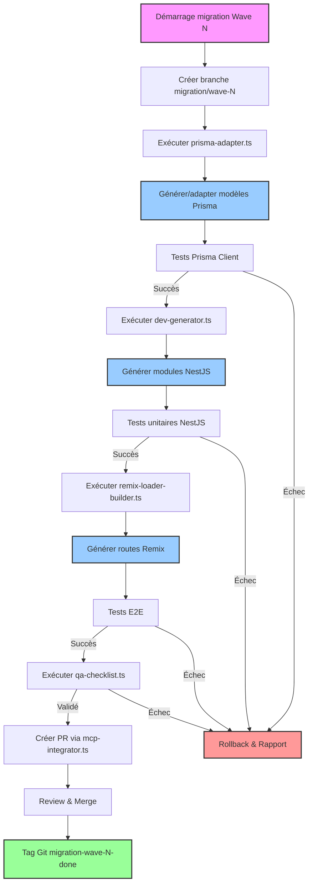

# 🌊 Exécution des Migrations par Vagues Fonctionnelles

## 🎯 Objectif

Mettre en œuvre une stratégie d'exécution des migrations par vagues fonctionnelles (waves) de façon :
- **Sécurisée** : avec possibilité de rollback à tout moment
- **Mesurable** : tests automatisés, rapports détaillés, versionnage précis
- **Orchestrée** : via agents IA et pipelines CI/CD intégrés

Cette approche assure une migration progressive, testable et réversible, tout en maintenant la cohérence fonctionnelle des modules migrés.

## 🧩 Cycle de Migration pour Chaque Vague

Chaque vague (lot de fichiers PHP interconnectés ou fonctionnellement liés) passe dans 3 générateurs synchronisés:

| Étape | Agent IA / Générateur | Rôle |
|-------|----------------------|------|
| 🧬 Modèle de Données | prisma-adapter.ts | Génère ou adapte les modèles Prisma basés sur le schema_migration_diff.json. |
| ⚙️ Backend NestJS | dev-generator.ts | Génére service.ts, controller.ts, dto.ts, tests, fixtures. |
| 🌐 Frontend Remix | remix-loader-builder.ts | Génère route.tsx, loader.ts, meta.ts, tests.tsx. |

## 🔄 Flux de travail complet



## 🔁 Synchronisation Automatisée

Chaque étape s'appuie sur les fichiers sources générés lors de l'analyse:

| Fichier | Source |
|---------|--------|
| *.audit.md | Résultats de php-analyzer-v2 |
| schema_migration_diff.json | Résultats de mysql-analyzer+optimizer |
| *.backlog.json | Tâches à réaliser, étapes validées ou non |
| discovery_map.json | Priorité de la vague |

## ✅ Résultats attendus

| Livrable | Description |
|----------|-------------|
| 📦 Modules générés | Fichiers .ts, .tsx, .prisma, .test.ts intégrés au monorepo |
| 📝 Journal de migration | wave_<n>_migration.log avec résumé des fichiers migrés, erreurs, résultats de tests |
| ♻️ Système de rollback | Chaque vague est commitée sur une branche Git dédiée migration/wave-<n> avec possibilité de rollback par PR |
| 🔍 Traçabilité | Ajout de tag Git migration-wave-n-done pour chaque phase validée |

## 🛠️ Phases détaillées d'exécution

### 1. Préparation de la vague

```bash
# Créer une branche dédiée
git checkout -b migration/wave-1
 
# Initialiser le journal de migration
echo "# Migration Wave 1\nStarted: $(date)\n" > wave_1_migration.log

# Extraire les fichiers de la vague depuis le plan de migration
node tools/extract-wave-files.js --wave 1 --output wave_1_files.json
```

### 2. Génération et adaptation du modèle Prisma

```bash
# Exécuter prisma-adapter.ts
node agents/prisma-adapter.ts --wave 1 --input schema_migration_diff.json --output prisma/

# Valider le modèle généré
npx prisma validate
npx prisma format

# Tests préliminaires
npm run test:prisma
```

### 3. Génération du backend NestJS

```bash
# Exécuter dev-generator.ts pour le backend
node agents/dev-generator.ts --wave 1 --type backend --input wave_1_files.json --output apps/backend/

# Exécuter les tests unitaires
npm run test:nestjs
```

### 4. Génération du frontend Remix

```bash
# Exécuter remix-loader-builder.ts
node agents/remix-loader-builder.ts --wave 1 --input wave_1_files.json --output apps/frontend/

# Exécuter les tests frontend
npm run test:remix
```

### 5. Contrôle qualité et validation

```bash
# Exécuter la checklist QA
node agents/qa-checklist.ts --wave 1 --output qa_report_wave_1.md

# Générer le rapport de migration
node tools/generate-migration-report.js --wave 1 --output wave_1_report.md
```

### 6. Intégration et déploiement

```bash
# Créer la PR via MCP
node agents/mcp-integrator.ts --wave 1 --create-pr

# Après validation, tag de la version
git tag migration-wave-1-done
git push origin migration-wave-1-done
```

## 🧠 Orchestration intelligente via n8n

Le workflow n8n `wave-runner.n8n.json` automatise l'ensemble du processus:

1. 🔁 Boucle sur la vague courante (wave_id)
2. 🔗 Exécute chaque agent: Prisma > Nest > Remix
3. ✅ Valide automatiquement via qa-checklist.ts
4. 🚦 Génère PR GitHub avec mcp-integrator.ts

## 💡 Mécanisme de Rollback

Chaque vague dispose d'un mécanisme de rollback automatisé:

1. **Rollback Git**: Restauration de la branche avant migration
   ```bash
   git checkout migration/wave-1
   git reset --hard origin/main
   git push --force
   ```

2. **Rollback Database**: Script de restauration du schéma Prisma
   ```bash
   npx prisma migrate reset
   npx prisma migrate resolve --rolled-back "20250625120000_wave_1"
   ```

3. **Rollback via MCP**: Création automatique d'une PR de rollback
   ```bash
   node agents/mcp-integrator.ts --wave 1 --rollback
   ```

## 🔍 Dashboard de Suivi des Vagues

Un dashboard Remix (`/dashboard/waves`) affiche par vague:

- **État**: 🟢 terminé / 🟡 en cours / 🔴 en erreur
- **Modules générés** (liens vers code)
- **Logs et tests**
- **Bouton de rollback** (déclenche une PR de revert via MCP)

```tsx
// Exemple simplifié du dashboard Remix
export default function WavesDashboard() {
  const { waves } = useLoaderData<typeof loader>();
  
  return (
    <div className="p-6">
      <h1 className="text-2xl font-bold mb-6">Migration Waves Dashboard</h1>
      
      <div className="grid grid-cols-1 md:grid-cols-2 lg:grid-cols-3 gap-6">
        {waves.map(wave => (
          <WaveCard 
            key={wave.id}
            wave={wave}
            onRollback={() => initiateRollback(wave.id)}
          />
        ))}
      </div>
    </div>
  );
}

function WaveCard({ wave, onRollback }) {
  const statusIcon = 
    wave.status === 'completed' ? '🟢' :
    wave.status === 'in_progress' ? '🟡' :
    wave.status === 'error' ? '🔴' : '⚪';
  
  return (
    <div className="border rounded-lg p-4 shadow-sm">
      <div className="flex justify-between items-center mb-3">
        <h2 className="text-xl font-semibold">Wave {wave.id}: {wave.name}</h2>
        <span className="text-2xl">{statusIcon}</span>
      </div>
      
      <div className="text-sm text-gray-600 mb-3">
        <p>Files: {wave.files.length}</p>
        <p>Progress: {wave.progress}%</p>
        <p>Started: {wave.startedAt}</p>
        {wave.completedAt && <p>Completed: {wave.completedAt}</p>}
      </div>
      
      <div className="mb-3">
        <h3 className="font-medium mb-1">Generated modules:</h3>
        <ul className="text-sm text-blue-600">
          {wave.modules.map(module => (
            <li key={module.path}>
              <a href={`/code-viewer?path=${module.path}`}>{module.name}</a>
            </li>
          ))}
        </ul>
      </div>
      
      <div className="flex justify-between">
        <a 
          href={`/logs?wave=${wave.id}`}
          className="text-sm text-blue-600"
        >
          View logs
        </a>
        
        {wave.status === 'completed' && (
          <button
            onClick={onRollback}
            className="text-sm text-red-600 hover:underline"
          >
            Rollback
          </button>
        )}
      </div>
    </div>
  );
}
```

## 🔄 Intégration avec GitHub

L'intégration avec GitHub permet une traçabilité complète et une gestion fluide des vagues de migration:

1. **Branche par vague**: Chaque vague a sa branche dédiée (`migration/wave-N`)
2. **PR automatisée**: Générée via MCP avec détails de la migration
3. **Workflow GitHub Actions**: Tests et validation automatisés
4. **Tags de versions**: Marquent les étapes importantes de la migration

Cette approche par vagues fonctionnelles assure une migration contrôlée, testable et réversible, tout en maintenant un historique précis des modifications et une qualité constante du code migré.
