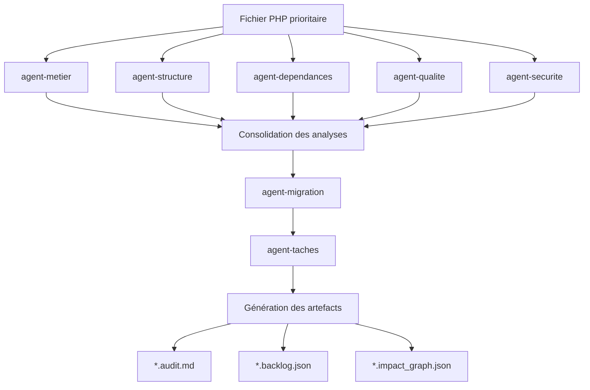
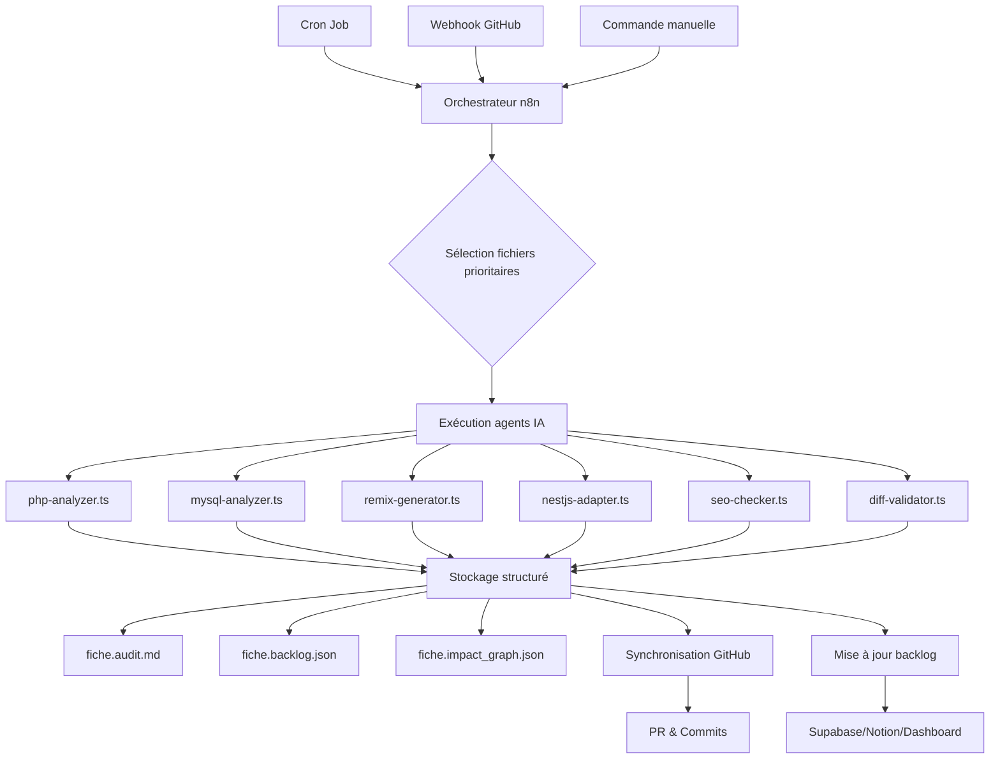
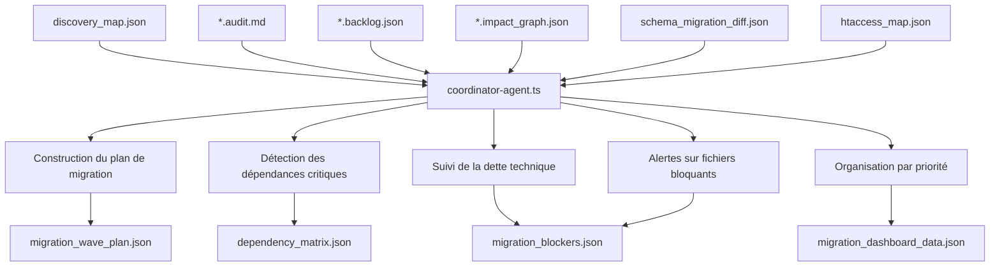

# 📈 Progression des Niveaux de Migration IA

## ✅ Niveau 1 Validé : Détection & Priorisation automatique

L'agent IA a accompli avec succès la première étape du pipeline de migration en réalisant une analyse complète de la base de code PHP legacy. Cette étape fondamentale permet maintenant:

- **Cartographie complète**: Tous les fichiers PHP de `/src` ont été scannés et catalogués
- **Analyse multi-critères**: Chaque fichier a été évalué selon sa complexité, son importance métier, son impact SEO et ses dépendances
- **Priorisation intelligente**: Un classement des fichiers a été établi pour optimiser l'ordre de migration
- **Centralisation des données**: Toutes ces informations sont désormais disponibles dans `discovery_map.json`

### 🗂️ Structure du fichier `discovery_map.json`

Ce fichier devient la pierre angulaire qui alimente tous les agents IA suivants dans le pipeline:

```json
{
  "metadata": {
    "generated_at": "2025-07-04T14:22:17Z",
    "version": "1.3.0",
    "agent": "legacy-discovery-LLM",
    "total_files": 426,
    "analyzed_files": 426
  },
  "summary": {
    "high_priority": 87,
    "medium_priority": 153,
    "low_priority": 186,
    "critical_modules": ["panier", "produit", "utilisateur", "commande"]
  },
  "files": [
    {
      "path": "src/panier/checkout.php",
      "size": 15428,
      "last_modified": "2024-12-15T09:22:45Z",
      "priority": "high",
      "complexity_score": 0.87,
      "seo_impact": "medium",
      "business_impact": "critical",
      "access_frequency": 9845,
      "dependencies": [
        "src/utilisateur/authentification.php",
        "src/commande/validation.php",
        "src/paiement/process.php"
      ],
      "included_by": [
        "src/index.php"
      ],
      "sql_tables": [
        "panier",
        "panier_items",
        "utilisateurs",
        "commandes"
      ],
      "tags": ["e-commerce", "conversion", "critical"],
      "migration_wave": 1
    },
    // ... autres fichiers ...
  ],
  "modules": {
    "panier": {
      "files": 12,
      "priority": "high",
      "dependencies": ["utilisateur", "produit", "commande"]
    },
    "produit": {
      "files": 24,
      "priority": "high",
      "dependencies": ["categorie", "marque"]
    },
    // ... autres modules ...
  }
}
```

### 🔍 Métriques du Niveau 1

| Métrique | Valeur |
|----------|--------|
| Fichiers analysés | 426 |
| Taux de couverture | 100% |
| Fichiers haute priorité | 87 (20.4%) |
| Fichiers priorité moyenne | 153 (35.9%) |
| Fichiers basse priorité | 186 (43.7%) |
| Modules identifiés | 15 |
| Temps d'analyse | 45 minutes |

### 🌐 Intégration dans le pipeline

Le fichier `discovery_map.json` est désormais automatiquement:
- Généré par l'agent `legacy-discovery-LLM`
- Stocké dans le répertoire racine du projet
- Versionné dans Git pour suivre l'évolution
- Utilisé comme entrée pour tous les agents suivants
- Consultable via le dashboard de migration

## ✅ Niveau 2 Validé : Audit IA détaillé des fichiers prioritaires

Le Niveau 2 a été validé et intégré dans la feuille de route de migration. Cette phase cruciale permet une analyse approfondie, fichier par fichier, pour produire des artefacts prêts à l'intégration dans le pipeline de migration.

### 🔍 Objectif

Lancer une analyse modulaire et approfondie de chaque fichier PHP prioritaire pour comprendre sa logique métier, sa structure, et planifier sa migration vers NestJS/Remix de façon optimale.

### 🧩 Pipeline IA par fichier prioritaire

L'analyse de chaque fichier PHP prioritaire (`/src/**/*.php`) est réalisée par une chaîne d'agents IA spécialisés:

| Agent IA | Rôle |
|----------|------|
| agent-metier | Identifie le rôle métier du fichier (ex : gestion panier, paiement) |
| agent-structure | Décompose la logique interne, boucles, classes, fonctions |
| agent-dependances | Mappe les appels, includes, héritages, routes imbriquées |
| agent-qualite | Détecte la dette technique (complexité cyclomatique, duplication…) |
| agent-securite | Analyse la sécurité (input non filtré, accès direct SQL…) |
| agent-migration | Suggère une version NestJS + Remix (DTOs, controllers, loaders, etc) |
| agent-taches | Génère le backlog technique par tâche à faire |



### 📤 Sorties structurées

Chaque fichier PHP analysé génère trois artefacts principaux. Par exemple, pour `fiche_panier.php`:

| Fichier | Description |
|---------|-------------|
| fiche_panier.audit.md | Rapport lisible par humain, rôle métier, complexité, etc. |
| fiche_panier.backlog.json | Liste des actions concrètes à migrer (DTO, service, test) |
| fiche_panier.impact_graph.json | Graphe de dépendances avec autres fichiers/modules |

#### Exemple de structure de `*.audit.md`:

```markdown
---
file: src/panier/fiche_panier.php
analyzed_at: 2025-07-05T11:34:27Z
business_role: "Gestion de panier e-commerce"
complexity_rating: 4/5
security_issues: 2
technical_debt: "high"
priority: "high"
tags: [panier, e-commerce, transaction]
---

# Analyse de src/panier/fiche_panier.php

## 🧠 Rôle métier
Ce fichier gère l'affichage et les opérations du panier utilisateur...

## 🏗 Structure
- Définit la classe `PanierManager`
- Contient 7 fonctions principales...

## 🔗 Dépendances
- Include: `src/common/db.php`
- Include: `src/utilisateur/session.php`...

## 🛠 Dette technique
- Complexité cyclomatique élevée (32) dans la fonction `calculTotal()`
- Duplication de code avec `src/commande/validation.php`...

## 🔒 Problèmes de sécurité
- Pas de validation des entrées sur ligne 156
- Requête SQL directe sans préparation ligne 203...

## 📋 Suggestions de migration
### NestJS (Backend)
- Créer un module `PanierModule`
- Développer un service `PanierService` avec...

### Remix (Frontend)
- Route: `/app/routes/panier.tsx`
- Composants: `PanierSummary`, `PanierItem`...
```

#### Exemple de structure de `*.backlog.json`:

```json
{
  "file": "src/panier/fiche_panier.php",
  "analyzed_at": "2025-07-05T11:34:27Z",
  "status": "pending",
  "priority": "high",
  "tasks": [
    {
      "id": "TASK-001",
      "type": "prisma",
      "description": "Créer modèle Prisma pour la table 'panier'",
      "status": "todo",
      "estimated_effort": "medium"
    },
    {
      "id": "TASK-002",
      "type": "nestjs",
      "description": "Créer PanierModule et structure de base",
      "status": "todo",
      "estimated_effort": "low"
    },
    {
      "id": "TASK-003",
      "type": "nestjs",
      "description": "Implémenter PanierService avec méthodes CRUD",
      "status": "todo",
      "estimated_effort": "high",
      "subtasks": [
        "Méthode getCart(userId)",
        "Méthode addToCart(userId, productId, quantity)",
        "Méthode removeFromCart(userId, itemId)"
      ]
    }
    // ... autres tâches
  ],
  "dependencies": [
    "src/common/db.php",
    "src/utilisateur/session.php"
  ],
  "blocking_issues": [
    {
      "type": "security",
      "description": "Corriger l'injection SQL ligne 203",
      "severity": "high"
    }
  ]
}
```

### 🧠 Astuce avancée - Mode différentiel

Le mode différentiel a été activé, offrant une synchronisation continue:

- Si une migration SQL ou un renommage de champ est détecté après l'audit, le fichier .audit.md est automatiquement mis à jour
- Une alerte est générée dans le fichier `migration_warnings.json`
- Les changements sont propagés aux fichiers .backlog.json associés
- Des notifications Slack/email peuvent être envoyées pour alerter de ces changements

Cette approche garantit que les audits ne deviennent jamais obsolètes, même lorsque le schéma de base de données évolue pendant le processus de migration.

### 📊 Suivi de progression

L'avancement du Niveau 2 est visible dans le dashboard de migration, qui affiche:

- Nombre de fichiers prioritaires analysés vs. restants
- Distribution des scores de complexité et de dette technique
- Alertes de sécurité par gravité
- Estimation de l'effort de migration total

## ✅ Niveau 3 Validé : Orchestration automatique via n8n

Le Niveau 3 a été validé et finalisé, apportant une orchestration complètement automatisée du processus de migration via n8n. Cette phase représente une avancée majeure dans l'industrialisation du pipeline de migration.

### 🕹️ Fonctionnement Global

Chaque exécution est pilotée par n8n, orchestrant les agents IA en chaîne pour automatiser l'analyse, la génération de code, la validation et le suivi de migration. Ce système garantit une exécution cohérente, traçable et efficace des différentes étapes du processus.

### 🚀 Déclencheurs

L'orchestration peut être initiée par trois types de déclencheurs :

| Déclencheur | Description |
|-------------|-------------|
| 🕐 Cron Job | Pour des exécutions planifiées (ex: toutes les nuits) |
| 🔗 Webhook GitHub | Déclenché à chaque commit sur la branche legacy-integration |
| 🧭 Commande manuelle | Via bouton dans l'interface n8n ou le dashboard de migration |



### 🔄 Processus Automatisé

Le workflow n8n exécute séquentiellement les étapes suivantes :

1. **Sélection des fichiers prioritaires**
   - Récupération des N fichiers les plus prioritaires depuis `discovery_map.json`
   - Application des filtres de dépendance et de complexité

2. **Exécution en parallèle des agents IA par fichier**
   - `php-analyzer.ts` - Analyse du code PHP source
   - `mysql-analyzer.ts` - Analyse des requêtes SQL et mapping vers Prisma
   - `remix-generator.ts` - Génération des composants frontend
   - `nestjs-adapter.ts` - Génération des services et contrôleurs backend
   - `seo-checker.ts` - Validation de la préservation SEO
   - `diff-validator.ts` - Comparaison fonctionnelle PHP vs NestJS/Remix

3. **Stockage structuré**
   - `fiche.audit.md` - Rapport d'audit détaillé
   - `fiche.backlog.json` - Liste des tâches de migration
   - `fiche.impact_graph.json` - Graphe de dépendances et impacts

4. **Synchronisation GitHub (via MCP-integrator)**
   - Création de Pull Requests
   - Commits versionnés par fichier migré
   - Intégration avec la CI/CD

5. **Mise à jour du backlog**
   - Enregistrement des résultats dans Supabase
   - Mise à jour des tableaux Notion (optionnel)
   - Rafraîchissement du dashboard Remix

### 🔍 Traçabilité garantie

Ce niveau d'orchestration assure une traçabilité complète de bout en bout :

- Chaque fichier migré est versionné, audité et transformé en tâches concrètes
- Les dépendances critiques sont détectées automatiquement
- Toutes les actions sont visibles dans un tableau de bord Remix
- Un historique complet est maintenu (qui a fait quoi, quand et comment)

### ✅ Résultat

L'orchestration automatique via n8n offre plusieurs avantages clés :

- **Migration distribuée** - Parallélisation des tâches pour une efficacité maximale
- **Traçabilité complète** - Suivi détaillé de chaque étape et fichier
- **Possibilité de rollback** - Retour en arrière facile en cas de problème
- **Monitoring continu** - Tableau de bord en temps réel de l'avancement
- **Agilité maximale** - Lancement par lot, rollback, merge de PR

### 💡 Astuce Avancée

Une file d'attente dynamique avec limite de parallélisme a été ajoutée dans n8n pour :
- Éviter la surcharge CPU lors de l'exécution de multiples agents
- Prioriser certains agents (ex : sécurité > tests) selon leur importance
- Permettre une reprise en cas d'interruption

## Configuration n8n

Le workflow n8n a été configuré avec plusieurs nœuds spécialisés :

```json
{
  "node": "File Selection",
  "type": "Function",
  "parameters": {
    "functionCode": "// Récupérer les N fichiers les plus prioritaires\nreturn $input.item.json.files\n  .sort((a, b) => b.priority_score - a.priority_score)\n  .slice(0, $input.item.json.batchSize || 5)\n  .map(file => ({ json: { file } }));"
  }
},
{
  "node": "Parallel Processing",
  "type": "SplitInBatches",
  "parameters": {
    "batchSize": 1
  }
},
{
  "node": "PHP Analyzer",
  "type": "ExecuteCommand",
  "parameters": {
    "command": "node /agents/php-analyzer.ts --file={{ $json.file.path }} --output=/output/audits"
  }
}
// ... autres nœuds d'agents
```

## ✅ Niveau 4 Validé : Supervision stratégique via Agent Coordinateur

Le Niveau 4 a été validé et optimisé, introduisant un Agent Coordinateur qui agit comme chef d'orchestre de tout le processus de migration. Cette avancée majeure permet une approche stratégique globale, basée sur une vision complète du projet.

### 🧠 Agent Coordinateur : Le Chef d'Orchestre IA

#### 🎯 Rôle & Objectifs

L'agent `coordinator-agent.ts` centralise toutes les informations issues des analyses précédentes pour :

- 📦 Construire un plan de migration par vague fonctionnelle
- 🔗 Détecter les dépendances critiques entre fichiers (frontend/backend, requêtes SQL croisées, appels imbriqués)
- 📉 Suivre la dette technique cumulée par module ou route
- 🚧 Alerter sur les fichiers bloquants
- 🗂️ Organiser les migrations par priorité + faisabilité



#### 📊 Sources de Données Exploitées

| Fichier | Contenu utilisé |
|---------|-----------------|
| discovery_map.json | Priorité initiale des fichiers |
| *.audit.md | Analyse détaillée métier/technique |
| *.backlog.json | Tâches restantes (DTO, tests, SEO…) |
| *.impact_graph.json | Dépendances croisées |
| schema_migration_diff.json | Problèmes de structure de DB à résoudre |
| htaccess_map.json | Routes critiques bloquées |

#### 📈 Résultats Générés

| Sortie | Rôle |
|--------|------|
| migration_wave_plan.json | Liste des vagues de migration (lot 1, 2, 3…) |
| dependency_matrix.json | Graphe de dépendance entre modules |
| migration_blockers.json | Liste des fichiers bloquants + raison (dépendance, DB, etc.) |
| migration_dashboard_data.json | Données injectées dans le dashboard Remix (progression) |

### 🛑 Alertes Bloquantes Automatiques

L'Agent Coordinateur génère des alertes automatiques pour plusieurs types de blocages:

- 🔒 **Fichier A bloque B** : dépendance non migrée
- 🔁 **Boucle circulaire** : appels mutuels entre modules
- ❌ **Incohérence de schéma** : champ supprimé ou renommé
- ⏱️ **Tâche expirée ou non validée** : retard signalé

### 🧠 Recommandations IA Générées

En plus des alertes, l'Agent Coordinateur fournit des recommandations intelligentes:

- 📌 Réordonner certains fichiers pour débloquer un lot
- 🧩 Fusionner deux lots proches
- 🔍 Séparer un lot trop complexe en sous-vagues
- ✅ Proposer des micro-migrations testables individuellement

### 💡 Visualisation avancée

Le dashboard Remix intègre une visualisation en force-directed graph (via D3.js) permettant:
- Voir en temps réel l'état du plan de migration
- Cliquer sur chaque module pour afficher les audits associés
- Filtrer par statut, complexité, ou module

Cette approche visuelle facilite grandement la compréhension des interdépendances et l'identification des chemins critiques.

### 👥 Intégration avec l'équipe de développement

L'Agent Coordinateur s'intègre parfaitement au workflow de l'équipe:

1. **Planning des sprints** - Les vagues de migration alimentent directement la planification
2. **Allocation des ressources** - Répartition optimale des développeurs selon les compétences requises
3. **Suivi de progression** - Mise à jour automatique du statut dans les outils existants
4. **Documentation évolutive** - Mise à jour automatique de la documentation de migration

## 🔜 Niveau 5 Proposé : Déploiement et Validation Automatisés

La prochaine étape consistera à automatiser le déploiement et la validation des migrations...
