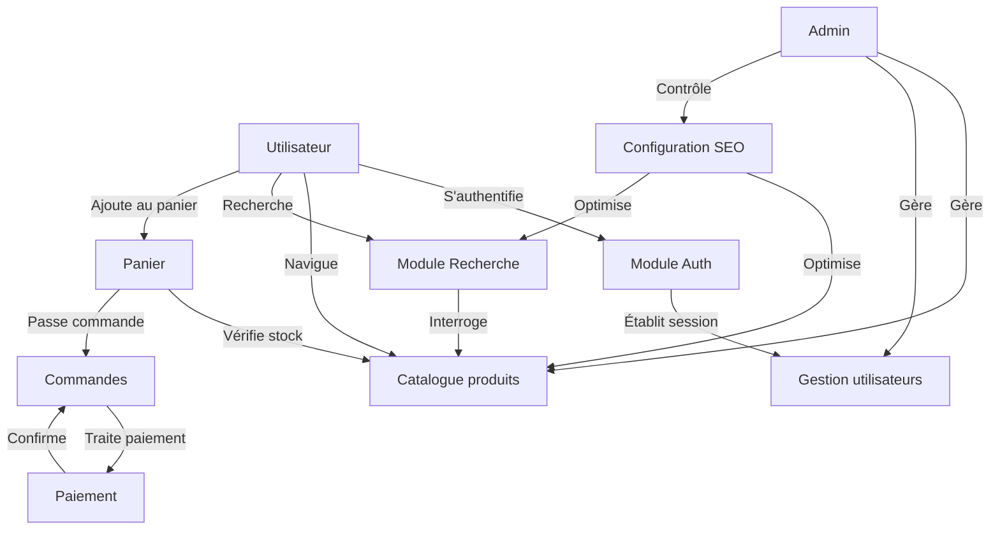

# Matrice des interdépendances

## 🔄 Vue d'ensemble

Ce document centralise les interdépendances entre les différents composants du projet, garantissant une traçabilité complète et une visibilité sur les impacts potentiels lors des modifications.

## 📊 Matrice des modules

| Module | Dépend de | Impact sur | Point de synchronisation | Priorité de migration |
|--------|-----------|------------|--------------------------|------------------------|
| **Authentification** | Base de données, Cache Redis | Tous les modules nécessitant une authentification | JWT, Sessions | Haute (P1) |
| **Gestion utilisateurs** | Module Auth, Base de données | Profil, Commandes, Admin | APIs `/users/*` | Moyenne (P2) |
| **Catalogue produits** | Base de données, Stockage fichiers | Panier, Recherche, SEO | APIs `/products/*`, `/categories/*` | Haute (P1) |
| **Panier / Commandes** | Auth, Produits, Paiement | Checkout, Profil utilisateur | APIs `/cart/*`, `/orders/*` | Moyenne (P2) |
| **Paiement** | Panier, Services externes | Commandes, Facturation | APIs `/payment/*`, webhooks | Basse (P3) |
| **Recherche** | Produits, Elasticsearch | Navigation, SEO | APIs `/search/*` | Moyenne (P2) |
| **Admin** | Tous les autres modules | Reporting, Config système | APIs `/admin/*` | Basse (P3) |
| **SEO / URLs** | Produits, Contenus | Tous les modules frontend | Redirections, sitemap.xml | Haute (P1) |

## 🔀 Flux de données principaux

## 🛠️ Interdépendances techniques

### Frontend (Remix) vers Backend (NestJS)

| Composant Remix | Endpoint NestJS | Méthode | Payload | Type de données |
|-----------------|-----------------|---------|---------|-----------------|
| `routes/login.tsx` | `/auth/login` | POST | `{ email, password }` | JSON |
| `routes/products/$id.tsx` | `/products/:id` | GET | - | JSON |
| `routes/cart.tsx` | `/cart` | GET, POST | `{ productId, quantity }` | JSON |
| `routes/checkout.tsx` | `/orders` | POST | `{ cartId, shippingAddress, ... }` | JSON |

### Backend (NestJS) vers Services

| Module NestJS | Service dépendant | Type | Configuration |
|---------------|-------------------|------|---------------|
| `AuthModule` | Redis | Cache, Sessions | TTL: 24h |
| `ProductsModule` | PostgreSQL | Base de données | Pool: 10 connexions |
| `SearchModule` | Elasticsearch | Indexation | Refresh: 30s |
| `PaymentModule` | Services externes | API | Timeout: 5s, Retry: 3x |
| `NotificationsModule` | Webhook, Email | API, SMTP | Async, Queue |

## 🏗️ Dépendances d'infrastructure

| Composant | Dépend de | Impact au déploiement | Surveillance |
|-----------|-----------|----------------------|--------------|
| NestJS API | PostgreSQL, Redis | Critique (blocant) | Healthcheck `/health` |
| Remix App | NestJS API | Critique (blocant) | E2E Tests |
| n8n Workflows | API, File system | Non-critique | Tâches planifiées |
| Agents IA | n8n, Code Server | Non-critique | Logs journaliers |
| Docker Compose | Tous les services | Critique (ensemble) | Container healthchecks |

## 📌 Points d'attention pour la migration

1. **Authentification** - Assurer la compatibilité des sessions/JWT pendant la phase de transition
2. **Base de données** - Garantir la synchronisation bidirectionnelle MySQL↔PostgreSQL
3. **URLs et routage** - Maintenir les règles de redirection pour préserver le SEO
4. **Cache** - Stratégie d'invalidation cohérente entre ancien et nouveau système
5. **Permissions** - Équivalence exacte du modèle RBAC entre les deux systèmes

Cette matrice des interdépendances est une documentation vivante qui doit être mise à jour à chaque modification significative de l'architecture.
