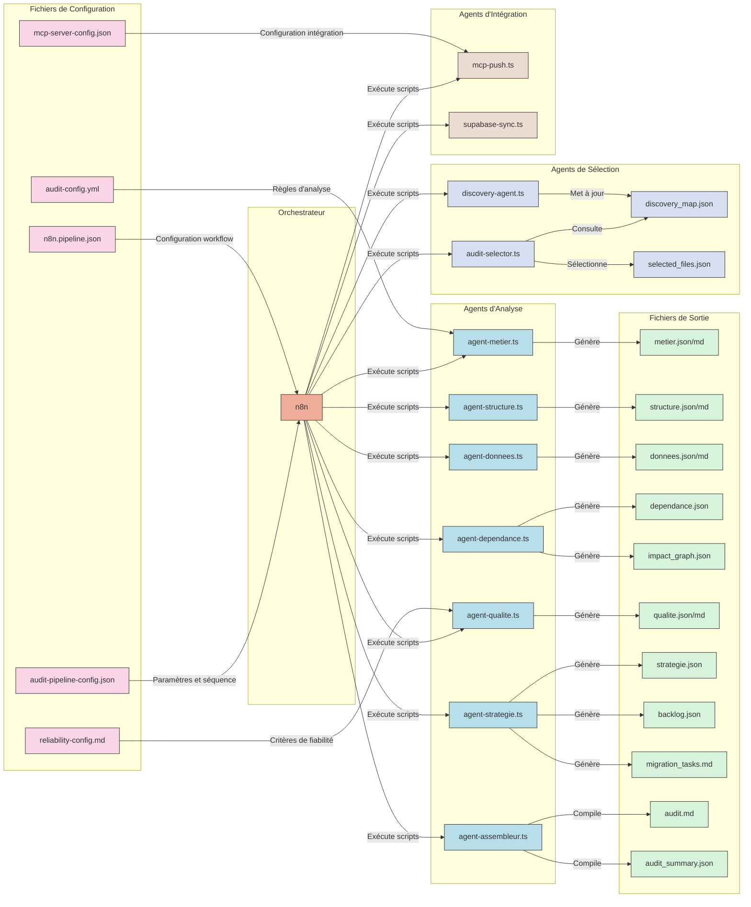
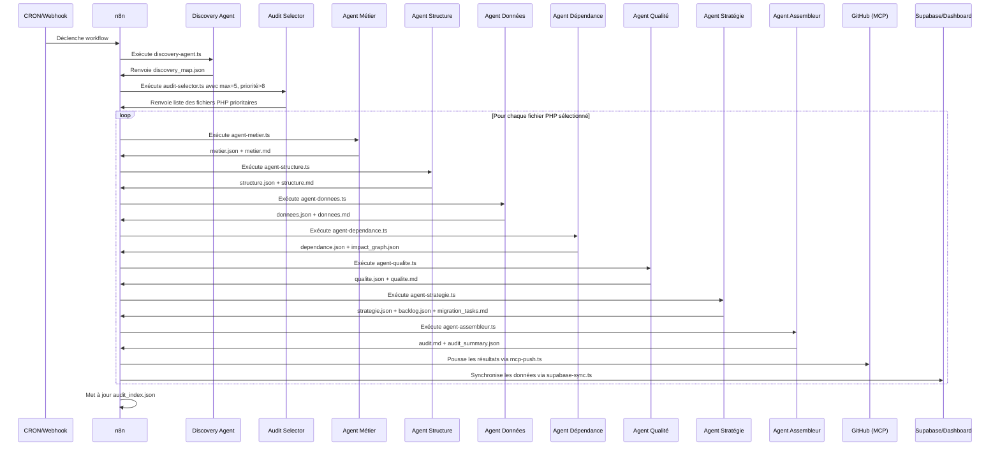

```mermaid
flowchart TD
  A[⏲️ Déclencheur\n(cron/webhook/manuel)] --> B[📁 Sélecteur IA\nde fichiers PHP]
  B --> C{Déjà audité ?}
  C -- Non --> D[📦 Envoi au pipeline\nIA d'audit]
  D --> E1[👨‍💼 Agent Métier]
  E1 --> E2[🏗️ Agent Structure]
  E2 --> E3[💾 Agent Données]
  E3 --> E4[🔄 Agent Dépendance]
  E4 --> E5[🧐 Agent Qualité]
  E5 --> E6[📊 Agent Stratégie]
  E6 --> E7[📋 Agent Assembleur]
  E7 --> F[📝 Génération\naudit.md + backlog.json]
  F --> G[🚀 Envoi GitHub\nvia MCP]
  G --> H[📚 Indexation\nSupabase / Dashboard]
  C -- Oui --> X[⏳ Ignoré\n(déjà traité)]
  
  subgraph "Sélection Intelligente"
    B
    C
  end
  
  subgraph "Pipeline Multi-Agents"
    D
    E1
    E2
    E3
    E4
    E5
    E6
    E7
  end
  
  subgraph "Intégration & Visualisation"
    F
    G
    H
  end
  
  classDef trigger fill:#ff9900,stroke:#333,stroke-width:2px;
  classDef selection fill:#3498db,stroke:#333,stroke-width:2px;
  classDef pipeline fill:#2ecc71,stroke:#333,stroke-width:2px;
  classDef integration fill:#9b59b6,stroke:#333,stroke-width:2px;
  classDef decision fill:#e74c3c,stroke:#333,stroke-width:2px;
  classDef ignored fill:#95a5a6,stroke:#333,stroke-width:2px;
  
  class A trigger;
  class B,C selection;
  class D,E1,E2,E3,E4,E5,E6,E7 pipeline;
  class F,G,H integration;
  class C decision;
  class X ignored;
```

## Avantages clés du pipeline d'audit automatisé

| Fonction | Bénéfice immédiat |
|----------|-------------------|
| **Sélection IA autonome** | Zéro clic, pas besoin de choisir de fichier |
| **Priorisation métier + technique** | Ce qui est critique passe en premier |
| **Audit continu & itératif** | À chaque exécution, progression intelligente |
| **Intégration avec GitHub + Supabase** | Visibilité totale et historique sécurisé |
| **Dashboard de suivi** | Contrôle visuel du backlog et de la progression |

## Architecture technique

Le pipeline d'audit automatisé est composé de trois parties principales :

1. **Sélection Intelligente**
   - Discovery Agent : cartographie tous les fichiers PHP
   - Audit Selector : priorise les fichiers en fonction de critères métier et techniques

2. **Pipeline Multi-Agents**
   - Agent Métier : analyse le rôle métier, les déclencheurs et la zone fonctionnelle
   - Agent Structure : analyse les fonctions, includes, switch et la logique
   - Agent Données : analyse les $_POST, $_GET, SQL, headers
   - Agent Dépendance : analyse les includes, lib externes et génère une carte de dépendances
   - Agent Qualité : analyse la complexité, duplication et sécurité
   - Agent Stratégie : élabore un plan de migration, définit des tâches et priorise
   - Agent Assembleur : compile tous les résultats en un rapport cohérent

3. **Intégration & Visualisation**
   - Génération des rapports : audit.md, backlog.json, impact_graph.json
   - Push vers GitHub via MCP pour versionnement
   - Synchronisation avec Supabase pour le dashboard Remix

Le système s'exécute automatiquement via un déclencheur CRON quotidien, un webhook GitHub ou manuellement si nécessaire.

## Interactions entre fichiers de configuration et agents



## Flux de données dans le pipeline d'audit



## Architecture des volumes de données

```mermaid
graph TD
    Root[/workspaces/cahier-des-charge] --> Agents[agents/]
    Root --> App[app/]
    Root --> Config[config/]
    Root --> Reports[reports/]
    Root --> Docs[docs/]
    
    Agents --> Analysis[analysis/]
    Agents --> Discovery[discovery/]
    
    Analysis --> AgentMetier[agent-metier.ts]
    Analysis --> AgentStructure[agent-structure.ts]
    Analysis --> AgentDonnees[agent-donnees.ts]
    Analysis --> AgentDependance[agent-dependance.ts]
    Analysis --> AgentQualite[agent-qualite.ts]
    Analysis --> AgentStrategie[agent-strategie.ts]
    Analysis --> AgentAssembleur[agent-assembleur.ts]
    
    Discovery --> DiscoveryAgent[discovery-agent.ts]
    Discovery --> AuditSelector[audit-selector.ts]
    
    Config --> AuditConfig[audit-config.yml]
    Config --> PipelineConfig[audit-pipeline-config.json]
    Config --> MCPConfig[mcp-server-config.json]
    Config --> N8NPipeline[n8n.pipeline.json]
    
    Reports --> Discovery[discovery_map.json]
    Reports --> Analysis[analysis/]
    Reports --> AuditIndex[audit_index.json]
    
    Reports --> AuditQuality[audit_quality_metrics.json]
    
    Analysis --> FileDir1[file1.php/]
    Analysis --> FileDir2[file2.php/]
    Analysis --> FileDir3[file3.php/]
    
    FileDir1 --> Metier1[metier.json/md]
    FileDir1 --> Structure1[structure.json/md]
    FileDir1 --> Donnees1[donnees.json/md]
    FileDir1 --> Dependance1[dependance.json]
    FileDir1 --> ImpactGraph1[impact_graph.json]
    FileDir1 --> Qualite1[qualite.json/md]
    FileDir1 --> Strategie1[strategie.json]
    FileDir1 --> Backlog1[backlog.json]
    FileDir1 --> MigrationTasks1[migration_tasks.md]
    FileDir1 --> Audit1[audit.md]
    FileDir1 --> AuditSummary1[audit_summary.json]
    
    classDef root fill:#f8f9fa,stroke:#333,stroke-width:2px;
    classDef dir fill:#e2e3e5,stroke:#333,stroke-width:1px;
    classDef agent fill:#d1e7dd,stroke:#333,stroke-width:1px;
    classDef config fill:#d1ecf1,stroke:#333,stroke-width:1px;
    classDef report fill:#fff3cd,stroke:#333,stroke-width:1px;
    classDef output fill:#f8d7da,stroke:#333,stroke-width:1px;
    
    class Root root;
    class Agents,App,Config,Reports,Docs,Analysis,Discovery dir;
    class AgentMetier,AgentStructure,AgentDonnees,AgentDependance,AgentQualite,AgentStrategie,AgentAssembleur,DiscoveryAgent,AuditSelector agent;
    class AuditConfig,PipelineConfig,MCPConfig,N8NPipeline config;
    class Discovery,Analysis,AuditIndex,AuditQuality,FileDir1,FileDir2,FileDir3 report;
    class Metier1,Structure1,Donnees1,Dependance1,ImpactGraph1,Qualite1,Strategie1,Backlog1,MigrationTasks1,Audit1,AuditSummary1 output;
```