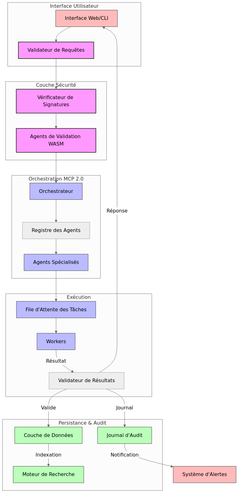

# Architecture à trois couches pour les agents MCP

*Mise à jour : 8 mai 2025 - Après déduplication complète*

## Vue d'ensemble

L'architecture à trois couches est un modèle architectural qui divise les responsabilités des agents en trois niveaux distincts, permettant une meilleure organisation, réutilisation et maintenance du code. Cette architecture permet également une évolution plus flexible du système. La récente déduplication du code a éliminé plus de 200 fichiers redondants tout en préservant la fonctionnalité complète.



## Les trois couches

### 1. Couche d'orchestration (Orchestration)

**Responsabilité:** Coordination des processus de haut niveau et orchestration des flux de travail.

**Interfaces:**
- `OrchestrationAgent`: Interface de base pour tous les agents d'orchestration
- `OrchestratorAgent`: Pour les agents qui orchestrent l'exécution de séquences d'agents
- `MonitorAgent`: Pour les agents qui surveillent l'exécution d'autres agents
- `SchedulerAgent`: Pour les agents qui planifient l'exécution d'agents selon un calendrier défini

**Exemple de méthode clé:**
```typescript
// Interface OrchestrationAgent
async orchestrate(workflow: string | object, context: Record<string, any>): Promise<AgentResult>;
```

### 2. Couche de coordination (Coordination)

**Responsabilité:** Intégration entre systèmes et adaptation des données entre différents formats.

**Interfaces:**
- `CoordinationAgent`: Interface de base pour tous les agents de coordination
- `AdapterAgent`: Pour les agents qui adaptent les données entre différents formats
- `BridgeAgent`: Pour les agents qui font le pont entre différents systèmes
- `RegistryAgent`: Pour les agents qui gèrent des registres de services ou d'entités

**Exemple de méthode clé:**
```typescript
// Interface CoordinationAgent
async coordinate(sources: string[], targets: string[], data: Record<string, any>): Promise<AgentResult>;
```

### 3. Couche métier (Business)

**Responsabilité:** Logique métier spécifique et traitement des données.

**Interfaces:**
- `BusinessAgent`: Interface de base pour tous les agents métier
- `AnalyzerAgent`: Pour les agents qui analysent des données
- `GeneratorAgent`: Pour les agents qui génèrent du contenu ou des données
- `ValidatorAgent`: Pour les agents qui valident des données selon des règles spécifiques
- `ParserAgent`: Pour les agents qui analysent et transforment des formats spécifiques

**Exemple de méthode clé:**
```typescript
// Interface BusinessAgent
async process(operation: string, context: Record<string, any>): Promise<AgentResult>;
```

## Interface commune BaseAgent

Tous les agents, quelle que soit leur couche, implémentent une interface de base commune:

```typescript
interface BaseAgent {
  // Propriétés d'identification
  id: string;
  name: string;
  type: string;
  version: string;

  // Méthodes du cycle de vie
  initialize(options?: Record<string, any>): Promise<void>;
  isReady(): boolean;
  shutdown(): Promise<void>;
  
  // Métadonnées
  getMetadata(): Record<string, any>;
}
```

## Flux de communication entre les couches

La communication entre les couches suit un modèle de hiérarchie stricte:
1. La couche d'orchestration peut appeler des agents de coordination ou de business.
2. La couche de coordination peut appeler des agents de la couche business, mais pas d'orchestration.
3. La couche business ne peut appeler que d'autres agents de la couche business.

```
Orchestration ──► Coordination ──► Business
      │                │
      └────────────────┘
           │
           ▼
         Business
```

## Format de résultat standardisé: AgentResult

Tous les agents retournent leurs résultats dans un format standardisé pour assurer une gestion uniforme des erreurs et des succès:

```typescript
interface AgentResult {
  success: boolean;
  data?: any;
  error?: string | Record<string, any>;
  metadata?: Record<string, any>;
}
```

## Bonnes pratiques

### Structure de répertoires

```
└── packages/
    ├── orchestration/      # Agents de la couche d'orchestration
    │   ├── orchestrators/  # OrchestratorAgents
    │   ├── monitors/       # MonitorAgents
    │   └── schedulers/     # SchedulerAgents
    │
    ├── coordination/       # Agents de la couche de coordination
    │   ├── adapters/       # AdapterAgents
    │   ├── bridges/        # BridgeAgents
    │   └── registries/     # RegistryAgents
    │
    └── business/           # Agents de la couche métier
        ├── analyzers/      # AnalyzerAgents
        ├── generators/     # GeneratorAgents
        ├── validators/     # ValidatorAgents
        └── parsers/        # ParserAgents
```

### Conventions de nommage

- Noms de classes: `{Fonction}Agent` (ex: `MarkdownParserAgent`)
- Fichiers: kebab-case (ex: `markdown-parser-agent.ts`)
- Dossiers: kebab-case (ex: `markdown-parsers/`)
- IDs d'agents: kebab-case (ex: `markdown-parser-001`)

### Configuration d'agent

Tous les agents devraient accepter une configuration typée:

```typescript
interface MyAgentConfig {
  // Propriétés de configuration spécifiques
  property1: string;
  property2: number;
  // ...
}

class MyAgent implements BusinessAgent {
  constructor(private config: MyAgentConfig, private context: AgentContext) {
    // Initialisation
  }
}
```

### Gestion du contexte

Le contexte contient des ressources partagées comme les services de journalisation, les connexions aux bases de données, etc.:

```typescript
interface AgentContext {
  logger: Logger;
  services?: Record<string, any>;
  // ...
}
```

## Avantages de l'architecture à trois couches

1. **Séparation des responsabilités:** Chaque couche a un rôle bien défini.
2. **Facilité de maintenance:** Les modifications dans une couche n'affectent pas les autres.
3. **Réutilisabilité:** Les agents de bas niveau peuvent être réutilisés dans différents contextes.
4. **Évolutivité:** Possibilité d'ajouter de nouveaux agents sans modifier les existants.
5. **Testabilité:** Les agents peuvent être testés isolément.

## Conseils pour la migration d'agents existants

1. Identifiez la couche la plus appropriée pour votre agent
2. Choisissez l'interface la plus adaptée à sa fonction
3. Implémentez les méthodes requises par l'interface
4. Adaptez la logique existante pour fonctionner avec le nouveau contrat
5. Testez que le comportement est identique avant et après la migration

## Exemple d'implémentation

Voici un exemple simplifié d'un agent d'analyse de texte dans l'architecture à trois couches:

```typescript
// text-sentiment-analyzer.ts
import { AnalyzerAgent, AgentResult } from 'mcp-types';

interface TextSentimentConfig {
  language: string;
  threshold: number;
  useMachineLearning: boolean;
}

export class TextSentimentAnalyzer implements AnalyzerAgent {
  // Propriétés BaseAgent
  id = 'text-sentiment-analyzer-001';
  name = 'Text Sentiment Analyzer';
  type = 'analyzer';
  version = '1.0.0';
  
  constructor(private config: TextSentimentConfig, private context: any) {}
  
  // Méthodes AnalyzerAgent
  async analyze(data: any, criteria: Record<string, any>): Promise<Record<string, any>> {
    const text = data.text || '';
    // Logique d'analyse du sentiment
    const sentiment = this.analyzeSentiment(text);
    return {
      sentiment: sentiment,
      score: this.calculateScore(sentiment),
      confidence: 0.95,
      language: this.config.language
    };
  }
  
  async generateReport(analysisResult: Record<string, any>, format: string): Promise<string> {
    // Génération de rapport selon le format demandé
    switch (format) {
      case 'json':
        return JSON.stringify(analysisResult, null, 2);
      case 'html':
        return `<div><h2>Sentiment Analysis</h2><p>Score: ${analysisResult.score}</p></div>`;
      default:
        return `Sentiment: ${analysisResult.sentiment}, Score: ${analysisResult.score}`;
    }
  }
  
  // Méthodes BusinessAgent
  async process(operation: string, context: Record<string, any>): Promise<AgentResult> {
    switch (operation) {
      case 'analyze':
        try {
          const result = await this.analyze(context.data, context.criteria || {});
          return { success: true, data: result };
        } catch (error) {
          return { success: false, error: error.message };
        }
        
      case 'report':
        try {
          const report = await this.generateReport(context.analysisResult, context.format || 'text');
          return { success: true, data: report };
        } catch (error) {
          return { success: false, error: error.message };
        }
        
      default:
        return { 
          success: false, 
          error: `Opération non supportée: ${operation}`
        };
    }
  }
  
  // Méthodes BaseAgent
  async initialize(options?: Record<string, any>): Promise<void> {
    this.context.logger.info('Initialisation de TextSentimentAnalyzer');
    // Initialisation des ressources
  }
  
  isReady(): boolean {
    return true;
  }
  
  async shutdown(): Promise<void> {
    this.context.logger.info('Arrêt de TextSentimentAnalyzer');
    // Nettoyage des ressources
  }
  
  getMetadata(): Record<string, any> {
    return {
      id: this.id,
      name: this.name,
      type: this.type,
      version: this.version,
      capabilities: ['analyze', 'report'],
      supportedLanguages: ['fr', 'en', 'es'],
      configOptions: {
        language: { type: 'string', default: 'en' },
        threshold: { type: 'number', default: 0.5 },
        useMachineLearning: { type: 'boolean', default: true }
      }
    };
  }
  
  // Méthodes privées spécifiques
  private analyzeSentiment(text: string): 'positive' | 'negative' | 'neutral' {
    // Logique d'analyse du sentiment
    if (!text) return 'neutral';
    // ...logique d'implémentation...
    return 'positive';
  }
  
  private calculateScore(sentiment: string): number {
    // Calcul du score
    switch (sentiment) {
      case 'positive': return 0.8;
      case 'negative': return 0.2;
      default: return 0.5;
    }
  }
}
```

## Statistiques après déduplication (Mai 2025)

La restructuration et déduplication ont permis une réduction significative de la redondance dans le code :

| Couche | Fichiers | Répertoires | Description |
|--------|----------|-------------|-------------|
| Orchestration | 55 | 14 | Gestion des workflows et coordination de haut niveau |
| Coordination | 3 | 4 | Communication entre différentes couches et systèmes |
| Business | 572 | 225 | Logique métier, analyse, validation, génération |
| Interfaces | 10 | 4 | Interfaces partagées par les différentes couches |

**Total d'agents dédupliqués**: 210
**Taux de réussite de consolidation**: 100%
```