# 📚 Sommaire du Cahier des Charges

## 📋 Vue d'ensemble du projet

Ce cahier des charges présente l'ensemble du processus de migration automatisée assistée par IA, organisé selon les phases logiques du projet, de la préparation au déploiement.

## 🗂️ Structure des chapitres

### I. Introduction et fondamentaux
1. [Introduction](./01-introduction.md) - Présentation du projet et objectifs
2. [Technologies, outils et services](./36-technologies-outils-services.md) - État actuel et perspectives d'évolution
3. [Gestion des risques](./37-gestion-risques.md) - Identification et stratégies d'atténuation

### II. Phase de préparation
1. [Checklist de pré-migration](./10-checklist-pre-migration.md) - Vérifications initiales
2. [Gel du code legacy PHP et SQL](./41-gel-code-legacy.md) - Création de la référence immuable
3. [Gel de la structure cible](./42-gel-structure-cible.md) - Définition de l'architecture NestJS/Remix
4. [Vérification de l'environnement de test](./44-verification-environnement-test.md) - Configuration des outils
5. [Finalisation du profil monorepo](./45-profil-monorepo-reference.md) - Création du profil de référence

### III. Infrastructure IA et automatisation
1. [Socle IA d'analyse et migration](./43-socle-ia-analyse-migration.md) - Configuration du système IA
2. [Procédure d'installation du pipeline](./39-procedure-installation-pipeline.md) - Mise en place de l'automatisation
3. [Command Center](./34-command-center.md) - Interface de suivi de la migration

### IV. Organisation et planification du travail
1. [Backlog par modules fonctionnels](./47-backlog-modules-fonctionnels.md) - Structure de migration
2. [Versionnement intelligent](./35-versionnement-intelligent.md) - Gestion des versions du code

### V. Qualité et validation
1. [Mismatch Tracker](./20-mismatch-tracker.md) - Détection des incohérences
2. [Alertes de désynchronisation](./30-alertes-desynchronisation.md) - Système de notification
3. [Audit automatique](./33-audit-automatique.md) - Vérification du code migré

### VI. Sécurité et déploiement
1. [Checklist d'avant lancement](./40-checklist-avant-lancement.md) - Vérifications finales
2. [Checklist bonus sécurité](./46-checklist-bonus-securite.md) - Mesures de sécurité additionnelles

### VII. Documentation et suivi
1. [Journal des modifications](./38-journal-modifications.md) - Historique des changements du CDC

## 📈 Progression du projet

```mermaid
graph LR
    A[Préparation] --> B[Infrastructure]
    B --> C[Planification]
    C --> D[Migration]
    D --> E[Validation]
    E --> F[Déploiement]
    F --> G[Maintenance]
    
    style A fill:#d4f1f9,stroke:#05a,stroke-width:2px
    style B fill:#d4f1f9,stroke:#05a,stroke-width:2px
    style C fill:#d4f1f9,stroke:#05a,stroke-width:2px
    style D fill:#ffe6cc,stroke:#d79b00,stroke-width:2px
    style E fill:#ffe6cc,stroke:#d79b00,stroke-width:2px
    style F fill:#d5e8d4,stroke:#82b366,stroke-width:2px
    style G fill:#f8cecc,stroke:#b85450,stroke-width:2px
```

## 🔄 Comment utiliser ce cahier des charges

1. **Pour les décideurs**: Commencez par la section I pour comprendre les fondamentaux
2. **Pour les architectes**: Concentrez-vous sur les sections II et III pour la mise en place
3. **Pour les développeurs**: Utilisez les sections IV et V pour le travail quotidien
4. **Pour les responsables qualité**: Référez-vous aux sections V et VI
5. **Pour le suivi du projet**: Consultez la section VII

Ce sommaire suit le cycle de vie du projet de migration, permettant à chaque partie prenante de se repérer facilement et d'accéder rapidement aux informations pertinentes selon son rôle.
