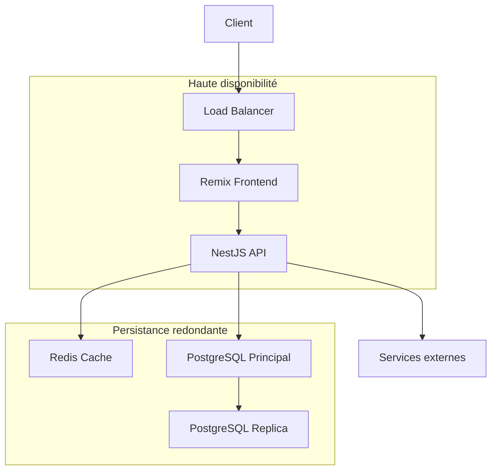

# Fiabilité du système

## 🛡️ Vue d'ensemble

La fiabilité du système est un pilier fondamental de notre architecture, garantissant que l'application reste stable, performante et résiliente face aux différentes conditions d'utilisation et aux défaillances potentielles.

## 📊 Objectifs de fiabilité

| Métrique | Objectif | Méthode de mesure |
|----------|----------|-------------------|
| Disponibilité | 99.95% | Temps de fonctionnement / temps total |
| MTBF (Mean Time Between Failures) | >720h | Temps moyen entre incidents |
| MTTR (Mean Time To Recovery) | <15min | Temps moyen de restauration |
| Taux d'erreurs | <0.1% | Erreurs / requêtes totales |
| Résilience | 100% | Capacité à survivre aux pannes des services non-critiques |

## 🏗️ Architecture résiliente

### Structure multi-couches



### Mécanismes de résilience

- **Circuit Breakers** : Prévention de la propagation des défaillances
- **Rate Limiting** : Protection contre les surcharges
- **Retry Policies** : Gestion automatique des échecs temporaires
- **Graceful Degradation** : Maintien du service avec fonctionnalités réduites
- **Bulkheads** : Isolation des défaillances pour éviter les effets en cascade

## 🔄 Stratégies de récupération

### Défaillances de base de données

1. **Réplication active** : PostgreSQL avec un serveur primaire et répliques en lecture
2. **Basculement automatique** : Promotion d'une réplique en cas de défaillance du primaire
3. **Point-in-time Recovery** : Restauration à partir de snapshots + WAL

### Défaillances d'application

1. **Déploiements Blue/Green** : Transition sans interruption
2. **Rollback automatique** : Retour à la version précédente en cas d'erreur détectée
3. **Canary Releases** : Exposition progressive aux utilisateurs

### Services externes

1. **Fallbacks** : Alternatives en cas d'indisponibilité d'un service
2. **Caching** : Réduction de la dépendance aux services externes
3. **Queues** : Traitement asynchrone pour les opérations non critiques

## 🧪 Tests de fiabilité

### Types de tests

- **Tests de charge** : Validation du comportement sous stress
- **Tests de chaos** : Simulation de défaillances aléatoires
- **Tests de résilience** : Vérification des mécanismes de récupération
- **Disaster Recovery Drills** : Exercices de reprise après sinistre

### Outils et implémentation

```typescript
// Exemple de test de chaos avec NestJS
@Injectable()
export class ChaosTester {
  private readonly services: string[] = [
    'database', 'redis', 'external-payment', 'email'
  ];

  constructor(
    private readonly moduleRef: ModuleRef,
    private readonly logger: Logger
  ) {}

  async simulateFailure(service: string, duration: number): Promise<void> {
    if (!this.services.includes(service)) {
      throw new Error(`Unknown service: ${service}`);
    }

    this.logger.warn(`🔥 Chaos test: Simulating ${service} failure for ${duration}ms`);
    
    // Obtenir le service et appliquer un proxy de défaillance
    const serviceInstance = this.moduleRef.get(service, { strict: false });
    const originalMethods = this.disableService(serviceInstance);
    
    // Rétablir après la durée spécifiée
    setTimeout(() => {
      this.restoreService(serviceInstance, originalMethods);
      this.logger.log(`✅ Chaos test: ${service} restored after ${duration}ms`);
    }, duration);
  }
  
  // ...autres méthodes d'aide pour la simulation de chaos
}
```

## 📈 Monitoring et alertes

### Indicateurs clés

- **Latence** : P95, P99 des temps de réponse API
- **Saturation** : Utilisation CPU, mémoire, disque, connexions DB
- **Trafic** : Requêtes par seconde, bande passante
- **Erreurs** : Taux, distribution par type, tendances

### Système d'alerte

Configuration en couches avec différents niveaux de criticité:
- **P1** : Alerte immédiate 24/7 (SMS, appel)
- **P2** : Notification pendant les heures de travail
- **P3** : Rapport quotidien pour analyse

## 🔐 Sécurité comme fondation de fiabilité

La sécurité est intrinsèquement liée à la fiabilité du système:

- **Scanning de dépendances** : Détection automatique des vulnérabilités
- **SAST/DAST** : Analyse de code et tests de pénétration réguliers
- **Audit logging** : Traçabilité complète des actions système
- **Threat modeling** : Anticipation des risques de sécurité

## 📝 Documentation des incidents

Chaque incident suit un processus documenté:

1. **Détection et classification**
2. **Containment et mitigation**
3. **Investigation et résolution**
4. **Post-mortem et lessons learned**

Template de rapport d'incident:
```markdown
# Rapport d'incident

## Informations générales
- **Date/heure de début:** YYYY-MM-DD HH:MM
- **Date/heure de résolution:** YYYY-MM-DD HH:MM
- **Durée:** X heures Y minutes
- **Impact:** Description de l'impact utilisateur
- **Sévérité:** P1/P2/P3

## Chronologie
- **HH:MM** - Événement 1
- **HH:MM** - Événement 2
- ...

## Cause racine
Description détaillée de la cause racine

## Actions correctives
- Action immédiate prise
- Corrections à moyen terme
- Améliorations systémiques

## Leçons apprises
- Quels processus ont bien fonctionné
- Ce qui aurait pu être amélioré
- Comment éviter que cela se reproduise
```

## 🚀 Évolution et amélioration continue

La fiabilité du système n'est pas statique mais s'améliore continuellement:

1. **Analyse des métriques historiques**
2. **Identification des points faibles récurrents**
3. **Amélioration ciblée des composants critiques**
4. **Révision régulière des objectifs de fiabilité**

> [!DECISION]  
> ## Décision technique: Adoption d'une architecture résiliente multi-niveaux
> 
> **Date:** 2023-11-20  
> **Statut:** Accepté  
> **Contexte:** Nécessité de garantir une haute disponibilité du système pendant et après la migration
> 
> **Options considérées:**
> 1. Architecture monolithique avec redondance simple
> 2. Microservices complets avec orchestration Kubernetes
> 3. Architecture modulaire avec isolation des défaillances
> 
> **Décision:** Adopter l'option 3 avec implémentation progressive des patterns de résilience
> 
> **Conséquences:** 
> - Développement de mécanismes de circuit breaker et bulkhead
> - Configuration de la réplication PostgreSQL
> - Mise en place de systèmes de monitoring avancés
> 
> **Métriques de validation:** 
> - Atteinte de l'objectif de 99.95% de disponibilité
> - Réduction du MTTR à moins de 15 minutes
