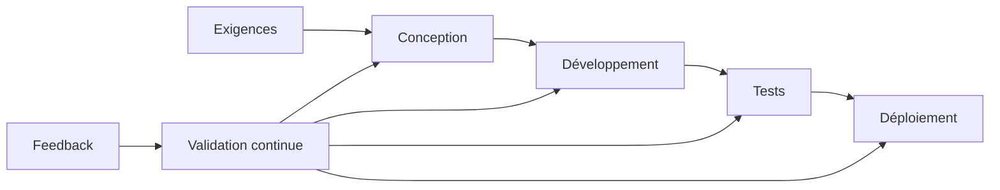
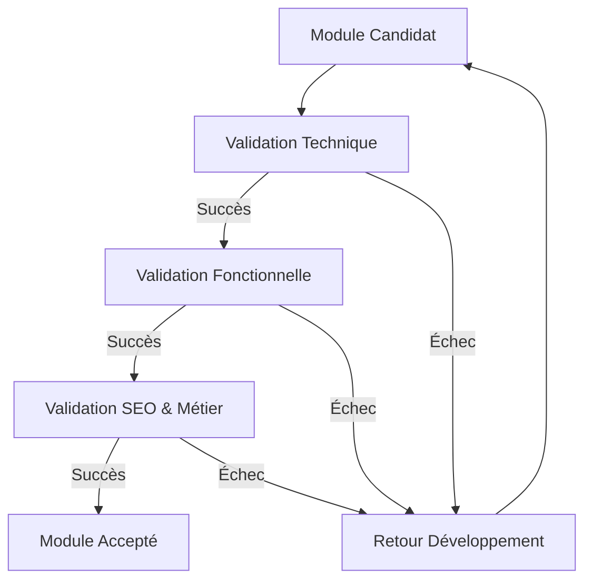

# Contrôle qualité & validation continue

## 🎯 Principes fondamentaux

Le contrôle qualité et la validation continue constituent un pilier essentiel du projet, garantissant que chaque module livré respecte les standards techniques et fonctionnels définis.

### Approche de haut niveau

La stratégie de qualité s'articule autour de quatre principes directeurs:

1. **Qualité intrinsèque** - La qualité est intégrée au processus de développement plutôt qu'ajoutée a posteriori
2. **Automatisation exhaustive** - Maximisation des validations automatisées pour garantir cohérence et répétabilité
3. **Feedback immédiat** - Détection précoce des problèmes pour minimiser le coût de correction
4. **Amélioration continue** - Évolution constante des critères de qualité basée sur les retours d'expérience



## 🔍 Processus de validation par couches

Chaque livraison de module suit un processus de validation en trois couches successives:



## ⚙️ Règles de validation technique

### Critères obligatoires

| Critère | Seuil | Outil de vérification | Blocant |
|---------|-------|------------------------|---------|
| Couverture de tests | ≥ 85% | Jest | Oui |
| Analyse statique | 0 erreur | ESLint | Oui |
| Type safety | 0 erreur | TypeScript strict | Oui |
| Complexité cyclomatique | ≤ 15 | SonarQube | Oui |
| Dette technique | ≤ 3j/fichier | SonarQube | Non |
| Build sans erreur | 100% | CI pipeline | Oui |
| Tests d'intégration | 100% réussite | Cypress | Oui |
| Sécurité | 0 vulnérabilité haute | OWASP ZAP | Oui |

### Validation NestJS spécifique

- **Architecture modulaire**: Respect strict du pattern NestJS
- **Séparation des responsabilités**: Controllers, Services, Repositories distincts
- **Injection de dépendances**: Aucune instanciation directe
- **Gestion des exceptions**: Utilisation des filtres d'exception NestJS
- **Validation DTO**: Utilisation de class-validator
- **Documentation API**: OpenAPI/Swagger complet

### Validation Remix spécifique

- **Routes conformes**: Structure de dossiers correcte
- **Loading states**: Gestion des états de chargement
- **Error boundaries**: Capture des erreurs à chaque niveau
- **Hydration correcte**: Pas d'erreurs d'hydration
- **Accessibilité**: WCAG AA minimum (score Lighthouse ≥ 90)
- **Performance**: Score Lighthouse Performance ≥ 85

## 🧪 Règles de validation fonctionnelle

### Matrice d'acceptation fonctionnelle

| Fonctionnalité | Critères d'acceptation | Méthode de validation | Environnement |
|----------------|-----------------------|------------------------|--------------|
| Authentification | Tous les flows (login, register, reset, 2FA) | Tests E2E automatisés | Staging |
| Gestion produits | CRUD complet, validation, médias | Tests E2E + revue manuelle | Staging |
| Panier & Commande | Ajout, modification, checkout, paiement | Tests E2E + scenarios métier | Staging |
| Administration | Toutes les actions CRUD, filtres, exports | Checklist manuelle | Staging |
| Recherche | Pertinence, filtres, performance | Benchmarks automatisés | Prod-like |

### Scénarios critiques

Pour chaque module, des scénarios critiques explicites sont définis:

```typescript
// Exemple de scénario critique pour le module Panier
const cartCriticalScenarios = [
  {
    name: 'Ajout produit avec stock limité',
    steps: [
      'Sélectionner produit avec stock=1',
      'Ajouter au panier',
      'Vérifier mise à jour stock temporaire',
      'Finaliser commande',
      'Vérifier stock définitif'
    ],
    expectedResults: [
      'Stock temporairement réservé pendant 15min',
      'Stock définitivement décrémenté après paiement',
      'Stock libéré si abandon panier'
    ],
    severity: 'CRITICAL'
  },
  // Autres scénarios...
];
```

## 🔒 Règles de validation de sécurité

### Vérifications obligatoires

- **Injections SQL**: Tests automatisés avec SQLMap
- **XSS**: Vérification avec OWASP ZAP
- **CSRF**: Protection présente et testée
- **Authentification**: Tests de bypass et brute force
- **Autorisations**: Tests d'escalade de privilèges
- **Données sensibles**: Chiffrement vérifié

### Validation RGPD

- **Consentement**: Mécanismes explicites
- **Suppression**: Droit à l'oubli fonctionnel
- **Portabilité**: Export de données disponible
- **Minimisation**: Données strictement nécessaires

## 🚀 Processus de validation continue

### Pipeline de validation

```
Code Push → Build → Tests unitaires → Linting → Tests d'intégration → Analyse sécurité → Déploiement staging → Tests E2E → Validation fonctionnelle → Approbation → Production
```

### Règles de promotion entre environnements

| Passage | Critères | Approbateurs | TTL (validité) |
|---------|----------|--------------|----------------|
| Dev → Staging | CI verte + revue code | 1 tech lead | 1 jour |
| Staging → Preprod | Tests E2E 100% + QA | 1 tech lead + 1 QA | 3 jours |
| Preprod → Prod | Validation métier + performance | 1 tech lead + 1 product owner | 5 jours |

### Mécanismes de rollback

- **Détection automatique**: Seuils de monitoring définis
- **Triggers**: Erreurs 5xx > 0.1%, latence > 500ms, taux conversion -5%
- **Procédure**: Rollback automatique sous 5 minutes
- **Notification**: Alerte immédiate à l'équipe responsable

## 📊 Tableau de bord qualité

Un tableau de bord centralisé présente en temps réel:

- **Statut global**: Score qualité agrégé
- **Métriques techniques**: Couverture, dette, performance
- **Métriques fonctionnelles**: Taux de validation des scénarios
- **Métriques utilisateur**: Satisfaction, erreurs rencontrées
- **Tendances**: Évolution des indicateurs

## 📝 Documentation des validations

### Rapport de validation automatique

Chaque module généré automatiquement inclut un rapport de validation:

```markdown
# Rapport de validation: Module Authentification

## Validation technique
- ✅ Tests unitaires: 92% couverture
- ✅ ESLint: 0 erreur, 3 warnings
- ✅ TypeScript: 0 erreur
- ✅ SonarQube: Dette technique 2.5j, 0 bug critique
- ✅ Build: Succès
- ✅ Tests intégration: 28/28 réussis

## Validation fonctionnelle
- ✅ Login standard: validé
- ✅ Login SSO: validé
- ✅ Récupération mot de passe: validé
- ✅ Inscription nouvel utilisateur: validé
- ⚠️ Login 2FA: 1 scénario en échec (résolu dans PR #1234)

## Validation sécurité
- ✅ OWASP Top 10: 0 vulnérabilité
- ✅ Tests de pénétration: Passés
- ✅ Audit de code: 0 faille critique

## Décision
**ACCEPTÉ AVEC RÉSERVE**
Module déployable après correction du scénario 2FA (PR #1234)
```

Ce processus rigoureux de validation garantit que chaque module livré respecte les standards de qualité les plus élevés, tout en permettant une itération rapide et une amélioration continue du système.
