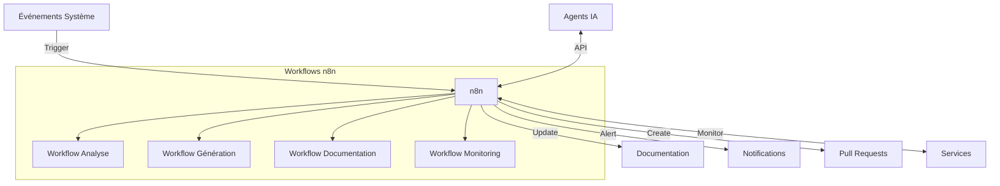
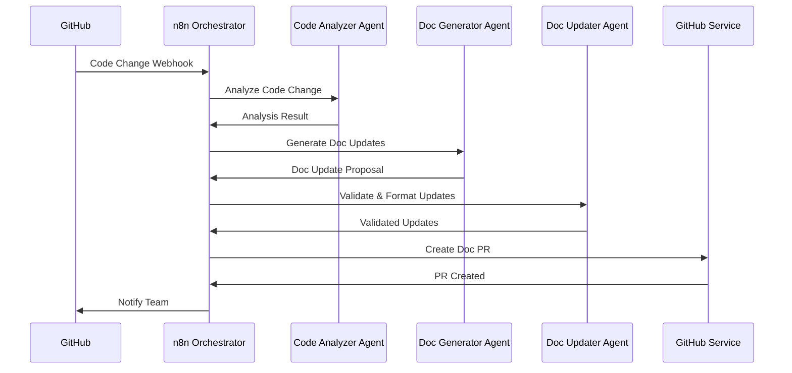

# Suivi automatisé par agents IA & orchestration documentaire

## 🔄 Vue d'ensemble

Ce système intégré assure le suivi automatisé du projet via des agents IA et l'orchestration de la documentation, garantissant cohérence, traçabilité et mise à jour continue du cahier des charges.

## 🔄 Orchestration distribuée via n8n

### Architecture d'orchestration

L'orchestration est réalisée via n8n, une plateforme de workflow automation qui coordonne les différents agents IA et systèmes:



### Structure des workflows

```
/workflows/
├── analysis/
│   ├── code-analyzer.json
│   ├── schema-analyzer.json
│   └── requirements-analyzer.json
├── generation/
│   ├── code-generator.json
│   ├── test-generator.json
│   └── migration-planner.json
├── documentation/
│   ├── docs-updater.json
│   ├── changelog-generator.json
│   └── kpi-reporter.json
└── monitoring/
    ├── agent-health.json
    ├── progress-tracker.json
    └── alert-manager.json
```

### Workflow type: Mise à jour documentaire

```json
{
  "name": "Documentation Update Workflow",
  "nodes": [
    {
      "id": "trigger",
      "type": "n8n-nodes-base.webhook",
      "parameters": {
        "path": "docs-update",
        "responseMode": "lastNode"
      },
      "position": [100, 300]
    },
    {
      "id": "extract_metadata",
      "type": "n8n-nodes-base.function",
      "parameters": {
        "functionCode": "../ Code extraction des métadonnées pertinentes"
      },
      "position": [300, 300]
    },
    {
      "id": "analyze_impact",
      "type": "n8n-nodes-base.httpRequest",
      "parameters": {
        "url": "http://agent-service/analyze-doc-impact",
        "method": "POST"
      },
      "position": [500, 300]
    },
    {
      "id": "update_decision",
      "type": "n8n-nodes-base.switch",
      "parameters": {
        "conditions": {
          "string": [
            {
              "value1": "={{ $json[\"impact_level\"] }}",
              "operation": "greaterThan",
              "value2": "3"
            }
          ]
        }
      },
      "position": [700, 300]
    },
    {
      "id": "generate_update",
      "type": "n8n-nodes-base.httpRequest",
      "parameters": {
        "url": "http://agent-service/generate-doc-update",
        "method": "POST"
      },
      "position": [900, 200]
    },
    {
      "id": "create_pr",
      "type": "n8n-nodes-base.github",
      "parameters": {
        "operation": "createPullRequest",
        "repository": "{{ $env.GITHUB_REPOSITORY }}",
        "title": "Documentation Update: {{ $json[\"update_type\"] }}",
        "body": "{{ $json[\"pr_description\"] }}",
        "base": "main",
        "head": "docs/update-{{ $json[\"timestamp\"] }}"
      },
      "position": [1100, 200]
    },
    {
      "id": "notify_team",
      "type": "n8n-nodes-base.slack",
      "parameters": {
        "channel": "doc-updates",
        "text": "🔄 Documentation update suggested: {{ $json[\"update_type\"] }}"
      },
      "position": [1300, 200]
    },
    {
      "id": "log_decision",
      "type": "n8n-nodes-base.httpRequest",
      "parameters": {
        "url": "http://logging-service/log",
        "method": "POST"
      },
      "position": [900, 400]
    }
  ],
  "connections": {
    "trigger": {
      "main": [
        [
          {
            "node": "extract_metadata",
            "type": "main",
            "index": 0
          }
        ]
      ]
    },
    "extract_metadata": {
      "main": [
        [
          {
            "node": "analyze_impact",
            "type": "main",
            "index": 0
          }
        ]
      ]
    },
    "analyze_impact": {
      "main": [
        [
          {
            "node": "update_decision",
            "type": "main",
            "index": 0
          }
        ]
      ]
    },
    "update_decision": {
      "main": [
        [
          {
            "node": "generate_update",
            "type": "main",
            "index": 0
          }
        ],
        [
          {
            "node": "log_decision",
            "type": "main",
            "index": 0
          }
        ]
      ]
    },
    "generate_update": {
      "main": [
        [
          {
            "node": "create_pr",
            "type": "main",
            "index": 0
          }
        ]
      ]
    },
    "create_pr": {
      "main": [
        [
          {
            "node": "notify_team",
            "type": "main",
            "index": 0
          }
        ]
      ]
    }
  }
}
```

### Événements déclencheurs

| Événement | Origine | Workflow déclenché | Action |
|-----------|---------|-------------------|--------|
| Commit code | GitHub | code-analyzer | Analyse impact code |
| PR merger | GitHub | docs-updater | Mise à jour documentation |
| Schéma DB modifié | Prisma | schema-analyzer | Analyse impact données |
| Issue créée | GitHub | requirements-analyzer | Analyse nouvelles exigences |
| Changement KPI | Monitoring | kpi-reporter | Mise à jour dashboard |
| Échec agent | Logs | agent-health | Notification + failover |

## 🤖 Communication inter-agents

### Protocole d'échange

Les agents communiquent via un protocole standardisé:

```typescript
interface AgentMessage {
  id: string;               // UUID unique du message
  timestamp: string;        // ISO DateTime
  sender: string;           // ID de l'agent émetteur
  recipient: string;        // ID de l'agent destinataire
  messageType: 'request' | 'response' | 'notification';
  priority: 'low' | 'normal' | 'high' | 'critical';
  content: {
    action?: string;        // Action demandée
    payload: unknown;       // Données du message
    context?: unknown;      // Contexte additionnel
  };
  metadata: {
    correlationId?: string; // Pour lier requêtes/réponses
    ttl?: number;           // Time-to-live en secondes
    retry?: number;         // Tentative actuelle (pour retry)
  };
}
```

### Exemple de séquence d'orchestration

Pour une mise à jour de documentation suite à un changement de code:



## 📊 Supervision et monitoring

### Tableau de bord d'orchestration

Un dashboard dédié `/admin/orchestration` présente:

- **État des agents**: Disponibilité et santé
- **File d'attente**: Tasks en attente, en cours, terminées
- **Métriques de performance**: Temps de traitement, taux de réussite
- **Historique des opérations**: Journal des activités

### Alertes et notifications

Le système génère des alertes contextuelles:

- **Slack/Teams**: Notifications temps réel pour l'équipe
- **Email**: Résumés périodiques et rapports
- **SMS/Pager**: Alertes critiques nécessitant action immédiate

## 🛡️ Sécurité et résilience

### Mécanismes de résilience

- **Circuit breaker**: Protection contre les cascades d'échecs
- **Rate limiting**: Prévention de surcharge des APIs
- **Retry with backoff**: Tentatives intelligentes en cas d'échec
- **Dead letter queue**: Capture des messages non traités

### Sécurisation des workflows

- **Authentication**: Tokens JWT pour tous les services
- **Authorization**: Contrôle granulaire des permissions
- **Audit trail**: Journalisation complète des opérations
- **Encryption**: Chiffrement des données sensibles

## 🔄 Configuration et déploiement

### Déploiement n8n

```yaml
# docker-compose.workflow.yml
version: '3'

services:
  n8n:
    image: n8nio/n8n
    restart: always
    ports:
      - "5678:5678"
    environment:
      - N8N_PROTOCOL=https
      - N8N_HOST=workflows.example.com
      - N8N_PORT=5678
      - N8N_ENCRYPTION_KEY=${N8N_ENCRYPTION_KEY}
      - DB_TYPE=postgresdb
      - DB_POSTGRESDB_HOST=postgres
      - DB_POSTGRESDB_PORT=5432
      - DB_POSTGRESDB_DATABASE=n8n
      - DB_POSTGRESDB_USER=n8n
      - DB_POSTGRESDB_PASSWORD=${DB_PASSWORD}
      - WEBHOOK_URL=https://workflows.example.com/
      - EXECUTIONS_PROCESS=main
    volumes:
      - n8n_data:/home/node/.n8n
      - ./workflows:/home/node/.n8n/workflows
      
  postgres:
    image: postgres:13
    restart: always
    environment:
      - POSTGRES_USER=n8n
      - POSTGRES_PASSWORD=${DB_PASSWORD}
      - POSTGRES_DB=n8n
      - POSTGRES_NON_ROOT_USER=n8n_user
    volumes:
      - postgres_data:/var/lib/postgresql/data
      
volumes:
  n8n_data:
  postgres_data:
```

Ce système d'orchestration distribué garantit la cohérence entre le code, la documentation et les processus du projet, tout en assurant une traçabilité complète et une réactivité optimale face aux changements.
