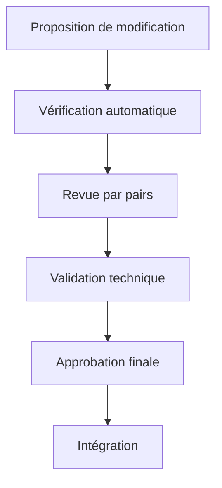

# Fiabilité du processus pour le cahier des charges

## 🔄 Vue d'ensemble

La fiabilité du processus de gestion du cahier des charges garantit que ce document reste précis, cohérent, et aligné avec les besoins du projet tout au long de son cycle de vie. Ce processus est conçu pour être robuste, traçable et reproductible.

## 🎯 Objectifs du processus fiable

| Objectif | Description | Indicateur de réussite |
|----------|-------------|------------------------|
| Précision | Information exacte et à jour | Taux d'erreurs < 1% |
| Complétude | Couverture de tous les aspects nécessaires | Score de couverture > 95% |
| Traçabilité | Historique clair des décisions et modifications | 100% des changements documentés |
| Cohérence | Absence de contradictions internes | Score de cohérence > 98% |
| Reproductibilité | Capacité à recréer/valider chaque aspect | 100% des processus documentés |

## 📋 Principes fondamentaux du processus

### 1. Validation multi-niveaux

Chaque modification du cahier des charges traverse plusieurs niveaux de validation:



### 2. Règles de modification strictes

- Toute modification doit avoir une justification documentée
- Les impacts sur d'autres sections doivent être identifiés et traités
- Les modifications majeures nécessitent une validation cross-fonctionnelle
- Chaque changement est versionné et horodaté

### 3. Mécanismes de vérification continues

- **Vérification syntaxique**: Format, structure, liens
- **Vérification sémantique**: Cohérence, terminologie, complétude
- **Vérification technique**: Exactitude, faisabilité, alignement
- **Vérification d'impact**: Effets sur le projet, dépendances

## 🛠️ Outils garantissant la fiabilité

### Scripts automatisés

- `verify-integrity.sh`: Vérification de l'intégrité structurelle
- `verify-reliability.sh`: Vérification approfondie de fiabilité
- `track-changes.sh`: Suivi des modifications et métriques
- `update-cahier.sh`: Mise à jour cohérente du sommaire et des références

### Workflows de modification

Workflow standardisé pour toute modification:

1. **Création d'une branche dédiée** pour la modification
2. **Exécution des scripts de vérification locale** avant commit
3. **Soumission via pull request** avec template détaillé
4. **Revue automatisée et humaine** selon des critères établis
5. **Validation des impacts** sur les autres sections
6. **Merge et déploiement** après approbation

### Audit trail complet

Chaque modification maintient un historique détaillé:

```json
{
  "change_id": "CH-2023-11-25-001",
  "type": "update",
  "section": "architecture-ia",
  "author": "username",
  "timestamp": "2023-11-25T14:23:45Z",
  "justification": "Mise à jour suite à l'adoption de la nouvelle version de NestJS",
  "verification": {
    "automated_checks": "passed",
    "peer_review": "approved by @reviewer1, @reviewer2",
    "technical_validation": "verified by @tech-lead"
  },
  "related_changes": ["CH-2023-11-25-002"],
  "affected_sections": ["specifications-techniques", "plan-migration"]
}
```

## 📊 Métriques de fiabilité du processus

| Métrique | Cible | Méthode de mesure |
|----------|-------|-------------------|
| Délai de mise à jour | <48h | Temps entre identification du besoin et implementation |
| Taux d'erreurs détectées | <2% | Erreurs identifiées / total des modifications |
| Couverture des revues | 100% | Sections revues / sections modifiées |
| Conformité au processus | >98% | Étapes suivies / étapes requises |
| Satisfaction des parties prenantes | >4.5/5 | Enquête trimestrielle |

## 🔄 Gestion des écarts et exceptions

### Processus d'exception

Pour les situations urgentes nécessitant une modification rapide:

1. **Demande d'exception** avec justification documentée
2. **Approbation accélérée** par au moins deux responsables
3. **Documentation post-modification** complète dans les 24h
4. **Revue rétrospective** lors du prochain cycle régulier

### Résolution des conflits

En cas de divergences d'opinions sur le contenu:

1. **Documentation des positions** divergentes
2. **Discussion basée sur des données** et des faits vérifiables
3. **Escalade structurée** si nécessaire
4. **Décision finale documentée** avec justification complète

## 📈 Amélioration continue du processus

Le processus lui-même évolue grâce à:

- **Revues trimestrielles** des métriques de fiabilité
- **Rétroaction des utilisateurs** du cahier des charges
- **Analyse des incidents** de non-conformité
- **Veille sur les meilleures pratiques** de gestion documentaire

## 🔄 Intégration avec le développement

### Synchronisation avec le code

- Chaque décision architecturale documentée est liée au code correspondant
- Les modifications du code qui impactent le cahier des charges sont identifiées
- Un processus automatisé détecte les divergences entre documentation et implémentation

### Validation bidirectionnelle

- Les revues de code vérifient la conformité avec le cahier des charges
- Les modifications du cahier des charges déclenchent des revues du code impacté
- Les tests automatisés vérifient le respect des exigences documentées

> [!DECISION]  
> ## Décision de processus: Adoption d'un workflow de modification à validation multiple
> 
> **Date:** 2023-11-28  
> **Statut:** Accepté  
> **Contexte:** Nécessité de garantir la fiabilité continue du cahier des charges
> 
> **Options considérées:**
> 1. Processus léger avec validation unique
> 2. Processus formel avec multiples validations
> 3. Système hybride basé sur l'impact des modifications
> 
> **Décision:** Adopter l'option 3 avec classification des changements en niveaux d'impact
> 
> **Conséquences:** 
> - Création de templates de PR selon le niveau d'impact
> - Mise en place des scripts de vérification automatisée
> - Définition claire des rôles de validation
> 
> **Métriques de validation:** 
> - Réduction de 90% des erreurs documentaires
> - Aucune contradiction interne dans le cahier des charges
> - Traçabilité complète de toutes les décisions
