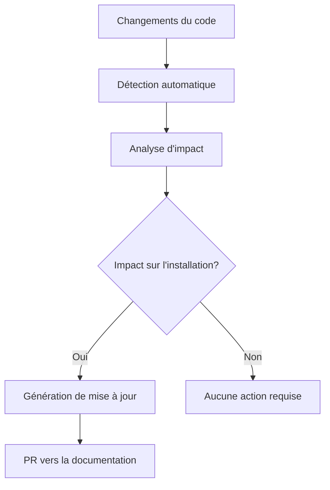

# Procédure d'installation du pipeline IA de migration

## 🚀 Vue d'ensemble

Cette procédure détaille l'installation complète du pipeline IA de migration, conçue pour être claire, versionnée et facilement partageable entre les équipes.

## 📋 Prérequis techniques

### Infrastructure requise

| Composant | Spécification minimale | Recommandée | Notes |
|-----------|------------------------|-------------|-------|
| CPU | 4 cœurs | 8+ cœurs | Architecture x86_64 |
| RAM | 16Go | 32Go | 8Go minimum pour les modèles légers uniquement |
| Stockage | 100Go SSD | 250Go SSD | Vitesse d'écriture >500MB/s |
| Réseau | 50Mbps | 100Mbps+ | Latence faible pour API OpenAI |
| GPU | Non requis | NVIDIA avec 8GB+ VRAM | Pour modèles locaux uniquement |

### Environnement logiciel

| Composant | Version | Obligatoire | Notes |
|-----------|---------|-------------|-------|
| Node.js | 20.x+ | Oui | LTS recommandée |
| Docker | 24.x+ | Oui | Docker Compose V2 |
| Git | 2.40.0+ | Oui | |
| Python | 3.10+ | Oui | Pour scripts utilitaires |
| MongoDB | 6.0+ | Non | Intégré au Docker Compose |
| PostgreSQL | 15.x+ | Non | Option pour stockage relationnel |

### Services cloud requis

| Service | Usage | Alternative | Obligatoire |
|---------|-------|-------------|-------------|
| OpenAI API | Cœur des agents IA | Modèles locaux via Ollama | Oui |
| GitHub | Gestion du code et CI/CD | GitLab/Bitbucket | Oui |
| n8n.cloud | Orchestration des workflows | n8n self-hosted (inclus) | Non |

### Clés et tokens nécessaires

| Clé | Utilisation | Comment l'obtenir |
|-----|-------------|-------------------|
| `OPENAI_API_KEY` | Communication avec les modèles IA | [Portail développeur OpenAI](https://platform.openai.com/account/api-keys) |
| `GITHUB_TOKEN` | Accès aux repos et création de PR | [Paramètres GitHub](https://github.com/settings/tokens) (Scopes: `repo`, `workflow`) |
| `N8N_WEBHOOK_URL` | Déclencheurs d'automatisation | Généré automatiquement au démarrage |

### Configuration réseau

| Port | Service | Usage | Note |
|------|---------|-------|------|
| 3000 | Dashboard | Interface utilisateur | Configurable |
| 3001 | API Agents | Communication inter-services | Interne uniquement par défaut |
| 5678 | n8n | Workflows et webhooks | Doit être accessible si webhooks externes |
| 27017 | MongoDB | Stockage des données | Interne uniquement |

### Vérification des prérequis

Exécutez le script de vérification des prérequis pour s'assurer que votre environnement est correctement configuré:

```bash
./scripts/check-prerequisites.sh
```

Résultat attendu:

## 🛠️ Procédure d'installation

### 1. Clonage et préparation du dépôt

Commencez par cloner le dépôt du pipeline IA de migration:

```bash
# Cloner le dépôt principal
git clone https://github.com/organisation/migration-ai-tools.git migration-ai-pipeline

# Se placer dans le répertoire du projet
cd migration-ai-pipeline

# Créer les branches nécessaires
git checkout -b development
```

#### Structure du dépôt

Après le clonage, vous devriez avoir la structure de fichiers suivante:

### 5. Tests et vérification du pipeline

Une fois l'installation terminée, il est crucial de vérifier que tous les composants fonctionnent correctement ensemble.

#### Vérification automatisée du système

Exécutez les tests automatisés pour valider l'installation:

```bash
# Exécuter la suite complète de tests d'intégration
npm run verify-installation

# Résultat attendu:
# ✅ MongoDB: Connectivité validée
# ✅ n8n: Instance accessible et fonctionnelle
# ✅ Agents IA: Tous les agents sont opérationnels
# ✅ Dashboard: Interface accessible
# ✅ Workflows: Tous les workflows sont correctement importés
# ✅ Permissions: Tous les accès sont correctement configurés
```

#### Test de migration d'un module simple

Pour vérifier l'ensemble du pipeline, effectuez un test de migration sur un module simple:

```bash
# Placer un fichier PHP d'exemple dans le répertoire de test
cp samples/simple-class.php test/

# Lancer la migration de test
npm run migration-test test/simple-class.php
```

Pendant l'exécution du test, vous pouvez suivre son avancement dans:
- Le dashboard d'administration: http://localhost:3000/jobs
- L'interface n8n: http://localhost:5678/workflow/1

#### Liste de vérification post-installation

Validez manuellement ces points essentiels:

| Composant | Test | Résultat attendu |
|-----------|------|------------------|
| API des agents | `curl http://localhost:3001/health` | `{"status":"ok","agents":[...]}` |
| n8n | Accès à l'interface web | Page de connexion ou liste des workflows |
| Dashboard | Accès à l'interface web | Page d'authentification |
| MongoDB | Connexion via CLI | Connection établie |
| Workflows | Vérifiez dans n8n | Au moins 4 workflows présents et actifs |

#### Dépannage courant

En cas de problème, voici les vérifications initiales:

1. **Les conteneurs Docker ne démarrent pas**
   ```bash
   # Vérifier les logs des conteneurs
   docker compose logs
   
   # Vérifier l'espace disque disponible
   df -h
   ```

2. **Erreurs de connexion aux agents**
   ```bash
   # Vérifier que les conteneurs sont en cours d'exécution
   docker compose ps
   
   # Redémarrer le service des agents si nécessaire
   docker compose restart agents-api
   ```

3. **Workflows n8n manquants**
   ```bash
   # Relancer l'importation des workflows
   npm run setup-n8n
   ```

### 6. Sécurisation du pipeline

### 7. Intégration avec GitHub Actions

Pour une automatisation complète, le pipeline peut être intégré à GitHub Actions pour déclencher des migrations automatiquement lors des Pull Requests.

#### Configuration des workflows GitHub Actions

Créez les dossiers et fichiers nécessaires dans votre dépôt:

```bash
# Créer le répertoire des workflows GitHub Actions
mkdir -p .github/workflows

# Copier les templates de workflows
cp config-templates/github-actions/* .github/workflows/
```

Le workflow principal de migration se déclenche automatiquement à chaque Pull Request:

```yaml
# .github/workflows/migration-pipeline.yml
name: Migration IA Pipeline

on:
  pull_request:
    types: [opened, synchronize]
    paths:
      - 'src/legacy/**/*.php'
      - 'database/schemas/**/*.sql'

jobs:
  analyze-and-migrate:
    runs-on: ubuntu-latest
    steps:
      - uses: actions/checkout@v3
      
      - name: Analyser les fichiers modifiés
        id: changed-files
        uses: tj-actions/changed-files@v35
        with:
          files: |
            src/legacy/**/*.php
            database/schemas/**/*.sql
      
      - name: Déclencher la migration des fichiers
        if: steps.changed-files.outputs.any_changed == 'true'
        run: |
          curl -X POST ${{ secrets.MIGRATION_WEBHOOK_URL }} \
            -H "Content-Type: application/json" \
            -d '{
              "files": ${{ steps.changed-files.outputs.all_changed_files }},
              "pr_number": ${{ github.event.pull_request.number }},
              "repository": "${{ github.repository }}",
              "branch": "${{ github.head_ref }}"
            }'
```

#### Configuration des secrets GitHub

Configurez les secrets nécessaires dans les paramètres de votre dépôt GitHub:

1. Allez dans **Settings > Secrets and variables > Actions**
2. Ajoutez les secrets suivants:
   - `MIGRATION_WEBHOOK_URL`: URL du webhook n8n pour déclencher les migrations
   - `OPENAI_API_KEY`: Votre clé API OpenAI
   - `MIGRATION_API_TOKEN`: Token d'authentification pour l'API des agents

#### Test de l'intégration avec GitHub Actions

Pour tester l'intégration:

1. Créez une nouvelle branche:
   ```bash
   git checkout -b test/github-actions-integration
   ```

2. Modifiez un fichier PHP legacy:
   ```bash
   echo "../ Test modification" >> src/legacy/example.php
   git add src/legacy/example.php
   git commit -m "Test: Déclencher pipeline de migration via GitHub Actions"
   git push -u origin test/github-actions-integration
   ```

3. Créez une Pull Request et vérifiez que le workflow se déclenche automatiquement

### 8. Sauvegarde quotidienne des workflows

Pour garantir la persistance des configurations, mettez en place des sauvegardes quotidiennes des workflows n8n.

#### Configuration des sauvegardes automatisées

Créez un script de sauvegarde et configurez-le pour s'exécuter quotidiennement:

```bash
# Copier le script de sauvegarde
cp scripts/backup-templates/backup-workflows.sh scripts/backup-workflows.sh
chmod +x scripts/backup-workflows.sh

# Configurer une tâche cron pour l'exécuter quotidiennement
(crontab -l 2>/dev/null; echo "0 2 * * * cd $(pwd) && ./scripts/backup-workflows.sh") | crontab -
```

Le script effectue les opérations suivantes:
- Export de tous les workflows n8n au format JSON
- Sauvegarde de la base de données MongoDB
- Rotation des sauvegardes (conservation des 7 dernières)
- Notification en cas d'échec

#### Restauration depuis une sauvegarde

En cas de besoin, restaurez depuis une sauvegarde:

```bash
# Lister les sauvegardes disponibles
ls -la backups/

# Restaurer depuis une sauvegarde spécifique
./scripts/restore-workflows.sh backups/workflows-backup-2023-12-25.tar.gz
```

### 9. Monitoring avec tableau de bord Remix

Le pipeline intègre un tableau de bord Remix pour surveiller tous les aspects de la migration.

#### Accès au tableau de bord

Une fois le pipeline démarré, accédez au tableau de bord:
- URL: http://localhost:3000
- Identifiants par défaut: admin / ChangeMe!2023

#### Fonctionnalités du tableau de bord

Le dashboard Remix offre plusieurs vues:

| Vue | URL | Fonctionnalité |
|-----|-----|----------------|
| Vue d'ensemble | `/` | KPIs et statut global |
| Jobs actifs | `/jobs` | Migrations en cours |
| Historique | `/history` | Migrations passées et résultats |
| Agents | `/agents` | Statut et performances des agents |
| Analytics | `/analytics` | Statistiques et tendances |
| Configuration | `/settings` | Paramètres du pipeline |

#### Intégration de métriques personnalisées

Pour ajouter des métriques spécifiques à votre projet:

1. Créez un fichier de configuration des métriques:
   ```bash
   cp config-templates/metrics.json config/metrics.json
   ```

2. Personnalisez les métriques selon vos besoins:
   ```json
   {
     "custom_metrics": [
       {
         "name": "Taux de réussite par module",
         "query": "db.migrations.aggregate([...])",
         "chart_type": "bar",
         "refresh_rate": 3600
       }
     ]
   }
   ```

3. Redémarrez le dashboard pour appliquer les changements:
   ```bash
   docker compose restart dashboard
   ```

#### Alertes et notifications

Configurez des alertes basées sur des seuils de métriques:

1. Dans le tableau de bord, accédez à **Settings > Alerts**
2. Créez une nouvelle alerte, par exemple:
   - Nom: "Échecs de migration consécutifs"
   - Condition: "failure_count > 3 in 24h"
   - Notification: Slack, Email ou webhook personnalisé

Ces alertes permettent de détecter rapidement les problèmes potentiels dans le processus de migration.

### 10. Évolution dynamique de la procédure d'installation

Cette procédure d'installation du pipeline IA est conçue pour évoluer dynamiquement en parallèle avec le cahier des charges et le projet lui-même.

#### Mécanisme d'évolution automatisée

Le pipeline intègre un système d'auto-mise à jour de sa documentation d'installation:



#### Versionnement sémantique de la procédure

La procédure d'installation suit un versionnement sémantique qui reflète son évolution:

| Changement de version | Signification | Exemple |
|----------------------|---------------|---------|
| Majeur (X.y.z) | Modifications structurelles de l'architecture | 2.0.0: Migration vers Kubernetes |
| Mineur (x.Y.z) | Ajout de nouvelles fonctionnalités | 1.3.0: Support de nouveaux agents |
| Correctif (x.y.Z) | Corrections et ajustements | 1.2.1: Mise à jour des dépendances |

La version actuelle est affichée dans le fichier `VERSION.md` à la racine du projet.

#### Synchronisation avec le cahier des charges

Chaque mise à jour significative du cahier des charges déclenche une vérification de la procédure d'installation:

1. Un agent IA analyse les changements du cahier des charges
2. Il évalue l'impact potentiel sur le processus d'installation
3. Si nécessaire, il génère automatiquement des mises à jour de la documentation
4. Ces mises à jour sont proposées via Pull Request

#### Journal des modifications de la procédure

Toutes les évolutions de la procédure sont documentées dans un journal dédié:

```bash
# Afficher l'historique des modifications de la procédure
./scripts/show-installation-changelog.sh
```

Ce journal inclut:
- La date de modification
- La nature du changement
- La référence au ticket ou PR associé
- La justification du changement

#### Tests de compatibilité des mises à jour

Chaque mise à jour de la procédure est accompagnée d'un script de test:

```bash
# Vérifier que la nouvelle version de la procédure est applicable
./scripts/verify-installation-update.sh v1.3.0
```

Ce script vérifie:
- La compatibilité avec l'environnement existant
- La présence des nouveaux prérequis
- La possibilité de mise à jour sans interruption de service

#### Feedback loop pour l'amélioration continue

L'amélioration de la procédure d'installation s'appuie sur une boucle de feedback:

1. **Collecte**: Recueil des expériences d'installation (automatique et via formulaire)
2. **Analyse**: Identification des points de friction et opportunités d'amélioration
3. **Synthèse**: Génération de recommandations d'amélioration
4. **Implémentation**: Intégration des améliorations à la procédure

Ce processus garantit que la procédure d'installation reste optimale, claire et alignée avec l'évolution du projet.
