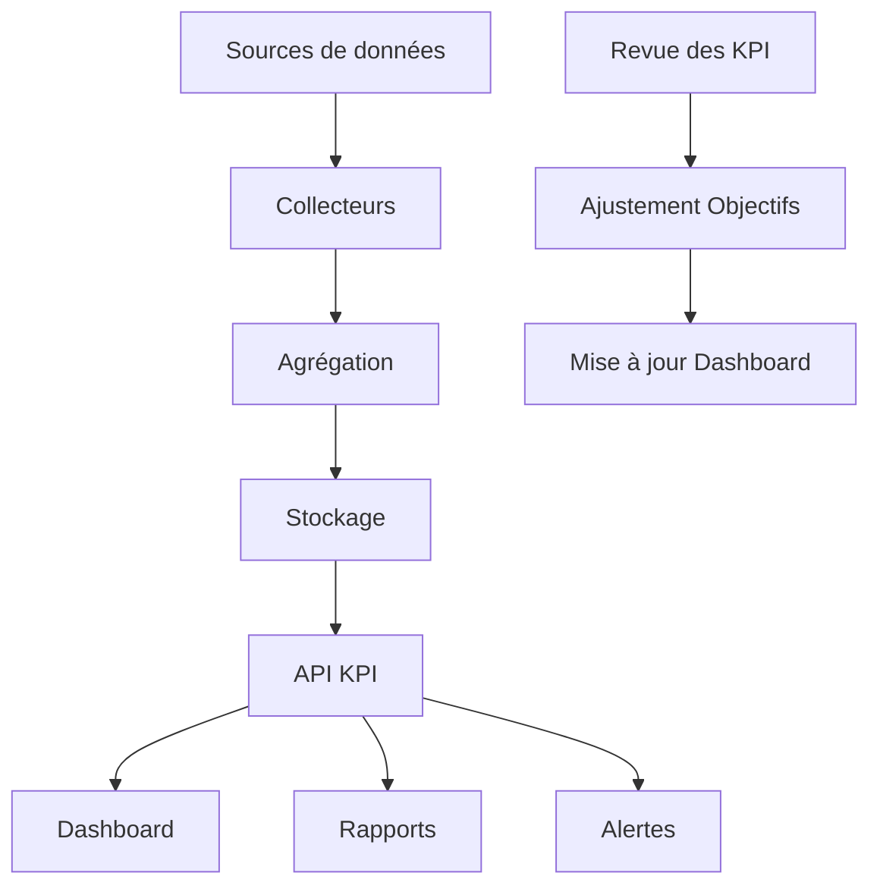

# KPI & Indicateurs projet

## 📊 Vue d'ensemble

Ce document définit les indicateurs clés de performance (KPI) et métriques qui permettent de suivre l'avancement et la santé du projet de migration dans le temps. Ces métriques serviront de base au tableau de bord de suivi dans Remix.

## 🎯 Indicateurs stratégiques

### Avancement global

| Indicateur | Description | Cible | Fréquence |
|------------|-------------|-------|-----------|
| Taux de migration | % de modules migrés | 100% | Hebdomadaire |
| Progression temporelle | % achèvement vs % temps écoulé | Ratio ≥ 1 | Hebdomadaire |
| Vélocité | Modules migrés par sprint | Stable ou croissante | Par sprint |
| Backlog evolution | Évolution du backlog restant | Décroissant | Hebdomadaire |

### Formule de calcul du taux de migration

```typescript
interface Module {
  weight: number;       // Poids relatif du module (1-10)
  status: "pending" | "in_progress" | "migrated" | "validated";
  progressPercent: number;  // Pour les modules en cours
}

function calculateMigrationRate(modules: Module[]): number {
  const totalWeight = modules.reduce((sum, m) => sum + m.weight, 0);
  
  const completedWeight = modules.reduce((sum, m) => {
    if (m.status === "migrated" || m.status === "validated") {
      return sum + m.weight;
    } else if (m.status === "in_progress") {
      return sum + (m.weight * m.progressPercent / 100);
    }
    return sum;
  }, 0);
  
  return (completedWeight / totalWeight) * 100;
}
```

## 📈 KPI techniques

### Performance

| KPI | Description | Baseline | Cible | Méthode de mesure |
|-----|-------------|----------|-------|-------------------|
| Temps de réponse API | Latence moyenne des endpoints | Legacy | -30% | New Relic / Prometheus |
| Latence FCP | First Contentful Paint | Legacy | < 1.2s | Lighthouse / RUM |
| Latence LCP | Largest Contentful Paint | Legacy | < 2.5s | Lighthouse / RUM |
| TTI | Time To Interactive | Legacy | < 3.8s | Lighthouse |
| Requêtes SQL | Nombre moyen par page | Legacy | -40% | Query Monitor |
| Consommation mémoire | Usage moyen | Legacy | -30% | Monitoring serveur |
| Temps de build | Durée du build complet | - | < 4min | CI Metrics |

### Qualité du code

| KPI | Description | Cible | Fréquence |
|-----|-------------|-------|-----------|
| Couverture de test | % du code couvert par les tests | > 80% | Quotidien |
| Dette technique | Heures estimées | Décroissante | Hebdomadaire |
| Complexité cyclomatique | Moyenne par fonction | < 15 | Quotidien |
| Duplication de code | % de code dupliqué | < 5% | Hebdomadaire |
| PR merge time | Temps moyen de merge des PR | < 2 jours | Hebdomadaire |
| Build success rate | % de builds réussis | > 95% | Quotidien |

## 📱 KPI utilisateurs

### Engagement et satisfaction

| KPI | Description | Baseline | Cible | Méthode de mesure |
|-----|-------------|----------|-------|-------------------|
| Taux de conversion | % visiteurs → acheteurs | Legacy | +10% | Analytics |
| Taux de rebond | % visites à page unique | Legacy | -15% | Analytics |
| Temps sur site | Durée moyenne session | Legacy | +20% | Analytics |
| Taux d'erreur utilisateur | % sessions avec erreur JS | Legacy | -90% | Error tracking |
| NPS | Net Promoter Score | Legacy | +15 points | Enquêtes |
| CSAT | Score satisfaction client | Legacy | > 4.2/5 | Enquêtes |

### SEO et visibilité

| KPI | Description | Baseline | Cible | Méthode de mesure |
|-----|-------------|----------|-------|-------------------|
| Trafic organique | Visiteurs via recherche | Legacy | +15% | Analytics |
| Positions SERP | Classement mots-clés prioritaires | Legacy | Top 5 | SEMRush / Ahrefs |
| Core Web Vitals | % URLs "Good" | Legacy | > 90% | Google Search Console |
| Crawl budget | Pages crawlées / jour | Legacy | +25% | Log serveur / GSC |
| Backlinks | Nombre de liens entrants | Legacy | Stable ou + | SEMRush / Ahrefs |

## 🚀 KPI de progression de la migration

### Métriques de développement

| KPI | Description | Cible | Visualisation |
|-----|-------------|-------|---------------|
| Modules migrés | Nombre et % | Croissant | Graphe temporel |
| Code legacy supprimé | LOC PHP supprimées | Croissant | Graphe temporel |
| Nouveau code | LOC TypeScript ajoutées | Croissant | Graphe temporel |
| Ratio refactoring/réécriture | % code réutilisé | > 30% | Graphe circulaire |
| PR de migration | Nombre et taille | - | Graphe temporel |
| Automation success rate | % générations réussies | > 75% | Graphe temporel |

### Métriques de migration de données

| KPI | Description | Cible | Visualisation |
|-----|-------------|-------|---------------|
| Tables migrées | % schéma migré | 100% | Progression |
| Intégrité données | % validation tests | 100% | Tableau |
| Temps synchronisation | Durée sync bi-directionnelle | < 5min | Graphe temporel |
| Volumétrie | Données migrées (Go) | - | Graphe temporel |

## 📉 KPI liés aux risques

### Détection et résolution

| KPI | Description | Cible | Fréquence |
|-----|-------------|-------|-----------|
| MTTR | Mean Time To Resolve | < 4h | Par incident |
| Issues bloquantes | Nombre en cours | < 3 | Quotidien |
| Regressions | Nombre par release | < 2 | Par release |
| Rollbacks | % déploiements avec rollback | < 5% | Mensuel |
| MTBF | Mean Time Between Failures | > 168h | Mensuel |

## 🖥️ Implémentation dans le dashboard Remix

Le dashboard de suivi dans Remix pourra exploiter ces KPI via une API dédiée:

```typescript
// apps/web/app/routes/admin/dashboard.tsx
import type { LoaderFunction } from "@remix-run/node";
import { useLoaderData, json } from "@remix-run/react";
import { KPIChart, KPITrend, KPIMeter } from "../components/dashboard";
import { getProjectKPIs } from "../services/kpi-service";

export const loader: LoaderFunction = async () => {
  const kpiData = await getProjectKPIs();
  return json({ kpiData });
};

export default function DashboardRoute() {
  const { kpiData } = useLoaderData<typeof loader>();
  
  return (
    <div className="dashboard-container">
      <header>
        <h1>Dashboard Migration</h1>
        <div className="overall-progress">
          <KPIMeter 
            value={kpiData.overallProgress} 
            target={100} 
            label="Progression globale"
          />
        </div>
      </header>
      
      <div className="dashboard-grid">
        <section className="kpi-card">
          <h2>Avancement technique</h2>
          <KPITrend 
            data={kpiData.trends.modulesMigrated} 
            format="percentage"
          />
        </section>
        
        <section className="kpi-card">
          <h2>Performance</h2>
          <KPIChart 
            data={kpiData.performance} 
            baseline={kpiData.baselines.performance}
            type="bar"
          />
        </section>
        
        {/* Autres sections KPI */}
      </div>
    </div>
  );
}
```

## 🔄 Cycle de vie des KPI

### Processus de collecte et mise à jour



### Fréquence et responsabilités

| Activité | Fréquence | Responsable |
|----------|-----------|-------------|
| Collecte données | Automatique / Continu | Système |
| Mise à jour dashboard | Quotidienne | Système |
| Analyse tendances | Hebdomadaire | Chef de projet |
| Ajustement objectifs | Mensuelle | Comité de pilotage |
| Revue complète KPI | Trimestrielle | Direction + Équipe |

Ce tableau de bord avec ses KPI fournira une vision claire et objective de l'avancement du projet, permettant des décisions basées sur les données et une communication transparente avec toutes les parties prenantes.
