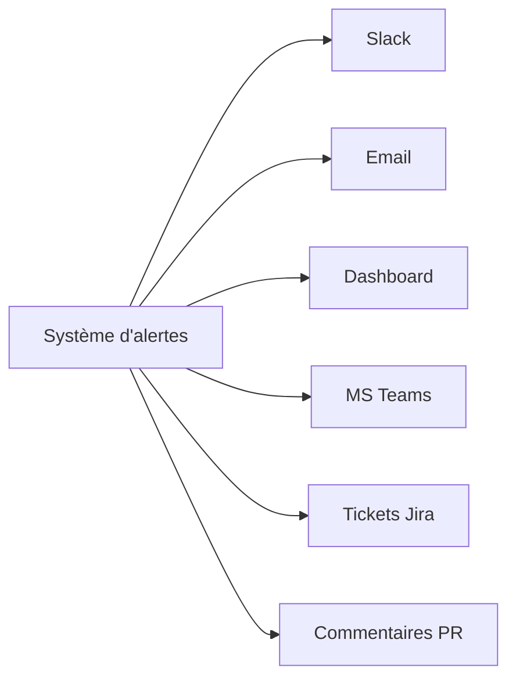
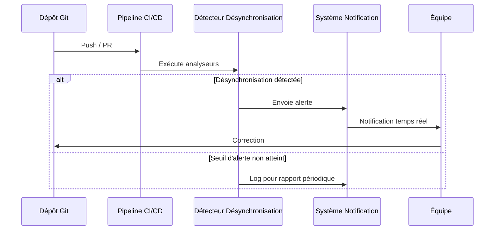

# Alertes de désynchronisation

## 🔔 Vue d'ensemble

Le système d'alertes de désynchronisation détecte proactivement les divergences entre documentation, code et autres artefacts du projet, puis notifie les parties prenantes appropriées en temps réel via différents canaux de communication.

## 🚨 Types d'alertes

### Alertes de divergence documentaire

| Type d'alerte | Déclencheur | Niveau de priorité | Destinataires |
|---------------|------------|-------------------|--------------|
| API divergente | Changement signature API | Élevé | Équipe API, Documentation |
| Modèle de données modifié | Changement schéma DB | Élevé | Équipe DB, Documentation |
| Config obsolète | Modification env/config | Moyen | DevOps, Documentation |
| Workflow modifié | Changement processus | Moyen | Product Owner, Documentation |

### Alertes de délais et d'obsolescence

| Type d'alerte | Déclencheur | Niveau de priorité | Destinataires |
|---------------|------------|-------------------|--------------|
| Documentation âgée | Non mise à jour > 90j | Faible | Équipe Documentation |
| Section obsolète | Détection automatique | Moyen | Propriétaire section |
| Technologie obsolète | Mise à jour disponible | Variable | Équipe Tech concernée |
| Décalage fonctionnel | Détection de régression | Élevé | Product Owner, QA |

## 📱 Canaux de notification

Le système utilise des canaux multiples pour assurer la livraison des alertes:



### Configuration des canaux par niveau

```yaml
# Configuration des canaux d'alerte
alert_channels:
  critical:
    - type: slack
      target: "#alerts-critical"
      include_details: true
      notification_style: interactive
    - type: email
      target: "team-leads@company.com"
      include_details: true
    - type: dashboard
      highlight: true
      auto_assign: true
      
  high:
    - type: slack
      target: "#alerts-important"
    - type: dashboard
      highlight: true
      
  medium:
    - type: dashboard
      highlight: false
    - type: weekly_digest
      section: "Issues à surveiller"
      
  low:
    - type: dashboard
      highlight: false
```

## ⏱️ Mécanisme de détection en temps réel

### Déclencheurs d'alerte



### Détection préventive

Le système ne se contente pas d'analyser l'état actuel mais prédit les désynchronisations potentielles:

- **Analyse de commits**: Détection des changements susceptibles de causer des désynchronisations
- **Surveillance des branches**: Alertes sur les développements parallèles contradictoires
- **Monitoring de dépendances**: Alertes sur les mises à jour susceptibles d'impacter la doc

## 🧠 Système d'intelligence contextuelle

Le système d'alertes utilise un moteur d'intelligence contextuelle pour:

1. **Classifier les alertes** en fonction de leur impact réel
2. **Cibler les notifications** vers les personnes les plus concernées
3. **Adapter le niveau d'urgence** au contexte du projet (ex: pré-release vs. développement)
4. **Réduire le bruit** par la coalescence d'alertes similaires

```typescript
interface AlertContext {
  projectPhase: 'development' | 'pre-release' | 'maintenance';
  recentAlerts: Alert[];
  teamAvailability: Record<string, boolean>;
  releaseSchedule: { nextRelease: Date; isCriticalPath: boolean };
  componentHealth: Record<string, { errorRate: number; changeFrequency: number }>;
}

function adjustAlertPriority(alert: Alert, context: AlertContext): Alert {
  // Augmenter la priorité en phase pré-release
  if (context.projectPhase === 'pre-release' && context.releaseSchedule.isCriticalPath) {
    alert.priority = Math.min(alert.priority + 1, 3); // Max priorité 3 (critique)
  }
  
  // Réduire la priorité si composant stable avec peu de changements
  const compHealth = context.componentHealth[alert.component];
  if (compHealth && compHealth.errorRate < 0.01 && compHealth.changeFrequency < 0.1) {
    alert.priority = Math.max(alert.priority - 1, 0); // Min priorité 0 (info)
  }
  
  // Autres règles d'ajustement contextuel...
  
  return alert;
}
```

## 📊 Actions et remédiation

### Types d'actions

| Type d'action | Description | Automatisation |
|--------------|-------------|---------------|
| Mise à jour automatique | Correction de documentation simple | Complète |
| Proposition de modification | Suggestion assistée par IA | Semi-automatique |
| Assignation de tâche | Création ticket pour humain | Semi-automatique |
| Blocage de pipeline | Arrêt processus CI/CD | Automatique avec override |

### Exemple de réponse automatisée

```typescript
async function handleApiDesynchronization(alert: ApiDesyncAlert): Promise<void> {
  // 1. Analyser la divergence
  const { docApi, codeApi, differences } = alert.details;
  
  // 2. Si changement mineur, tenter correction automatique 
  if (differences.severity === 'minor' && differences.parameterChanges.length < 3) {
    const updatedDoc = await documentUpdaterService.autoUpdateApiReference(
      docApi.file,
      docApi.position,
      codeApi
    );
    
    if (updatedDoc.success) {
      await createPullRequest({
        title: `Auto-update API documentation for ${codeApi.name}`,
        description: `Automatic synchronization of API documentation with implementation.
                      
                      Changes:
                      ${differences.description}`,
        branch: `auto-sync/api-doc-${Date.now()}`,
        files: [{ path: docApi.file, content: updatedDoc.content }]
      });
      
      return;
    }
  }
  
  // 3. Sinon, création de tâche assignée
  await ticketService.createTicket({
    type: 'doc-sync',
    title: `Update documentation for API ${codeApi.name}`,
    description: `The API documentation is out of sync with the implementation.
                  
                  Documentation: ${docApi.file}
                  Code: ${codeApi.file}
                  
                  Differences:
                  ${differences.description}`,
    priority: alert.priority,
    assignee: await findBestAssignee(docApi.file, codeApi.file),
    labels: ['documentation', 'api-sync', 'technical-debt']
  });
}
```

## 📈 Tableau de bord des désynchronisations

Le tableau de bord `/admin/sync-alerts` présente:

- **Vue d'ensemble** des alertes actives par sévérité et catégorie
- **Timeline** de l'évolution des désynchronisations
- **Heatmap** des composants souvent désynchronisés
- **Liste détaillée** des alertes avec actions disponibles
- **Métriques** de santé globale de la synchronisation

### Métriques clés

| Métrique | Description | Cible | Tendance |
|----------|------------|-------|----------|
| Temps de détection | Délai entre désynchronisation et détection | < 1 jour | ↓ |
| Temps de résolution | Délai entre alerte et correction | < 3 jours | ↓ |
| Taux de faux positifs | % d'alertes non pertinentes | < 5% | ↓ |
| Taux de synchronisation | % documentation synchronisée | > 95% | ↑ |

## 🔐 Gouvernance des alertes

### Politiques de gestion

- **Règle d'escalade** - Alerte non traitée → escalade automatique après délai défini
- **SLA documentation** - Engagement de synchronisation sous 48h pour APIs publiques
- **Priorisation** - Matrice de décision basée sur visibilité et impact utilisateur
- **Audit trail** - Historique complet des alertes et actions associées

Ce système d'alertes de désynchronisation garantit que toute divergence entre documentation et implémentation est rapidement identifiée et corrigée, maintenant ainsi l'intégrité du cahier des charges en temps réel.
