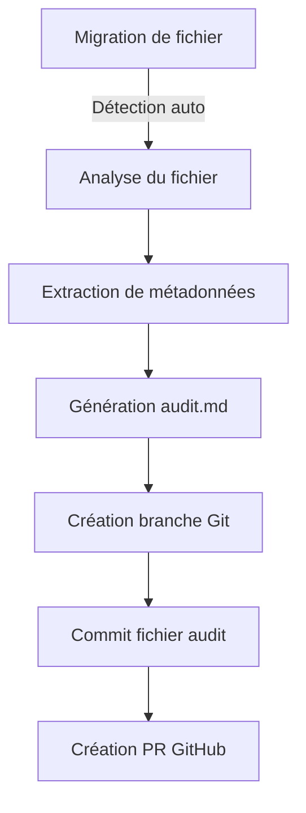

# Création automatique des fichiers .audit.md + PR IA

## 🔍 Vue d'ensemble

Le système génère automatiquement des fichiers d'audit (`.audit.md`) pour chaque module migré, documentant ses spécifications techniques et fonctionnelles, puis soumet ces fichiers via une Pull Request GitHub pour revue humaine.

## 📋 Structure des fichiers d'audit

Chaque fichier d'audit (`modulename.audit.md`) contient les sections suivantes:

```markdown
# Audit: [Nom du Module]

## Objectif du module
[Description détaillée du but et des fonctionnalités du module]

## Modèle SQL associé
```sql
-- Schéma de la table principale
CREATE TABLE example (
  id INT PRIMARY KEY,
  field1 VARCHAR(255),
  field2 INT,
  ...
);
```

## Routes associées
| Méthode | Endpoint | Description | Auteur |
|---------|----------|-------------|--------|
| GET | /api/resource | Récupère les ressources | AI/Humain |
| POST | /api/resource | Crée une ressource | AI/Humain |
| ... | ... | ... | ... |

## Checklist de validation

### Validation AI
- [ ] Tous les endpoints du module original sont couverts
- [ ] Intégrité référentielle des clés étrangères maintenue
- [ ] Règles de validation des données implémentées
- [ ] Gestion des erreurs conforme aux standards
- [ ] Tests unitaires générés

### Validation humaine requise
- [ ] Logique métier correctement transposée
- [ ] Performances acceptables sous charge
- [ ] Sécurité des endpoints vérifiée
- [ ] Consistance avec le reste de l'API
- [ ] Documentation complète et exacte
```

## 🔄 Processus d'audit automatique

### Déclenchement



Le processus est déclenché automatiquement par:
1. La migration réussie d'un fichier legacy
2. Une commande explicite `generate-audit [filename]`
3. Un hook post-commit sur les fichiers nouvellement migrés

### Extraction des métadonnées

Le système extrait automatiquement:

1. **Objectif du module** - Via analyse du code et des commentaires
2. **Modèle SQL** - Via analyse des requêtes et ORM utilisés
3. **Routes associées** - Via analyse des controllers et routes
4. **Checklist adaptée** - Basée sur la complexité et le type de module

### Création de la Pull Request

La PR est automatiquement:
1. Créée sur GitHub avec le tag `#ai-generated`
2. Assignée au propriétaire du module ou à l'équipe concernée
3. Liée au ticket de migration d'origine
4. Enrichie d'un résumé des changements générés

## 🛠️ Implémentation technique

### Composants d'implémentation

| Composant | Responsabilité | Technologies |
|-----------|----------------|--------------|
| FileWatcher | Détection des fichiers migrés | Node.js fs/chokidar |
| MetadataExtractor | Analyse du code source | TypeScript AST/Parser |
| AuditGenerator | Génération fichier markdown | Template engine |
| GitManager | Gestion branches et commits | simple-git/isomorphic-git |
| PRCreator | Création PR GitHub | Octokit/GitHub API |

### Configuration par projet

```yaml
# audit-config.yml
project:
  name: "NomDuProjet"
  repo: "organisation/repo"
  
extraction:
  code_patterns:
    objective:
      - "../ Module:"
      - "/** @module"
      - "class .* implements .*"
    sql_models:
      - "@Entity"
      - "CREATE TABLE"
      - "prisma.model"
  
templates:
  audit: "../templates/audit-template.md"
  pr_description: "../templates/pr-template.md"
  
github:
  pr_labels: 
    - "documentation"
    - "ai-generated"
  default_reviewers:
    - "tech-lead"
    - "qa-team"
```

## 📈 Métriques et suivi

### Tableau de bord d'audit

Un tableau de bord dédié (`/admin/audit-status`) affiche:

1. **Fichiers récemment audités** - Avec statut de la PR
2. **Taux de validation** - % de validations réussies
3. **Top problèmes** - Points de checklist fréquemment échoués
4. **Temps moyen d'approbation** - Durée jusqu'à la validation

### Intégration au workflow CI/CD

Le processus d'audit s'intègre au workflow CI/CD:

1. **Bloquant** - La validation de l'audit peut être obligatoire avant déploiement
2. **Informatif** - L'audit peut être consultatif durant les phases initiales
3. **Progressif** - Le niveau d'exigence peut évoluer progressivement

Ce mécanisme garantit que chaque module migré est correctement documenté et validé, facilitant ainsi la maintenance future et la collaboration entre équipes.
