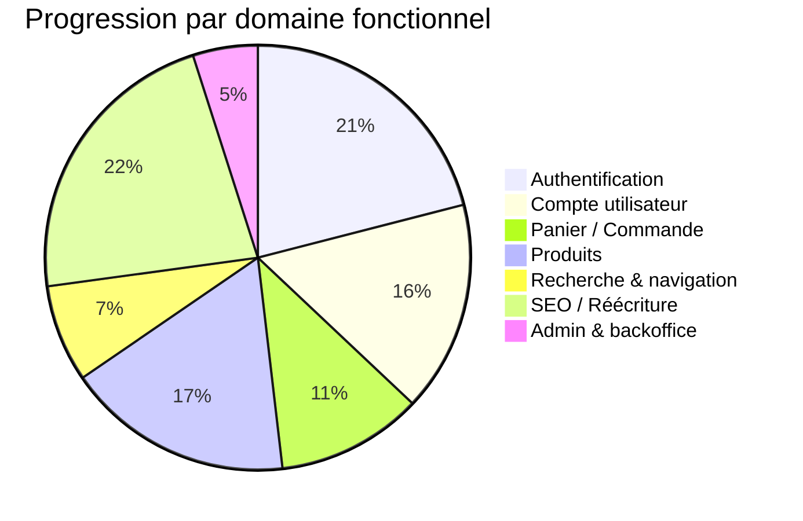

# 📋 Organisation du backlog de migration par modules fonctionnels

## 🎯 Objectif

Structurer le backlog de migration selon des **domaines fonctionnels clairs**, facilitant la gestion des dépendances, le versioning progressif et la coordination multi-équipe. Cette organisation optimise les ressources, réduit les risques et assure une continuité fonctionnelle pendant toute la durée du projet.

## 🧩 Exemples de groupes de modules fonctionnels

| Groupe                        | Modules inclus                              | Avantages |
|------------------------------|---------------------------------------------|-----------|
| **Authentification**         | Login, inscription, mot de passe oublié     | Découplé, peu dépendant |
| **Compte utilisateur**       | Données personnelles, historique commandes  | Migration autonome |
| **Commande & paiement**      | Étapes de commande, paiement                | Bloc logique complet |
| **Catalogue produits**       | Produits, stocks                            | Optimisé pour les tests UI/API |
| **SEO & navigation**         | Moteur, filtres, redirections SEO           | Impact SEO immédiat |
| **Pages legacy**             | Data, URLs legacy, page 404/410/412         | Préserve l'indexation |
| **Admin interne**            | Gestion catalogue, comptes, logs            | Utilisateurs internes |

### Principes d'organisation

### Niveaux de décomposition

| Niveau | Description | Exemple |
|--------|-------------|---------|
| **Domaine** | Zone fonctionnelle majeure de l'application | Authentification, Facturation, Inventaire |
| **Module** | Sous-ensemble cohérent d'un domaine | Gestion des utilisateurs, Génération de factures |
| **Composant** | Élément fonctionnel spécifique | Formulaire d'inscription, Calcul de taxes |
| **Classe/Fichier** | Unité individuelle de code | UserManager.php, InvoiceGenerator.php |

## 📊 Matrice de classification des modules

### Critères de classification

| Critère | Description | Importance |
|---------|-------------|------------|
| **Criticité métier** | Impact sur les fonctions essentielles | Élevée |
| **Complexité technique** | Difficulté de migration | Élevée |
| **Dépendances** | Nombre et type de dépendances | Moyenne |
| **Surface de code** | Taille et portée du module | Moyenne |
| **Fréquence d'utilisation** | Intensité d'utilisation par les utilisateurs | Moyenne |
| **Dette technique** | Niveau de dette technique accumulée | Basse |

### Tableau de priorisation

## 👥 Coordination multi-équipe

Cette approche de coordination multi-équipe combinée avec l'organisation fonctionnelle du backlog permet d'optimiser la parallélisation du travail tout en maintenant la cohérence globale du système migré.

### Mécanismes de coordination

| Situation | Mécanisme de résolution | Responsable |
|-----------|-------------------------|-------------|
| Conflit de priorité | Arbitrage basé sur l'impact business | Product Owner |
| Divergence technique | RFC avec période de commentaires | Tech Lead |
| Blocage de dépendance | Escalade en daily stand-up | Scrum Master |
| Conflit d'interface | Réunion de conception ad-hoc | Architecte technique |

- **Réunions de synchronisation**:
  - Stand-up quotidien inter-équipes
  - Revue de modules hebdomadaire
  - Démo d'intégration bi-hebdomadaire

- **Documentation partagée**:
  - Wiki des interfaces entre modules
  - Registre des décisions d'architecture
  - Glossaire commun des termes métier

- **Pratiques de développement**:
  - Convention de nommage unifiée
  - Pull requests inter-équipes pour les interfaces
  - Tests d'intégration automatisés

- **Outils de coordination**:
  - Tableau Kanban partagé par domaine fonctionnel
  - Système de notification des changements d'API
  - Visualisation des dépendances inter-modules

### Attribution des modules par équipe

| Équipe | Modules appropriés | Critères d'attribution |
|--------|-------------------|------------------------|
| **Frontend** | Recherche & navigation, UI Produits, Panier | Expertise UI/UX, React/Remix |
| **Backend** | Authentification, API Produits, Commandes | Expertise NestJS, sécurité |
| **Data** | Base de données, intégrations, reporting | Expertise Prisma, SQL |
| **DevOps** | CI/CD, monitoring, performance | Expertise infrastructure |
| **QA** | Tests E2E, validation fonctionnelle | Expertise test automation |

### Stratégie de répartition

L'organisation fonctionnelle du backlog facilite la répartition du travail entre plusieurs équipes.

## 🌟 Avantages de cette approche

- ✅ Migration **modulaire** et **rollbackable**
- ✅ Moins de conflits entre branches ou fichiers
- ✅ Permet une PR par bloc fonctionnel
- ✅ Adapté à une gestion Kanban dans `backlog.md`
- ✅ Revue ciblée, déploiement par tranche

## 📑 Intégration avec les outils de gestion

### Lien avec le backlog existant


### Stratégie de classification

La classification automatique des fichiers PHP et TypeScript dans les groupes fonctionnels permet une traçabilité complète du processus de migration.

| Type de fichier | Méthode de classification | Outil |
|-----------------|--------------------------|-------|
| PHP Legacy | Analyse des namespaces et imports | `backlog-classifier.ts` |
| Controllers | Analyse des routes et endpoints | `route-mapper.ts` |
| Models/Entities | Analyse des relations et schemas | `entity-analyzer.ts` |
| UI Components | Analyse des props et dépendances | `component-classifier.ts` |

## ✅ À faire

- [ ] Lier chaque ligne de `13-backlog.md` à un groupe fonctionnel
- [ ] Ajouter un tag dans le tableau : `fonction=auth / produits / seo`
- [ ] Créer une **vue par groupe fonctionnel** dans Notion ou GitHub Projects
- [ ] Utiliser un agent IA `backlog-classifier.ts` pour classer automatiquement les fichiers

### Agent de classification automatique

```typescript
// Extrait conceptuel du fonctionnement de backlog-classifier.ts
function classifyPhpFile(filePath: string): FunctionalGroup {
  const content = readFileSync(filePath, 'utf8');
  
  // Analyse des imports et namespaces
  const imports = extractImports(content);
  const namespaces = extractNamespaces(content);
  
  // Détection de patterns caractéristiques
  if (hasAuthPatterns(content, imports)) return 'auth';
  if (hasProductPatterns(content, imports)) return 'products';
  if (hasCartPatterns(content, imports)) return 'cart';
  
  // Analyse sémantique plus poussée
  return semanticClassification(content);
}
```

### Modèle de tableau de backlog enrichi

```markdown
| Fichier PHP | Statut | Fichier TypeScript | Groupe fonctionnel | PR | Migration |
|-------------|--------|--------------------|--------------------|-------|----------|
| Auth.php | ✅ | Auth.ts | `auth` | #123 | @dev1 |
| Product.php | 🔄 | Product.ts | `products` | #124 | @dev2 |
| Cart.php | ⏳ | - | `cart` | - | - |
```

💡 Cette stratégie est idéale pour synchroniser le backlog avec les fichiers PHP legacy et les blocs Remix/NestJS modernes.

## 📈 Métriques de progression par groupe fonctionnel

La décomposition en groupes fonctionnels permet un suivi précis de la progression:



Cette visualisation claire de l'avancement permet d'ajuster les priorités et ressources en fonction des besoins du projet et des objectifs d'affaires.

