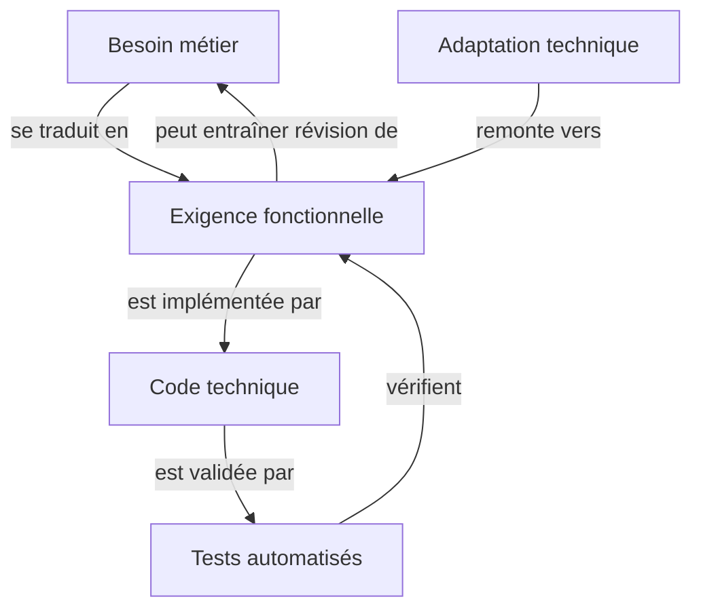
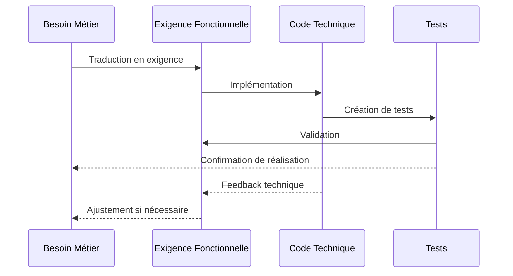
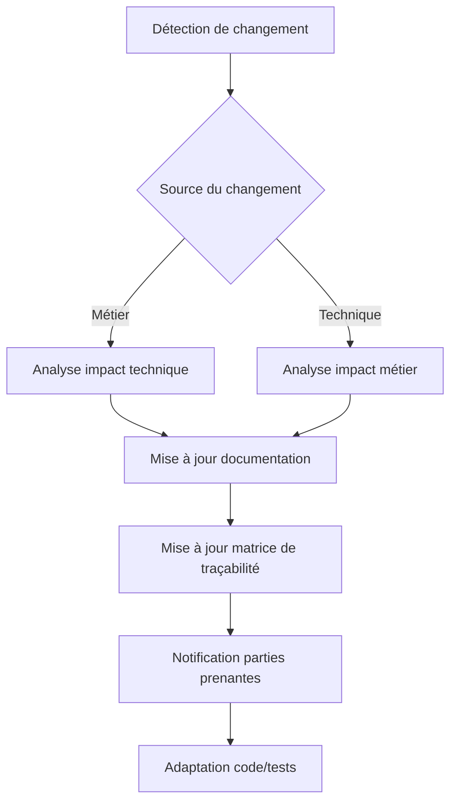

# Synchronisation entre besoins métier et implémentation technique

## 🔄 Vue d'ensemble

La réussite du projet de migration repose sur une synchronisation parfaite entre les besoins métier/fonctionnels et leur implémentation technique. Cette section détaille les mécanismes qui garantissent cette cohérence tout au long du processus.

## 🧩 Architecture de synchronisation

### Traçabilité bidirectionnelle

Chaque exigence métier est tracée jusqu'à son implémentation technique et vice-versa:



### Base de données de synchronisation

Une base de données centrale de synchronisation maintient les relations entre:
- Exigences métier (issues GitHub)
- Spécifications fonctionnelles (documentation)
- Implémentations techniques (code)
- Tests de validation (suites de tests)

## 📊 Mécanismes de synchronisation

### Agents d'alignement

Des agents IA spécialisés assurent l'alignement continu:

1. **BusinessAnalyzerAgent** - Analyse les besoins métier et identifie les impacts techniques
2. **RequirementMapperAgent** - Convertit les exigences métier en spécifications techniques
3. **ImplementationTrackerAgent** - Vérifie la correspondance entre exigences et code
4. **FeedbackLoopAgent** - Identifie les opportunités d'amélioration dans le cycle

### Workflows de synchronisation



## 🔍 Validation de la synchronisation

### Métriques de cohérence

| Métrique | Description | Cible | Méthode de mesure |
|----------|-------------|-------|-------------------|
| Couverture des exigences | % des besoins métier avec implémentation | 100% | Matrice de traçabilité |
| Alignement fonctionnel | % de fonctionnalités alignées avec besoins | >95% | Tests d'acceptation |
| Dérive technique | Écart entre conception et implémentation | <5% | Analyse statique |
| Complétude des tests | Couverture des cas d'utilisation | >90% | Tests métier automatisés |

### Rituel de synchronisation

Une revue de synchronisation est organisée régulièrement:

1. **Cadence**: Bi-hebdomadaire (après chaque sprint)
2. **Participants**: Product Owner, Tech Lead, QA Lead
3. **Contenu**:
   - Revue de la matrice de traçabilité
   - Analyse des écarts détectés
   - Identification des ajustements nécessaires
   - Validation des priorités

## 🛠️ Outils de synchronisation

### Tableau de bord unifié

Le tableau de bord `/admin/alignment` présente:

- **Vue hiérarchique**: Organisation des besoins → exigences → code
- **Statut de synchronisation**: Indicateurs visuels d'alignement
- **Points d'attention**: Zones nécessitant une révision
- **Tendances**: Évolution de la synchronisation dans le temps

### Documentation vivante

La documentation est automatiquement mise à jour pour refléter l'état réel:

```typescript
interface SyncPoint {
  businessRequirementId: string;
  functionalSpecId: string;
  technicalImplementations: string[];
  testCases: string[];
  synchronizationStatus: 'aligned' | 'drifting' | 'misaligned';
  lastVerified: Date;
}

// Exemple d'entrée de synchronisation
const cartCheckoutSync: SyncPoint = {
  businessRequirementId: 'BR-123',
  functionalSpecId: 'FS-456',
  technicalImplementations: ['CartController.ts', 'CheckoutService.ts'],
  testCases: ['checkout.spec.ts', 'cart-total.spec.ts'],
  synchronizationStatus: 'aligned',
  lastVerified: new Date('2023-12-10')
};
```

## 🔄 Processus d'adaptation

### Gestion du changement bidirectionnelle

Les changements sont propagés dans les deux sens:

1. **Top-down** (Métier → Technique):
   - Évolution des besoins métier
   - Ajustement des exigences fonctionnelles
   - Adaptation du code et des tests

2. **Bottom-up** (Technique → Métier):
   - Contraintes techniques identifiées
   - Impact sur les fonctionnalités
   - Reformulation des besoins métier

### Workflow d'adaptation



## 🚀 Exemples concrets de synchronisation

### Cas d'étude: Module Panier

| Besoin métier | Exigence fonctionnelle | Implémentation technique | Tests |
|---------------|------------------------|--------------------------|-------|
| Calcul taxes selon pays | Règles fiscales par juridiction | TaxService avec stratégies par pays | test-tax-calculation.spec.ts |
| Limite produits par panier | Maximum 50 produits par commande | Validation dans CartController | test-cart-limits.spec.ts |
| Réduction fidélité | -5% dès 3 commandes précédentes | LoyaltyDiscount dans PricingService | test-loyalty-program.spec.ts |

### Tableaux d'alignement par domaine

Pour chaque domaine métier, des tableaux d'alignement sont maintenus:

```json
{
  "domain": "Checkout",
  "alignmentTable": [
    {
      "businessNeed": "Paiements sécurisés",
      "functionalRequirement": "Intégration 3D Secure",
      "technicalComponent": "SecurePaymentProvider",
      "alignmentScore": 100
    },
    {
      "businessNeed": "Factures personnalisées",
      "functionalRequirement": "Template de factures par pays",
      "technicalComponent": "InvoiceGenerator",
      "alignmentScore": 85
    }
  ]
}
```

Cette synchronisation parfaite garantit que le projet reste constamment aligné sur les besoins métier tout en bénéficiant d'une implémentation technique optimale.
