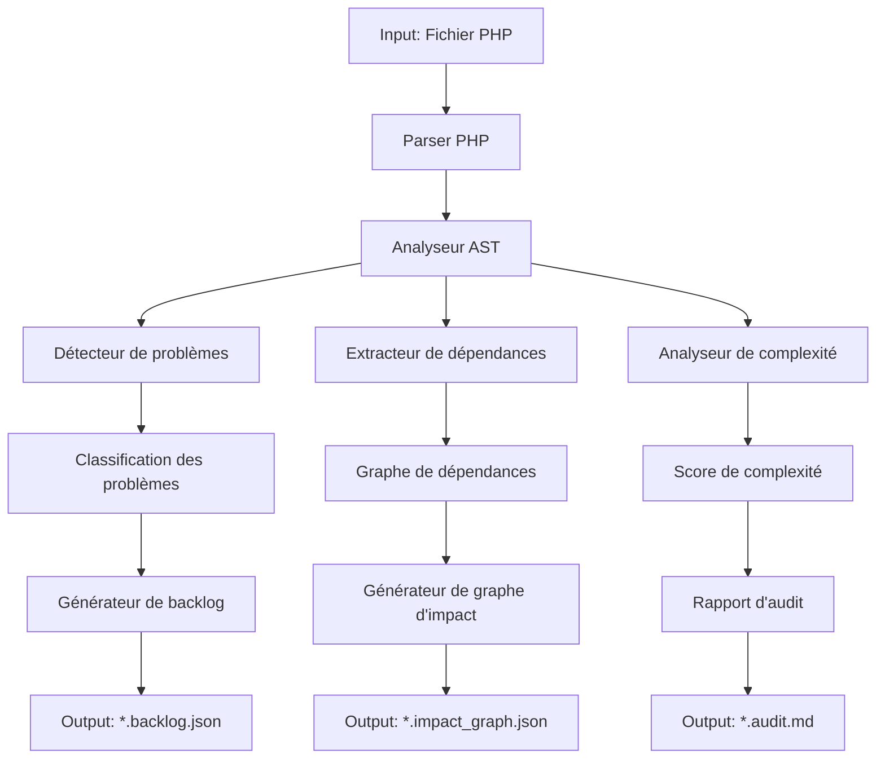

# 🔍 Agent d'Analyse d'Audit Technique

Ce document détaille le fonctionnement de l'agent d'analyse d'audit (`audit-analyzer.ts`) au sein du pipeline d'orchestration IA.

## Objectif et responsabilités

L'agent d'analyse d'audit est responsable d'effectuer une analyse approfondie des fichiers PHP legacy pour :
- Identifier les problèmes techniques et les dettes techniques
- Quantifier les risques associés à chaque fichier
- Générer des recommandations de migration
- Créer une cartographie des dépendances

## Architecture interne

### Composants principaux



### 1. Parser PHP
- Utilise un analyseur syntaxique PHP robuste basé sur `php-parser`
- Gère les erreurs de syntaxe et les constructions dépréciées
- Produit une représentation structurée du code source

### 2. Analyseur AST (Abstract Syntax Tree)
- Traverse l'arbre syntaxique abstrait du fichier
- Identifie les structures de code, les fonctions, et les dépendances
- Annote l'AST avec des métadonnées pour l'analyse ultérieure

### 3. Modules d'Analyse Spécialisés
- **Détecteur de problèmes** : Identifie les anti-patterns, le code obsolète, et les vulnérabilités
- **Extracteur de dépendances** : Cartographie les relations entre les fichiers et les composants
- **Analyseur de complexité** : Calcule des métriques comme la complexité cyclomatique et cognitive

### 4. Génération des Sorties
- Création de documents structurés au format markdown et JSON
- Génération de visualisations et graphiques pour le dashboard
- Préparation des données pour l'intégration avec Supabase

## Règles d'Analyse

L'agent utilise un ensemble extensible de règles d'analyse, stockées dans le répertoire `/rules`. Ces règles sont classées en plusieurs catégories :

| Catégorie | Description | Exemples de règles |
|-----------|-------------|-------------------|
| **Sécurité** | Vulnérabilités et failles de sécurité | Injections SQL, XSS, CSRF |
| **Performance** | Problèmes d'optimisation et goulots d'étranglement | Requêtes N+1, fonctions récursives |
| **Maintenabilité** | Qualité du code et facilité de maintenance | Duplication de code, méthodes trop longues |
| **Obsolescence** | Fonctionnalités dépréciées ou obsolètes | Fonctions PHP dépréciées, anciennes APIs |
| **Architecture** | Problèmes de conception et d'architecture | Couplage fort, violations SOLID |

Chaque règle est configurée dans un fichier YAML avec la structure suivante :

```yaml
id: php.security.sql_injection
name: "Détection d'injection SQL potentielle"
severity: critical
description: "Identifie les risques d'injection SQL dans les requêtes non préparées"
detection:
  patterns:
    - "mysql_query\\(.*\\$"
    - "mysqli_query\\(.*\\$"
    - "\\$.*->query\\(.*\\$"
  context_lines: 5
remediation:
  suggestions:
    - "Utiliser des requêtes préparées avec PDO"
    - "Mettre en place un filtrage strict des entrées utilisateur"
  code_example: |
    // Avant
    $query = "SELECT * FROM users WHERE username = '" . $_GET['username'] . "'";
    $result = mysqli_query($conn, $query);
    
    // Après
    $stmt = $conn->prepare("SELECT * FROM users WHERE username = ?");
    $stmt->bind_param("s", $_GET['username']);
    $stmt->execute();
    $result = $stmt->get_result();
```

## Process d'Analyse

Le processus d'analyse suit ces étapes :

1. **Chargement et initialisation**
   - Lecture du fichier PHP source
   - Chargement des règles applicables
   - Initialisation des analyseurs

2. **Parsing et génération de l'AST**
   - Analyse syntaxique du code
   - Construction de l'arbre syntaxique
   - Validation de la structure

3. **Analyse principale**
   - Application des règles sur l'AST
   - Collecte des résultats d'analyse
   - Scoring des problèmes détectés

4. **Génération du graphe de dépendances**
   - Identification des includes/requires
   - Détection des appels de fonctions externes
   - Construction des relations entre composants

5. **Création des rapports**
   - Génération du rapport d'audit au format markdown
   - Création du fichier backlog JSON avec les tâches
   - Production du graphe d'impact au format JSON

## Intégration avec le Pipeline

L'agent d'analyse est invoqué par le `selector-agent.ts` pour chaque fichier PHP identifié comme nécessitant une analyse. Il s'intègre dans le pipeline de la façon suivante :

```javascript
// Extrait simplifié de selector-agent.ts
async function analyzeFile(filePath) {
  const fileContent = await fs.readFile(filePath, 'utf-8');
  
  // Mise à jour du statut du fichier
  await updateFileStatus(filePath, 'in-progress');
  
  try {
    // Appel de l'agent d'analyse
    const analysisResults = await auditAnalyzer.analyze(filePath, fileContent, {
      rulesDir: './rules',
      configPath: './config/audit-config.yml',
      outputDir: './outputs'
    });
    
    // Traitement des résultats
    const { auditReport, backlogItems, impactGraph } = analysisResults;
    
    // Enregistrement des résultats
    await saveOutputs(filePath, auditReport, backlogItems, impactGraph);
    
    // Mise à jour du statut
    await updateFileStatus(filePath, 'analyzed');
    
    return analysisResults;
  } catch (error) {
    console.error(`Error analyzing file ${filePath}:`, error);
    await updateFileStatus(filePath, 'error');
    throw error;
  }
}
```

## Configuration et Personnalisation

La configuration de l'agent d'analyse se fait via le fichier `/config/audit-config.yml` :

```yaml
analyzer:
  version: "2.3.0"
  max_file_size_mb: 5
  timeout_seconds: 60
  log_level: "info"

rules:
  enabled_categories:
    - security
    - performance
    - maintenability
    - obsolescence
    - architecture
  severity_thresholds:
    audit_inclusion: "low"  # Inclure tous les problèmes à partir de "low"
    backlog_creation: "medium"  # Créer des tâches backlog à partir de "medium"

output:
  formats:
    - markdown
    - json
  include_code_snippets: true
  max_snippets_per_file: 5
  include_remediation_suggestions: true

integration:
  supabase:
    enabled: true
    auto_sync: true
  github:
    enabled: true
    create_issues: false
```

## Exemples de Sorties

### Fichier d'audit (*.audit.md)

```markdown
# Rapport d'Audit : `fiche.php`

## Résumé
- **Niveau de risque global** : Élevé
- **Score de complexité** : 76/100
- **Problèmes critiques** : 3
- **Problèmes majeurs** : 7
- **Problèmes mineurs** : 12

## Problèmes Critiques
### 1. Injection SQL Potentielle
**Ligne 45** : Utilisation de variables non échappées dans une requête SQL
```php
$query = "SELECT * FROM fiches WHERE id = " . $_GET['id'];
$result = mysql_query($query);
```
**Recommandation** : Utiliser des requêtes préparées avec PDO ou mysqli.

### 2. Fonction Obsolète
**Ligne 78** : Utilisation de la fonction `mysql_*` dépréciée
```php
$connection = mysql_connect($host, $user, $pass);
```
**Recommandation** : Migrer vers mysqli ou PDO.

## Dépendances
- `include/config.php`
- `include/functions.php`
- `classes/User.class.php`
- `classes/Product.class.php`

## Plan de Migration Recommandé
1. Remplacer les fonctions mysql_* par des équivalents PDO
2. Extraire la logique métier dans des classes dédiées
3. Implémenter une validation des entrées utilisateur
4. Restructurer le fichier selon le pattern MVC
```

### Fichier Backlog (*.backlog.json)

```json
{
  "file": "fiche.php",
  "analyzed_at": "2025-04-11T14:25:30Z",
  "tasks": [
    {
      "id": "T001",
      "title": "Corriger l'injection SQL à la ligne 45",
      "description": "Remplacer la requête non préparée par une requête PDO avec paramètres",
      "severity": "critical",
      "effort_estimate": "medium",
      "category": "security",
      "line_start": 45,
      "line_end": 46,
      "rule_id": "php.security.sql_injection"
    },
    {
      "id": "T002",
      "title": "Remplacer la fonction mysql_connect obsolète",
      "description": "Migrer de mysql_* vers mysqli ou PDO",
      "severity": "critical",
      "effort_estimate": "high",
      "category": "obsolescence",
      "line_start": 78,
      "line_end": 78,
      "rule_id": "php.obsolescence.mysql_functions"
    }
  ]
}
```

## Performance et Optimisation

L'agent d'analyse est conçu pour être performant et fiable, avec les caractéristiques suivantes :

- **Parallélisation** : Analyse de plusieurs fichiers en parallèle
- **Mise en cache** : Résultats intermédiaires mis en cache pour éviter les analyses redondantes
- **Gestion des timeout** : Protection contre les analyses infinies sur des fichiers complexes
- **Robustesse** : Tolérance aux erreurs et capacité à poursuivre l'analyse même en cas de problèmes
- **Extensibilité** : Architecture modulaire permettant d'ajouter facilement de nouvelles règles

## Évolutions Futures

Les évolutions prévues pour l'agent d'analyse incluent :

1. Support pour d'autres langages (JavaScript, TypeScript, etc.)
2. Analyse sémantique plus poussée avec compréhension du contexte d'exécution
3. Suggestions de refactoring générées par IA
4. Intégration avec des outils d'analyse statique tiers
5. Analyse différentielle entre les versions du code