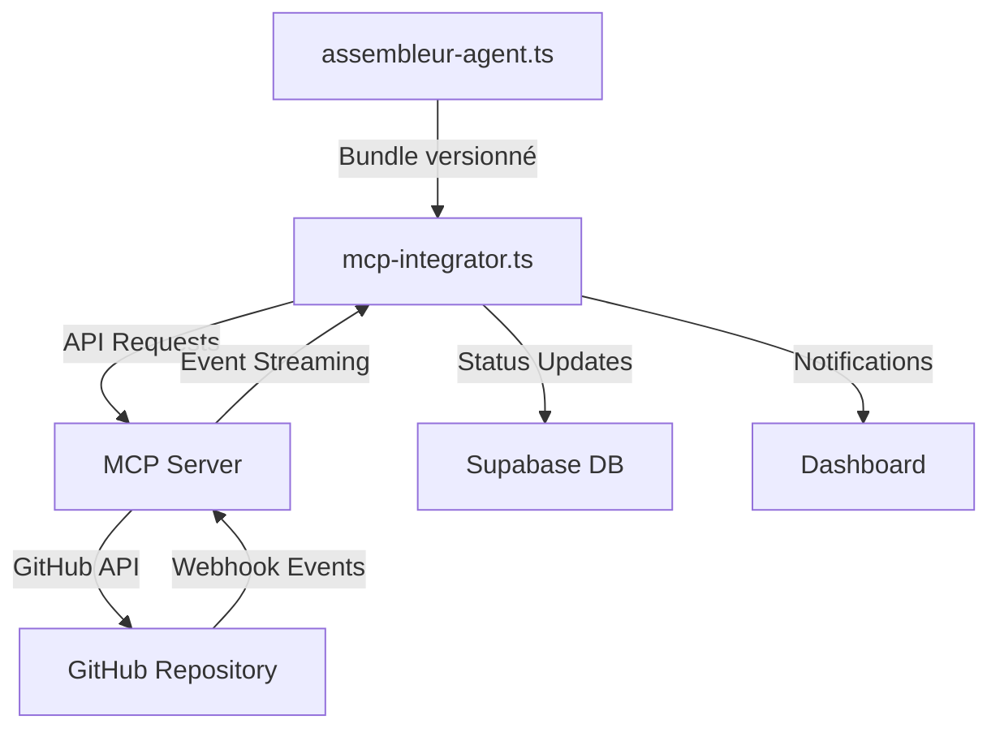

# 🔄 Intégration MCP (Model Context Protocol)

Ce document détaille l'intégration du Model Context Protocol (MCP) dans le pipeline d'orchestration IA pour la communication avec GitHub et d'autres systèmes externes.

## Présentation du Model Context Protocol

Le Model Context Protocol (MCP) est un protocole standardisé pour faciliter les interactions entre les modèles d'IA et les systèmes externes, notamment les plateformes de gestion de code comme GitHub. Dans notre pipeline, le composant `mcp-integrator.ts` implémente ce protocole pour assurer une communication bidirectionnelle fluide.

## Architecture MCP



## Fonctionnalités principales

### 1. Création automatisée de Pull Requests

Le MCP permet de créer des Pull Requests sur GitHub de manière automatisée avec :
- Création de branches dédiées (`audit-results/nom_fichier`)
- Commit des fichiers d'analyse (`*.audit.md`, `*.backlog.json`, etc.)
- Génération de descriptions détaillées pour les PRs
- Assignation automatique aux reviewers pertinents

### 2. Contexte enrichi

Contrairement à une simple API GitHub, le MCP fournit un contexte riche qui comprend :
- L'historique des modifications précédentes
- Les commentaires des revues précédentes
- Des métadonnées sur l'importance et la priorité des changements
- Des liens vers les analyses associées

### 3. Communication bidirectionnelle

Le MCP ne se contente pas de pousser du contenu, il écoute également les événements :
- Détection des commentaires sur les PRs
- Prise en compte des suggestions de modifications
- Suivi des statuts (merged, closed, reviewed)
- Réponses automatisées aux questions dans les PRs

## Implémentation dans le Pipeline

Le composant `mcp-integrator.ts` s'intègre dans le pipeline de la façon suivante :

```javascript
// Extrait simplifié de mcp-integrator.ts
import { MCPClient } from './mcp/client';
import { GitHubProvider } from './mcp/providers/github';
import { formatCommitMessage, formatPRDescription } from './utils/formatters';

export class MCPIntegrator {
  private mcpClient: MCPClient;
  private config: MCPConfig;
  
  constructor(config: MCPConfig) {
    this.config = config;
    
    // Initialisation du client MCP avec le provider GitHub
    this.mcpClient = new MCPClient({
      provider: new GitHubProvider({
        token: config.githubToken,
        repository: config.repository,
        owner: config.owner
      }),
      serverUrl: config.mcpServerUrl,
      modelId: 'audit-migration-model'
    });
  }
  
  async pushToGitHub(filePath: string, analysisBundle: AnalysisBundle): Promise<string> {
    // Génération du nom de branche basé sur le nom du fichier
    const branchName = `audit-results/${path.basename(filePath, '.php')}`;
    
    // Création de la branche si elle n'existe pas
    await this.mcpClient.createBranch(branchName, 'main');
    
    // Préparation des fichiers à commiter
    const files = [
      {
        path: `audits/${path.basename(filePath)}.audit.md`,
        content: analysisBundle.auditReport
      },
      {
        path: `backlogs/${path.basename(filePath)}.backlog.json`,
        content: JSON.stringify(analysisBundle.backlogItems, null, 2)
      },
      {
        path: `impact-graphs/${path.basename(filePath)}.impact_graph.json`,
        content: JSON.stringify(analysisBundle.impactGraph, null, 2)
      }
    ];
    
    // Commit des fichiers
    const commitSha = await this.mcpClient.commitFiles({
      branch: branchName,
      files,
      message: formatCommitMessage(filePath, analysisBundle),
      author: {
        name: 'Audit Analysis Agent',
        email: 'audit-agent@organisation.com'
      }
    });
    
    // Création ou mise à jour de la PR
    const prUrl = await this.mcpClient.createOrUpdatePR({
      branch: branchName,
      title: `Audit Analysis: ${path.basename(filePath)}`,
      body: formatPRDescription(filePath, analysisBundle),
      labels: this.getPriorityLabels(analysisBundle)
    });
    
    // Enregistrement du lien de la PR
    await this.savePrReference(filePath, prUrl);
    
    return prUrl;
  }
  
  private getPriorityLabels(analysisBundle: AnalysisBundle): string[] {
    const labels = ['audit-result'];
    
    // Ajouter un label de priorité basé sur les résultats
    if (analysisBundle.criticalIssuesCount > 0) {
      labels.push('priority:critical');
    } else if (analysisBundle.majorIssuesCount > 0) {
      labels.push('priority:high');
    } else {
      labels.push('priority:normal');
    }
    
    return labels;
  }
  
  async setupWebhookListener(): Promise<void> {
    // Configuration du listener pour les événements GitHub
    this.mcpClient.onPrComment(async (prEvent) => {
      // Traitement des commentaires sur les PRs
      await this.processPrComment(prEvent);
    });
    
    this.mcpClient.onPrStatusChange(async (statusEvent) => {
      // Mise à jour du statut dans Supabase
      await this.updatePrStatus(statusEvent);
    });
  }
  
  async processPrComment(prEvent: PRCommentEvent): Promise<void> {
    const { prNumber, comment, author } = prEvent;
    
    // Analyse du commentaire pour détecter des demandes spécifiques
    if (comment.includes('/regenerate')) {
      // Logique pour régénérer l'analyse
    } else if (comment.includes('/explain')) {
      // Logique pour fournir des explications supplémentaires
      await this.mcpClient.addPrComment(prNumber, generateExplanation(comment));
    }
  }
  
  // ... autres méthodes
}
```

## Configuration du MCP Server

Le MCP Server est configuré via le fichier `/config/mcp-server-config.json` :

```json
{
  "server": {
    "port": 3001,
    "host": "0.0.0.0",
    "logLevel": "info"
  },
  "auth": {
    "apiKey": "${MCP_API_KEY}",
    "githubAppId": "${GITHUB_APP_ID}",
    "githubAppPrivateKey": "${GITHUB_APP_PRIVATE_KEY}",
    "webhookSecret": "${WEBHOOK_SECRET}"
  },
  "providers": {
    "github": {
      "enabled": true,
      "baseUrl": "https://api.github.com",
      "repositories": [
        {
          "owner": "organisation",
          "name": "cahier-des-charge",
          "webhooks": {
            "pr": true,
            "issue": true,
            "push": true
          }
        }
      ]
    }
  },
  "models": {
    "audit-migration-model": {
      "type": "openai",
      "model": "gpt-4",
      "contextWindowSize": 8192,
      "temperature": 0.2,
      "systemPrompt": "Vous êtes un assistant spécialisé dans l'analyse d'audit et la migration de code PHP..."
    }
  },
  "cache": {
    "enabled": true,
    "ttl": 3600,
    "maxSize": "1GB"
  },
  "rateLimit": {
    "windowMs": 60000,
    "max": 100
  }
}
```

## Modèle de communication MCP

Le MCP utilise un modèle de communication basé sur des messages structurés :

### 1. Messages du Pipeline vers GitHub (Output)

```json
{
  "type": "github.pr.create",
  "payload": {
    "repository": "cahier-des-charge",
    "owner": "organisation",
    "branch": "audit-results/fiche",
    "base": "main",
    "title": "Audit Analysis: fiche.php",
    "body": "## Résumé de l'audit\n\n- **Niveau de risque global** : Élevé\n- **Score de complexité** : 76/100\n...",
    "files": [
      {
        "path": "audits/fiche.php.audit.md",
        "content": "# Rapport d'Audit : `fiche.php`\n\n## Résumé\n..."
      },
      {
        "path": "backlogs/fiche.php.backlog.json",
        "content": "{\"file\":\"fiche.php\",\"analyzed_at\":\"2025-04-11T14:25:30Z\",...}"
      }
    ],
    "labels": ["audit-result", "priority:critical"]
  },
  "metadata": {
    "requestId": "req-123456",
    "timestamp": "2025-04-11T14:30:45Z",
    "source": "audit-pipeline"
  }
}
```

### 2. Messages de GitHub vers le Pipeline (Input)

```json
{
  "type": "github.pr.comment",
  "payload": {
    "repository": "cahier-des-charge",
    "owner": "organisation",
    "pr": 42,
    "comment": {
      "id": 123456789,
      "author": "username",
      "body": "/explain Pourriez-vous détailler davantage les risques de sécurité ?",
      "created_at": "2025-04-11T15:05:22Z"
    }
  },
  "metadata": {
    "webhookId": "webhook-123456",
    "timestamp": "2025-04-11T15:05:25Z"
  }
}
```

## Avantages de l'utilisation du MCP

1. **Standardisation** : Interface uniforme pour communiquer avec différents systèmes externes
2. **Contextualisation** : Capacité à maintenir et enrichir le contexte des interactions
3. **Bidirectionnalité** : Communication dans les deux sens (pipeline vers GitHub et vice versa)
4. **Sécurité** : Authentification et autorisation standardisées
5. **Extensibilité** : Facilité d'ajout de nouveaux providers (GitLab, Bitbucket, etc.)

## Gestion des erreurs et résilience

Le MCP Integrator implémente plusieurs mécanismes pour assurer la résilience :

- **Retry avec backoff exponentiel** : En cas d'échec de communication
- **Circuit breaker** : Pour éviter les appels en cascade lorsque le service est indisponible
- **Transactions** : Pour garantir l'atomicité des opérations
- **Validation** : Vérification des données avant leur transmission
- **Fallback local** : Stockage local temporaire en cas d'indisponibilité du MCP Server

## Sécurité et authentification

La sécurité est assurée par plusieurs mécanismes :

- **Authentification par token** : Pour les API GitHub
- **Signature HMAC** : Pour la vérification des webhooks
- **TLS/SSL** : Pour le chiffrement des communications
- **Rate limiting** : Pour prévenir les abus
- **Audit logging** : Pour tracer toutes les opérations

## Métriques et monitoring

Le MCP Integrator expose des métriques pour le monitoring :

- **Latence** : Temps de réponse des appels API
- **Taux de réussite** : Pourcentage d'opérations réussies
- **Volume** : Nombre de requêtes par période
- **Erreurs** : Classification et fréquence des erreurs
- **Ressources** : Utilisation CPU/mémoire

## Évolutions futures

Les évolutions prévues pour le MCP Integrator incluent :

1. Support pour d'autres plateformes (GitLab, Bitbucket)
2. Amélioration de l'intelligence des réponses aux commentaires
3. Génération automatique de code correctif basé sur les retours
4. Intégration plus poussée avec les systèmes CI/CD
5. Interface d'administration pour configurer les règles de communication