# 🗃️ Intégration avec Supabase

Ce document détaille l'intégration de Supabase dans le pipeline d'orchestration IA pour le stockage, la synchronisation et la visualisation des données d'analyse.

## Vue d'ensemble

Supabase joue un rôle central dans notre pipeline d'audit et de migration en servant de plateforme de stockage et d'accès aux données. Le composant `supabase-sync.ts` s'occupe de synchroniser les résultats d'analyse avec la base de données Supabase, permettant ainsi une visualisation en temps réel dans le dashboard Remix.

## Architecture de l'intégration

```mermaid
graph TD
    A[assembleur-agent.ts] -->|Bundle d'analyse| B[supabase-sync.ts]
    B -->|API Supabase| C[Supabase Database]
    D[audit-dashboard.tsx] -->|Requêtes API| C
    C -->|Réponses JSON| D
    E[Console reporter] -->|Logs| B
    F[mcp-integrator.ts] -->|Statut PR| B
    B -->|Mise à jour statut| G[Table Audits]
    B -->|Tâches détaillées| H[Table Tasks]
    B -->|Métriques| I[Table Metrics]
    G --> J[Dashboard Remix]
    H --> J
    I --> J
```



## Structure de la base de données

L'intégration avec Supabase s'appuie sur une structure de base de données relationnelle optimisée pour le suivi des audits :

### Table principale : `audits`

| Colonne | Type | Description |
|---------|------|-------------|
| `id` | UUID | Identifiant unique de l'audit |
| `file_path` | TEXT | Chemin du fichier analysé |
| `file_name` | TEXT | Nom du fichier |
| `status` | ENUM | État de l'audit (pending, in-progress, completed, error) |
| `risk_level` | ENUM | Niveau de risque global (low, medium, high, critical) |
| `complexity_score` | INTEGER | Score de complexité (0-100) |
| `critical_issues_count` | INTEGER | Nombre de problèmes critiques |
| `major_issues_count` | INTEGER | Nombre de problèmes majeurs |
| `minor_issues_count` | INTEGER | Nombre de problèmes mineurs |
| `functional_area` | TEXT | Zone fonctionnelle (cart, seo, account...) |
| `pr_url` | TEXT | URL de la Pull Request GitHub |
| `audit_report_url` | TEXT | URL du rapport d'audit |
| `analyzed_at` | TIMESTAMP | Date et heure de l'analyse |
| `updated_at` | TIMESTAMP | Dernière mise à jour |
| `created_at` | TIMESTAMP | Date de création |

### Table de détails : `tasks`

| Colonne | Type | Description |
|---------|------|-------------|
| `id` | UUID | Identifiant unique de la tâche |
| `audit_id` | UUID | Référence à l'audit parent |
| `title` | TEXT | Titre de la tâche |
| `description` | TEXT | Description détaillée |
| `severity` | ENUM | Sévérité (critical, high, medium, low) |
| `category` | ENUM | Catégorie (security, performance, maintainability...) |
| `effort_estimate` | ENUM | Estimation d'effort (small, medium, large) |
| `status` | ENUM | État (pending, in-progress, completed, blocked) |
| `line_start` | INTEGER | Ligne de début dans le fichier |
| `line_end` | INTEGER | Ligne de fin dans le fichier |
| `rule_id` | TEXT | Identifiant de la règle d'analyse |
| `created_at` | TIMESTAMP | Date de création |
| `updated_at` | TIMESTAMP | Dernière mise à jour |

### Table de métriques : `metrics`

| Colonne | Type | Description |
|---------|------|-------------|
| `id` | UUID | Identifiant unique |
| `audit_id` | UUID | Référence à l'audit |
| `name` | TEXT | Nom de la métrique |
| `value` | FLOAT | Valeur numérique |
| `unit` | TEXT | Unité de mesure |
| `category` | TEXT | Catégorie de métrique |
| `created_at` | TIMESTAMP | Date de création |

### Table de dépendances : `dependencies`

| Colonne | Type | Description |
|---------|------|-------------|
| `id` | UUID | Identifiant unique |
| `source_file_id` | UUID | Fichier source (référence à audits) |
| `target_file_path` | TEXT | Chemin du fichier cible |
| `dependency_type` | ENUM | Type (include, require, function_call...) |
| `created_at` | TIMESTAMP | Date de création |

## Implémentation dans le pipeline

Le composant `supabase-sync.ts` s'intègre au pipeline comme suit :

```typescript
// Extrait simplifié de supabase-sync.ts
import { createClient, SupabaseClient } from '@supabase/supabase-js';
import { AuditResult, BacklogItem, ImpactGraph, Metric } from '../types';
import { extractMetricsFromAudit } from '../utils/metrics';

export class SupabaseSync {
  private supabase: SupabaseClient;
  
  constructor(supabaseUrl: string, supabaseKey: string) {
    this.supabase = createClient(supabaseUrl, supabaseKey);
  }
  
  async syncAuditResults(
    filePath: string, 
    auditReport: string, 
    backlogItems: BacklogItem[], 
    impactGraph: ImpactGraph
  ): Promise<void> {
    try {
      // Extraire les informations principales de l'analyse
      const auditInfo = this.extractAuditInfo(auditReport);
      
      // Insérer ou mettre à jour l'audit principal
      const { data: audit, error: auditError } = await this.supabase
        .from('audits')
        .upsert({
          file_path: filePath,
          file_name: this.extractFileName(filePath),
          status: 'completed',
          risk_level: auditInfo.riskLevel,
          complexity_score: auditInfo.complexityScore,
          critical_issues_count: auditInfo.criticalIssuesCount,
          major_issues_count: auditInfo.majorIssuesCount,
          minor_issues_count: auditInfo.minorIssuesCount,
          functional_area: this.determineFunctionalArea(filePath),
          analyzed_at: new Date().toISOString(),
          updated_at: new Date().toISOString()
        })
        .select('id')
        .single();
      
      if (auditError) throw auditError;
      
      // Supprimer les anciennes tâches pour cet audit
      await this.supabase
        .from('tasks')
        .delete()
        .match({ audit_id: audit.id });
      
      // Insérer les nouvelles tâches
      const tasks = backlogItems.map(item => ({
        audit_id: audit.id,
        title: item.title,
        description: item.description,
        severity: item.severity,
        category: item.category,
        effort_estimate: item.effort_estimate,
        status: 'pending',
        line_start: item.line_start,
        line_end: item.line_end,
        rule_id: item.rule_id,
        created_at: new Date().toISOString(),
        updated_at: new Date().toISOString()
      }));
      
      if (tasks.length > 0) {
        const { error: tasksError } = await this.supabase
          .from('tasks')
          .insert(tasks);
        
        if (tasksError) throw tasksError;
      }
      
      // Extraire et stocker les métriques
      const metrics = extractMetricsFromAudit(auditReport, auditInfo);
      if (metrics.length > 0) {
        const metricsData = metrics.map(metric => ({
          audit_id: audit.id,
          name: metric.name,
          value: metric.value,
          unit: metric.unit,
          category: metric.category,
          created_at: new Date().toISOString()
        }));
        
        const { error: metricsError } = await this.supabase
          .from('metrics')
          .insert(metricsData);
        
        if (metricsError) throw metricsError;
      }
      
      // Stocker les dépendances du graphe d'impact
      const dependencies = this.extractDependenciesFromGraph(impactGraph, audit.id);
      if (dependencies.length > 0) {
        const { error: depError } = await this.supabase
          .from('dependencies')
          .insert(dependencies);
        
        if (depError) throw depError;
      }
      
      console.log(`✅ Synchronisation Supabase réussie pour ${filePath}`);
    } catch (error) {
      console.error(`❌ Erreur lors de la synchronisation avec Supabase:`, error);
      throw error;
    }
  }
  
  async updatePrStatus(filePath: string, prUrl: string): Promise<void> {
    const { error } = await this.supabase
      .from('audits')
      .update({
        pr_url: prUrl,
        updated_at: new Date().toISOString()
      })
      .match({ file_path: filePath });
    
    if (error) {
      console.error(`Erreur lors de la mise à jour du statut PR:`, error);
      throw error;
    }
    
    console.log(`✅ Statut PR mis à jour pour ${filePath}`);
  }
  
  // Méthodes utilitaires pour l'extraction des données
  private extractAuditInfo(auditReport: string): AuditInfo {
    // Logique d'extraction des informations principales du rapport d'audit markdown
    // ...
  }
  
  private extractFileName(filePath: string): string {
    return filePath.split('/').pop() || filePath;
  }
  
  private determineFunctionalArea(filePath: string): string {
    // Logique pour déterminer la zone fonctionnelle basée sur le chemin ou le contenu
    // ...
  }
  
  private extractDependenciesFromGraph(impactGraph: ImpactGraph, auditId: string): any[] {
    // Logique pour extraire les dépendances du graphe d'impact
    // ...
  }
}
```

## Modèle d'accès aux données depuis le Dashboard

Le dashboard Remix accède aux données via le client Supabase :

```typescript
// Extrait de audit-dashboard.tsx
import { useEffect, useState } from 'react';
import { createClient } from '@supabase/supabase-js';
import { AuditSummary, AuditDetails, TaskList } from '../components';

export default function AuditDashboard() {
  const [audits, setAudits] = useState([]);
  const [loading, setLoading] = useState(true);
  const [filters, setFilters] = useState({
    status: 'all',
    riskLevel: 'all',
    functionalArea: 'all'
  });
  
  const supabase = createClient(
    process.env.SUPABASE_URL,
    process.env.SUPABASE_ANON_KEY
  );
  
  useEffect(() => {
    async function fetchAudits() {
      setLoading(true);
      
      let query = supabase
        .from('audits')
        .select(`
          id,
          file_name,
          file_path,
          status,
          risk_level,
          complexity_score,
          critical_issues_count,
          major_issues_count,
          minor_issues_count,
          functional_area,
          pr_url,
          analyzed_at
        `)
        .order('analyzed_at', { ascending: false });
      
      // Appliquer les filtres
      if (filters.status !== 'all') {
        query = query.eq('status', filters.status);
      }
      
      if (filters.riskLevel !== 'all') {
        query = query.eq('risk_level', filters.riskLevel);
      }
      
      if (filters.functionalArea !== 'all') {
        query = query.eq('functional_area', filters.functionalArea);
      }
      
      const { data, error } = await query;
      
      if (error) {
        console.error('Erreur lors de la récupération des audits:', error);
      } else {
        setAudits(data || []);
      }
      
      setLoading(false);
    }
    
    fetchAudits();
  }, [filters]);
  
  async function fetchAuditDetails(auditId) {
    const { data, error } = await supabase
      .from('tasks')
      .select('*')
      .eq('audit_id', auditId)
      .order('severity', { ascending: false });
    
    if (error) {
      console.error('Erreur lors de la récupération des tâches:', error);
      return [];
    }
    
    return data || [];
  }
  
  // ... reste du composant
}
```

## Fonctionnalités avancées

### 1. Temps réel avec Supabase Realtime

Le dashboard peut s'abonner aux changements en temps réel :

```typescript
useEffect(() => {
  const subscription = supabase
    .from('audits')
    .on('INSERT', payload => {
      setAudits(current => [payload.new, ...current]);
    })
    .on('UPDATE', payload => {
      setAudits(current => 
        current.map(audit => 
          audit.id === payload.new.id ? payload.new : audit
        )
      );
    })
    .subscribe();
  
  return () => {
    supabase.removeSubscription(subscription);
  };
}, []);
```

### 2. Filtrage et recherche avancés

Le dashboard implémente des capacités de recherche et filtrage avancées :

```typescript
async function searchAudits(term) {
  const { data, error } = await supabase
    .from('audits')
    .select('*')
    .or(`
      file_name.ilike.%${term}%,
      file_path.ilike.%${term}%,
      functional_area.ilike.%${term}%
    `);
  
  if (error) {
    console.error('Erreur de recherche:', error);
    return [];
  }
  
  return data || [];
}
```

### 3. Statistiques et analyses

Des requêtes SQL complexes permettent de générer des statistiques :

```typescript
async function fetchStatistics() {
  const { data, error } = await supabase
    .rpc('get_audit_statistics', {
      period_start: startDate.toISOString(),
      period_end: endDate.toISOString()
    });
  
  if (error) {
    console.error('Erreur lors de la récupération des statistiques:', error);
    return null;
  }
  
  return data;
}
```

## Sécurité et authentification

L'accès à Supabase est sécurisé grâce à plusieurs mécanismes :

### 1. Authentification JWT

```typescript
// Middleware d'authentification Remix
export async function authenticateRequest(request) {
  const sessionCookie = getCookie(request, 'sb-auth-token');
  
  if (!sessionCookie) {
    throw redirect('/login');
  }
  
  try {
    const { error, user } = await supabase.auth.api.getUser(sessionCookie);
    
    if (error || !user) {
      throw redirect('/login');
    }
    
    return user;
  } catch (e) {
    throw redirect('/login');
  }
}
```

### 2. Politiques de sécurité Row-Level (RLS)

Supabase permet d'implémenter des politiques de sécurité RLS :

```sql
-- Exemple de politique RLS
CREATE POLICY "Utilisateurs authentifiés peuvent voir tous les audits"
ON public.audits
FOR SELECT
USING (auth.role() = 'authenticated');

CREATE POLICY "Seuls les membres de l'équipe peuvent modifier les audits"
ON public.audits
FOR UPDATE
USING (auth.uid() IN (
  SELECT user_id FROM team_members WHERE role IN ('admin', 'developer')
));
```

## Configuration et personnalisation

La configuration de l'intégration Supabase se fait via des variables d'environnement et des fichiers de configuration :

```json
// config/supabase-config.json
{
  "supabase": {
    "url": "${SUPABASE_URL}",
    "anonKey": "${SUPABASE_ANON_KEY}",
    "serviceKey": "${SUPABASE_SERVICE_KEY}"
  },
  "sync": {
    "batchSize": 50,
    "retryAttempts": 3,
    "parallelUploads": 5,
    "debounceMs": 500
  },
  "realtime": {
    "enabled": true,
    "channels": [
      "audits",
      "tasks"
    ]
  },
  "cache": {
    "enabled": true,
    "ttl": 300
  }
}
```

## Monitoring et durabilité

Le monitoring de l'intégration Supabase est assuré par :

1. **Logs structurés** : Enregistrement des opérations de synchronisation
2. **Métriques de performance** : Temps de réponse, taux de réussite
3. **Alertes** : Notifications en cas d'échec de synchronisation
4. **Audit trail** : Suivi des modifications sensibles

## Scalabilité

L'architecture est conçue pour gérer des volumes importants de données :

- **Traitement par lots** : Synchronisation par lots pour les grands volumes
- **Pagination** : Chargement paginé des données dans le dashboard
- **Indexation** : Optimisation des requêtes fréquentes
- **Partitionnement** : Tables partitionnées pour les grands ensembles de données

## Évolutions futures

Les évolutions prévues pour l'intégration Supabase incluent :

1. **Historisation avancée** : Suivi des changements dans le temps
2. **IA prédictive** : Prédiction des risques basée sur l'historique
3. **Évolution du schéma** : Ajout de tables pour de nouveaux types d'analyses
4. **Intégration Edge Functions** : Traitement côté serveur avec Supabase Edge Functions
5. **Graphes de dépendances interactifs** : Visualisation interactive des relations entre fichiers