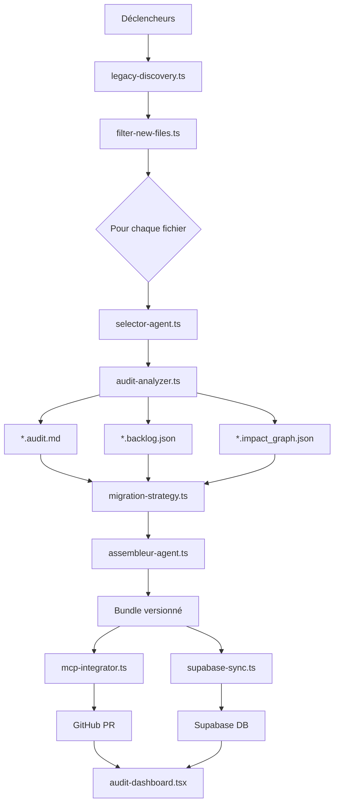

# ⚙️ Orchestration IA Complète avec n8n

Ce document détaille l'architecture complète du pipeline d'orchestration IA implémenté avec n8n pour l'analyse et la migration des fichiers PHP legacy.

## 🔔 Déclencheurs du pipeline

Le workflow peut être initié par l'un des trois déclencheurs suivants:

| Déclencheur | Description | Configuration |
|-------------|-------------|---------------|
| **Cron** | Exécution planifiée à intervalles réguliers | Tous les jours à 02:00 UTC |
| **GitHub Push** | Déclenchement automatique lors d'un push sur la branche `legacy-integration` | Via webhook GitHub |
| **Webhook manuel** | Lancement manuel pour un audit ciblé à la demande | Endpoint `/webhook/audit-manual` |

## 🧠 Séquence des étapes automatisées

| Étape | Action | Agent IA / Outil | Sortie |
|-------|--------|------------------|--------|
| 1️⃣ | Scanner les fichiers PHP | `legacy-discovery.ts` | `discovery_map.json` |
| 2️⃣ | Identifier ceux à analyser (pending) | `filter-new-files.ts` | Liste priorisée |
| 3️⃣ | Déclencher le pipeline IA (fichier par fichier) | `selector-agent.ts` + `audit-analyzer.ts` | `*.audit.md`, `*.backlog.json`, `*.impact_graph.json` |
| 4️⃣ | Générer un plan stratégique | `migration-strategy.ts` | `migration_plan.md` |
| 5️⃣ | Fusionner les résultats | `assembleur-agent.ts` | Bundle versionné |
| 6️⃣ | Pousser vers GitHub | `mcp-integrator.ts` | Commit + PR automatique |
| 7️⃣ | Insérer dans Supabase | `supabase-sync.ts` | Backlog live |
| 8️⃣ | Affichage dans Remix | `audit-dashboard.tsx` | Vue interactive filtrable |

## 📦 Distribution des résultats

Les résultats de l'analyse sont disponibles automatiquement sur trois canaux:

### 📁 Dans GitHub
- Branche dédiée : `audit-results/nom_fichier`
- Structure organisée des fichiers d'audit
- Historique des changements capturé via Git

### 🗃️ Dans Supabase
- Table principale : `audits`
- Table associée : `tasks`
- Mise à jour en temps réel des statuts

### 🌐 Dans Remix
Dashboard interactif accessible à `/dashboard/audits` avec filtres :
- Par priorité (critical, high, medium, low)
- Par statut (pending, in-progress, migrated, blocked)
- Par zone fonctionnelle (cart, seo, account, etc.)

## 🔄 Architecture détaillée du pipeline



## 💡 Astuces avancées pour industrialiser le processus

### ✅ Conteneurisation des agents
Utilisation du nœud Run Agent de n8n pour exécuter chaque agent dans un conteneur isolé, garantissant:
- Sécurité renforcée
- Isolation des processus
- Logs indépendants
- Meilleure gestion des ressources

### ✅ Système d'auto-verrouillage
- Si un fichier est déjà en cours de traitement (state: `in-progress` dans `discovery_map.json`), il est ignoré jusqu'à la fin du cycle
- Prévient les analyses redondantes et les conflits de ressources
- Assure l'intégrité des données

### ✅ Rapports de console en temps réel
Intégration de `console-reporter.ts` à la fin de chaque exécution pour afficher:

```bash
🧪 Analyse terminée pour fiche.php
📄 Audit : OK
🧩 Backlog : OK
🔁 Graphe : OK
🚀 PR : créée avec succès
🗃️ Supabase : synchronisé
```

## 🔍 Détails techniques des agents principaux

### 1. `legacy-discovery.ts`
- **Fonction** : Scanner le codebase pour identifier tous les fichiers PHP legacy
- **Méthode** : Utilise des expressions régulières et des analyses AST pour catégoriser les fichiers
- **Sortie** : Fichier JSON structuré contenant tous les fichiers et leur état actuel
- **Emplacement** : `/agents/discovery/legacy-discovery.ts`

### 2. `filter-new-files.ts`
- **Fonction** : Filtrer uniquement les fichiers nécessitant une analyse
- **Logique** : Priorisation basée sur les dépendances, la complexité et les modifications récentes
- **Sortie** : Liste ordonnée de fichiers à analyser avec leurs métadonnées
- **Emplacement** : `/agents/filter/filter-new-files.ts`

### 3. `selector-agent.ts` & `audit-analyzer.ts`
- **Fonction** : Coordonner l'analyse approfondie de chaque fichier PHP
- **Méthode** : Décomposition du fichier, analyse du code, identification des dépendances
- **Sortie** : Multiples documents structurés pour chaque aspect de l'analyse
- **Emplacement** : `/agents/analysis/selector-agent.ts` et `/agents/analysis/audit-analyzer.ts`

### 4. `migration-strategy.ts`
- **Fonction** : Élaborer une stratégie de migration pour chaque fichier analysé
- **Logique** : Recommandations basées sur les risques identifiés et les meilleures pratiques
- **Sortie** : Document Markdown détaillant les étapes recommandées
- **Emplacement** : `/agents/strategy/migration-strategy.ts`

### 5. `assembleur-agent.ts`
- **Fonction** : Fusion de tous les résultats d'analyse en un bundle cohérent
- **Méthode** : Association intelligente des différents formats de données
- **Sortie** : Package complet contenant tous les artefacts d'analyse
- **Emplacement** : `/agents/core/assembleur-agent.ts`

### 6. `mcp-integrator.ts`
- **Fonction** : Intégration avec GitHub via le Model Context Protocol
- **Méthode** : Création automatisée de branches, commits et PRs
- **Sortie** : Pull Request sur GitHub avec documentation structurée
- **Emplacement** : `/agents/integration/mcp-integrator.ts`

### 7. `supabase-sync.ts`
- **Fonction** : Synchronisation des données d'analyse avec Supabase
- **Méthode** : API REST pour mise à jour des tables
- **Sortie** : Base de données mise à jour avec les dernières analyses
- **Emplacement** : `/agents/sync/supabase-sync.ts`

## 📈 Monitoring et amélioration continue

Le pipeline inclut des fonctionnalités de monitoring permettant:
- Suivi des performances de chaque agent
- Détection des goulots d'étranglement
- Amélioration continue basée sur les métriques collectées
- Rapports d'analyse des tendances

## 🔧 Configuration et personnalisation

La configuration du pipeline est centralisée dans:
- `/config/migration-workflow.n8n.json` : Configuration principale du workflow n8n
- `/config/audit-config.yml` : Paramètres spécifiques des agents d'audit
- `/config/mcp-server-config.json` : Configuration de l'intégration avec le MCP

## 🚀 Prochaines étapes

1. Extension du pipeline aux fichiers JavaScript et autres types de ressources
2. Intégration avec des outils de CI/CD pour des tests automatiques après migration
3. Développement d'un agent de feedback pour améliorer progressivement les migrations
4. Interface d'administration pour ajuster les paramètres du pipeline en temps réel