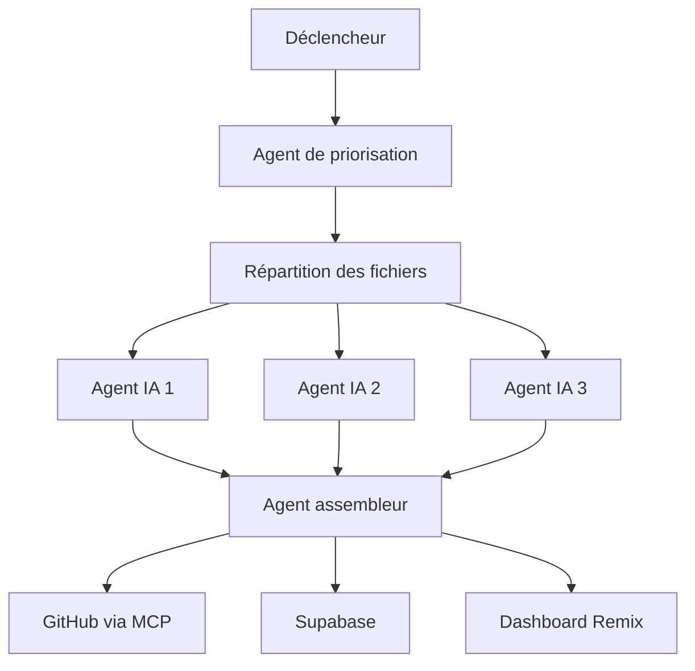

# ⚙️ Orchestration dans n8n

Ce document décrit l'architecture et le fonctionnement du pipeline d'orchestration dans n8n pour le projet de cahier des charges.

## Vue d'ensemble du processus

Le pipeline d'orchestration suit un modèle de flux de travail séquentiel avec des étapes parallèles pour l'analyse des fichiers. Voici un aperçu des étapes principales:

## Composants principaux

### Déclencheur

Le workflow peut être initié par l'un des déclencheurs suivants:
- **Cron**: Exécution planifiée à intervalles réguliers
- **Push GitHub**: Déclenchement automatique lors d'un push sur le repository
- **Manuel**: Lancement manuel du workflow par un utilisateur

### Agent de priorisation

Cet agent effectue un scan initial des fichiers PHP dans le répertoire source:
- Cible le répertoire `/src/*.php`
- Évalue et priorise les fichiers nécessitant une analyse
- Exclut les fichiers déjà traités ou qui ne nécessitent pas d'analyse

### Pipeline d'analyse IA

Les fichiers non traités sont répartis dans un pipeline d'agents IA spécialisés:
- Chaque agent est responsable de la génération d'une section spécifique du cahier des charges
- Les agents travaillent en parallèle pour optimiser le temps de traitement
- Chaque agent génère un résultat structuré pour sa section attribuée

### Agent assembleur

Un agent assembleur final est responsable de:
- Fusionner les résultats provenant des différents agents IA
- Assurer la cohérence entre les différentes sections
- Formater le document final selon les standards établis

### Distribution des rapports

Les rapports finalisés sont distribués via plusieurs canaux:
1. **GitHub (via MCP)**: Les rapports sont poussés dans le repository GitHub via le Model Context Protocol
2. **Supabase**: Les données sont envoyées dans une base de données Supabase pour le stockage et l'analyse
3. **Dashboard Remix**: Les rapports sont affichés dans une interface utilisateur interactive développée avec Remix

## Configuration technique

La configuration du workflow n8n est disponible dans les fichiers suivants:
- `n8n.pipeline.json`: Configuration principale du pipeline
- `n8n.pipeline.clean.json`: Version épurée du pipeline
- `config/migration-workflow.n8n.json`: Configuration spécifique à la migration

## Intégration avec les systèmes externes

### Model Context Protocol (MCP)

L'intégration avec GitHub se fait via le MCP qui permet:
- La communication bidirectionnelle avec le repository
- La gestion contextualisée des commits et des pull requests
- Le suivi des modifications avec traçabilité

### Supabase

L'intégration avec Supabase permet:
- Le stockage structuré des données d'analyse
- La persistance des résultats pour l'analyse historique
- L'accès aux API pour l'intégration avec le dashboard

### Dashboard Remix

Le dashboard Remix offre:
- Une visualisation interactive des rapports
- Des tableaux de bord personnalisés pour différents types d'utilisateurs
- Des métriques et KPIs sur l'avancement et la qualité du projet

## Prochaines étapes

- Amélioration de l'algorithme de priorisation
- Ajout d'agents spécialisés pour d'autres types de fichiers
- Intégration avec des systèmes d'alerte pour les anomalies détectées
- Développement de rapports personnalisés pour différentes parties prenantes