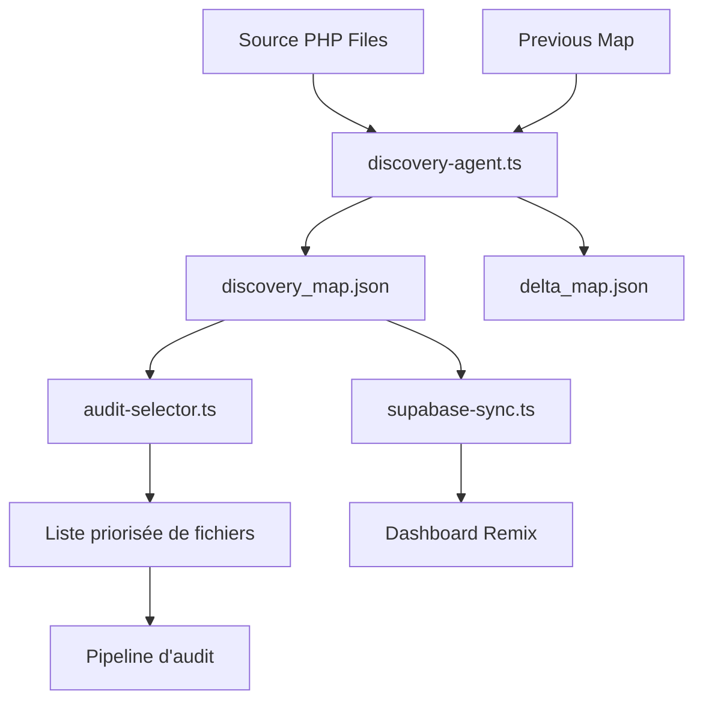

# 🧠 Sélection Intelligente des Fichiers PHP à Auditer

Ce document détaille le fonctionnement du système de découverte et de priorisation automatique des fichiers PHP à analyser dans le pipeline d'audit.

## Objectif

Automatiser totalement la découverte des fichiers PHP critiques, sans intervention humaine ni liste manuelle, en utilisant un système de scoring intelligent basé sur plusieurs critères.

## Architecture du système



## Composants du système

### 1. Agent de découverte (`discovery-agent.ts`)

L'agent de découverte est le cœur du système. Il analyse tous les fichiers PHP dans le répertoire source et attribue à chacun un score de priorité basé sur plusieurs critères.

#### Entrées
- **Dossier source** : Répertoire contenant les fichiers PHP à analyser.
- **Carte précédente** : Résultats de l'analyse précédente (facultatif).

#### Processus d'analyse
L'agent effectue une analyse statique rapide sur chaque fichier PHP avec les critères suivants :

1. **Analyse du contenu**
   - Recherche de mots-clés critiques (base de données, sécurité, authentification)
   - Détection de patterns SEO (meta, canonical, robots)
   - Évaluation de la complexité (structures de contrôle, taille)
   - Identification de fonctionnalités métier (panier, paiement, utilisateur)

2. **Analyse du chemin**
   - Répertoires stratégiques (/cart/, /user/, /admin/, etc.)
   - Noms de fichiers significatifs (login, checkout, product)

3. **Métadonnées**
   - Taille du fichier
   - Date de dernière modification
   - Statut actuel (pending, audited, in-progress, migrated)

4. **Comparaison avec version précédente**
   - Détection de modifications (comparaison de hashes)
   - Évolution du statut

#### Attribution des scores
Le score de priorité (0-10) est calculé sur la base de :

- **Importance métier présumée** (pondération par nom/répertoire)
- **Complexité** (taille, structures de contrôle imbriquées)
- **Risque sécurité** (présence de points d'entrée utilisateur, manipulations de sessions)
- **Risque SEO** (présence de balises meta, canonicals)
- **Gestion de données** (requêtes SQL, manipulations de base de données)
- **Antériorité d'analyse** (statut du fichier)

#### Sorties
- **discovery_map.json** : Carte complète des fichiers analysés avec leurs scores et statuts
- **delta_map.json** : Changements détectés par rapport à l'analyse précédente

### 2. Sélecteur d'audit (`audit-selector.ts`)

Ce composant consomme les données produites par l'agent de découverte et sélectionne les fichiers à traiter dans le pipeline d'audit.

#### Fonctionnalités
- Filtre les fichiers "pending" de la carte de découverte
- Sélectionne les N fichiers les plus prioritaires
- Gère les verrous pour éviter l'analyse simultanée du même fichier
- Met à jour le statut des fichiers sélectionnés à "in-progress"

### 3. Intégration avec le Dashboard (`supabase-sync.ts`)

Synchronise les données de découverte avec Supabase pour affichage dans le Dashboard Remix.

## Exemple de sortie : `discovery_map.json`

```json
[
  {
    "file": "src/cart/shopping_cart.php",
    "priority": 9.5,
    "type": "cart",
    "status": "pending",
    "lastModified": "2025-04-09T14:32:15.000Z",
    "fileHash": "a1b2c3d4e5f6g7h8i9j0k1l2m3n4o5p6",
    "sizeKb": 24.5,
    "complexityEstimate": 3.2,
    "keywords": ["cart", "SELECT", "POST", "SESSION"],
    "categories": ["business", "data", "security"]
  },
  {
    "file": "src/user/login.php",
    "priority": 8.2,
    "type": "auth",
    "status": "pending",
    "lastModified": "2025-03-17T09:45:22.000Z",
    "fileHash": "p6o5n4m3l2k1j0i9h8g7f6e5d4c3b2a1",
    "sizeKb": 18.7,
    "complexityEstimate": 2.5,
    "keywords": ["SESSION", "POST", "login", "password"],
    "categories": ["security", "business"]
  },
  {
    "file": "src/core/_seo/meta.update.php",
    "priority": 7.4,
    "type": "seo",
    "status": "audited",
    "lastModified": "2025-01-25T16:12:03.000Z",
    "fileHash": "q7r8s9t0u1v2w3x4y5z6a7b8c9d0e1f2",
    "sizeKb": 12.3,
    "complexityEstimate": 1.7,
    "keywords": ["meta", "canonical", "robots", "UPDATE"],
    "categories": ["seo", "data"]
  }
]
```

## Exemple de sortie : `delta_map.json`

```json
{
  "new": [
    {
      "file": "src/payment/stripe_integration.php",
      "priority": 8.7,
      "type": "payment",
      "status": "pending",
      "lastModified": "2025-04-10T10:23:45.000Z",
      "fileHash": "g1h2i3j4k5l6m7n8o9p0q1r2s3t4u5v6",
      "sizeKb": 32.1,
      "complexityEstimate": 3.8,
      "keywords": ["payment", "POST", "SESSION", "stripe"],
      "categories": ["business", "security", "payment"]
    }
  ],
  "modified": [
    {
      "file": "src/cart/checkout.php",
      "priority": 9.2,
      "type": "checkout",
      "status": "pending",
      "lastModified": "2025-04-11T09:17:32.000Z",
      "fileHash": "v6u5t4s3r2q1p0o9n8m7l6k5j4i3h2g1",
      "sizeKb": 28.9,
      "complexityEstimate": 3.5,
      "keywords": ["checkout", "payment", "cart", "SESSION", "UPDATE"],
      "categories": ["business", "data", "security"]
    }
  ],
  "statusChanged": [
    {
      "file": "src/user/profile.php",
      "priority": 7.8,
      "type": "user",
      "status": "audited",
      "lastModified": "2025-03-21T14:05:12.000Z",
      "fileHash": "w7x8y9z0a1b2c3d4e5f6g7h8i9j0k1l2",
      "sizeKb": 20.5,
      "complexityEstimate": 2.8,
      "keywords": ["user", "profile", "UPDATE", "SESSION"],
      "categories": ["business", "security"]
    }
  ],
  "priorityChanged": [
    {
      "file": "src/product/search.php",
      "priority": 8.5,
      "type": "catalog",
      "status": "pending",
      "lastModified": "2025-04-08T11:42:18.000Z",
      "fileHash": "m2n3o4p5q6r7s8t9u0v1w2x3y4z5a6b7",
      "sizeKb": 45.2,
      "complexityEstimate": 4.2,
      "keywords": ["product", "search", "SELECT", "GET"],
      "categories": ["business", "data"]
    }
  ]
}
```

## Intégration avec n8n

L'agent de découverte est intégré dans le workflow n8n comme suit :

1. **Déclencheur** 
   - Exécution quotidienne (via CRON)
   - Sur push GitHub (branche legacy-integration)
   - Webhook manuel

2. **Étape de découverte**
   - Nœud "Run Agent" exécutant `discovery-agent.ts`
   - Génération de `discovery_map.json` et `delta_map.json`

3. **Sélection des fichiers à analyser**
   - Nœud "JavaScript" exécutant la fonction de sélection
   - Filtrage des fichiers en attente d'analyse par priorité

4. **Traitement parallèle**
   - Split des fichiers sélectionnés
   - Exécution du pipeline d'audit pour chaque fichier

## Configuration et personnalisation

Le comportement de l'agent de découverte peut être ajusté via la configuration :

```typescript
// config/discovery-config.json
{
  "discovery": {
    "rootDir": "src",
    "outputFile": "discovery_map.json",
    "previousMapFile": "discovery_map.previous.json",
    "maxFilesToProcess": 1000,
    "minScoreThreshold": 4.0,
    "keywordWeights": {
      "security": 1.2,
      "business": 1.5,
      "seo": 1.0,
      "data": 1.1
    },
    "directoryWeights": {
      "cart": 1.5,
      "payment": 1.8,
      "user": 1.2,
      "admin": 1.3
    }
  }
}
```

## Analyse périodique et adaptative

Le système est conçu pour évoluer avec le code :

1. **Comparaison avec l'analyse précédente**
   - Détection de nouveaux fichiers
   - Identification des modifications dans les fichiers existants
   - Suivi des changements de statut

2. **Adaptation des priorités**
   - Ajustement automatique basé sur l'évolution du codebase
   - Prise en compte des fichiers migrés

3. **Amélioration continue**
   - Le système apprend des analyses précédentes
   - Affinage progressif des critères de scoring

## Avantages du système

1. **Automatisation complète**
   - Aucune intervention manuelle requise
   - Priorisation objective basée sur des critères mesurables

2. **Adaptabilité**
   - S'ajuste automatiquement aux évolutions du codebase
   - Détecte les nouveaux fichiers et les modifications

3. **Visibilité**
   - Fournit une vue d'ensemble claire de l'état du projet
   - Permet de suivre la progression de la migration

4. **Efficacité**
   - Concentre les efforts sur les fichiers les plus critiques
   - Optimise l'utilisation des ressources

## Cas d'utilisation avancés

### 1. Audit ciblé par catégorie

Vous pouvez filtrer la carte de découverte pour vous concentrer sur une catégorie spécifique :

```typescript
// Exemple d'audit ciblé sur la sécurité
const securityFiles = discoveryMap
  .filter(item => item.status === 'pending' && item.categories.includes('security'))
  .sort((a, b) => b.priority - a.priority)
  .slice(0, 10);
```

### 2. Détection de points chauds

Identifiez les zones du codebase qui concentrent les fichiers à haut risque :

```typescript
// Regroupement par répertoire
const hotspots = discoveryMap.reduce((acc, item) => {
  const directory = item.file.split('/').slice(0, -1).join('/');
  if (!acc[directory]) acc[directory] = { count: 0, avgPriority: 0, files: [] };
  
  acc[directory].count++;
  acc[directory].avgPriority = (acc[directory].avgPriority * (acc[directory].count - 1) + item.priority) / acc[directory].count;
  acc[directory].files.push(item.file);
  
  return acc;
}, {});

// Tri des hotspots par priorité moyenne
const sortedHotspots = Object.entries(hotspots)
  .map(([dir, data]) => ({ directory: dir, ...data }))
  .sort((a, b) => b.avgPriority - a.avgPriority);
```

### 3. Analyse de dépendances

Étendez le système pour capturer les relations entre fichiers :

```typescript
// Extraction des includes/requires
function extractDependencies(content, filePath) {
  const dependencies = [];
  const includePattern = /include|require(_once)?\s*\(\s*['"](.+?)['"]\s*\)/g;
  
  let match;
  while ((match = includePattern.exec(content)) !== null) {
    dependencies.push({
      source: filePath,
      target: match[2],
      type: match[0].startsWith('include') ? 'include' : 'require'
    });
  }
  
  return dependencies;
}
```

## Prochaines évolutions

1. **Analyse sémantique** : Utiliser des techniques d'analyse de code plus sophistiquées pour mieux comprendre la fonction de chaque fichier.

2. **Apprentissage automatique** : Incorporer des algorithmes d'apprentissage pour améliorer la priorisation sur la base des audits précédents.

3. **Graphe de dépendances** : Construire un graphe complet des dépendances entre fichiers pour optimiser l'ordre d'analyse.

4. **Intégration avec les métriques de qualité** : Enrichir le scoring avec des métriques de qualité de code (complexité cyclomatique, dette technique, etc.).

5. **Analyse de l'impact métier** : Intégrer des données d'usage pour prioriser les fichiers les plus utilisés.